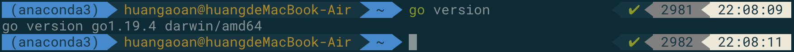
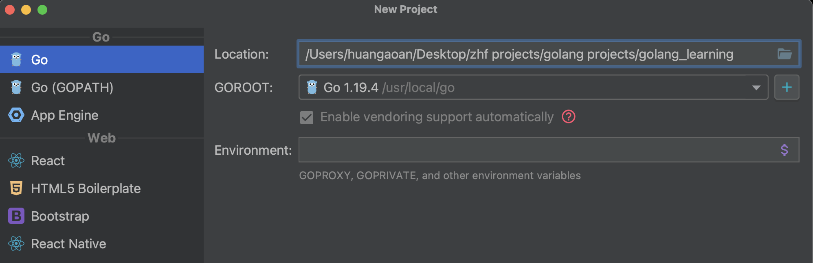
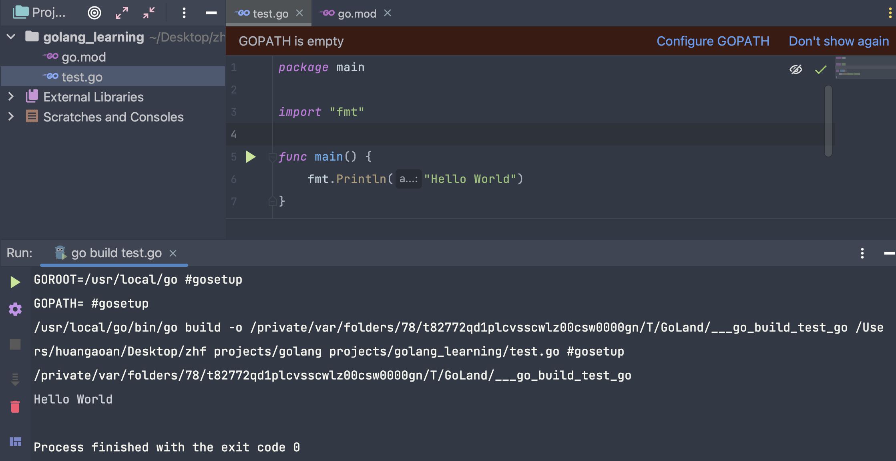
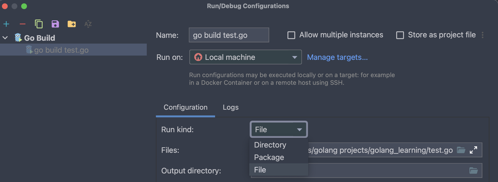

# 1. 安装go语言


## 1.1 在官网下载对应的版本进行安装

安装完成后可以使用下面的命令进行查看：

```go
go version
```




## 1.2 进行镜像代理的配置

官方网站：https://goproxy.cn/

执行代码：

```go
$ go env -w GO111MODULE=on
$ go env -w GOPROXY=https://goproxy.cn,direct
```

执行完毕后可以使用go env进行查看


## 1.3 在创建项目的时候新版本的idea的默认项目就是原来的go module




## 1.4 helloworld 项目

- 要注意package的名称需要为main

- 要注意我们需要创建一个main函数，大括号需要和main在同一行




## 1.5 设置运行的种类

如果我们运行的是package，那么一个package之中只能够存在一个main函数，如果运行的是File，那么可以存在多个main.

