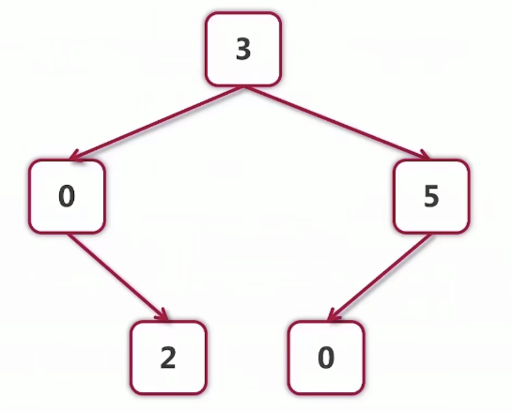
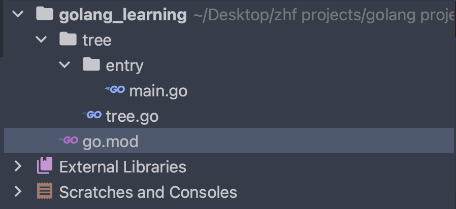
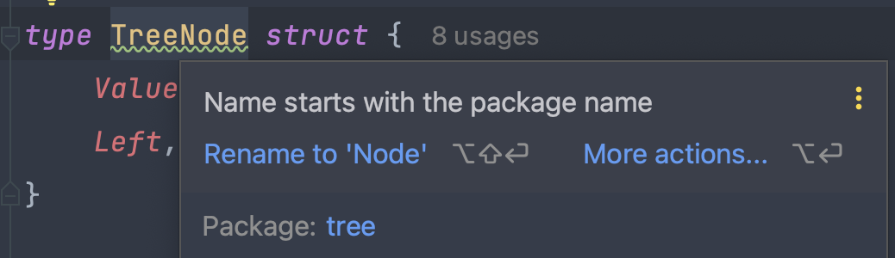

# 1. Go 语言面向对象学习

- go 语言仅仅支持封装，不支持继承和多态，go语言没有class，只有struct
- 继承和多态放到哪里做呢？放到接口去做，我们面向接口进行编程。


## 1.1 struct 的创建和使用

**示例代码：**

```go
package main

import "fmt"

type point struct{ i, j int }

var points []point = []point{{1, 2}, {3, 4}}

func main() {
   for index, value := range points {
      fmt.Println(index, value.i, value.j)
      // 输出结果
      /*
      0 1 2
      1 3 4
      */
   }
}
```


## 1.2 使用struct构建一个二叉树

### 1.2.1 不同的创建方式

**示例代码：**当我们fmt.Println带有指针元素的结构体的时候，输出的是指向内存的地址

**注意事项：**由于存在大括号初始化，所以不需要有各种各样的乱七八糟的构造函数的重载

```go
package main

import "fmt"

type treeNode struct {
	value       int
	left, right *treeNode
}

func main() {
	var root treeNode
  root = treeNode{value: 3} // treeNode创建，用大括号{key1: value1, key2:value2}初始化完成后，返回地址
	root.left = &treeNode{} // treeNode创建，用大括号初始化完成后，返回地址
  root.right = &treeNode{5, nil, nil} // treeNode创建，用大括号{value, value, ...}初始化完成后，返回地址
  
	root.right.left = new(treeNode) // 使用new的话返回的是创建的这个treeNode的地址
	nodes := []treeNode{{value: 3}, {6, nil, &root}} // 进行结构体数组的创建
	fmt.Println(root)  // {3 0xc000010048 0xc000010060}
	fmt.Println(nodes) // [{3 <nil> <nil>} {6 <nil> 0xc000010030}]
}

```

### 1.2.2 自定义工厂函数进行结构体对象的创建

**注意事项：**这里返回了局部变量的地址，这在c++之中是一个错误，除非我们是在堆上的内存，但是在go语言之中是可行的，那么go语言之中的局部变量的它到底是在栈上还是在堆上呢？go语言局部变量如果我们返回了他的地址，那么它将是放在堆上的，如果没有返回它的地址，可能他是在栈上，总之它有一套非常完善的垃圾回收机制，我们不用关心那么多。

```go
package main

import "fmt"

type treeNode struct {
   value       int
   left, right *treeNode
}

func createTreeNode(value int) *treeNode {
   return &treeNode{value: value}
}

func main() {
   result := createTreeNode(3)
   fmt.Println(result) // &{3 <nil> <nil>}
}
```

### 1.2.3 下面我们通过代码建立一棵二叉树，我们下面写一个几个供结构体使用的方法



**进行print方法的定义：**我们可以看到这里有一个接收者的概念，这个接收者就可以理解为java或者c++之中的this指针。

```go
package main

import "fmt"

type treeNode struct {
	value       int
	left, right *treeNode
}

// 为结构题进行遍历方法的定义
// func 后面的小括号是接收者，或者说是这个方法的调用者
func (node treeNode) print() {
	fmt.Println("节点的值为:", node.value)
}

func (node treeNode) setValue(value int) {
	node.value = value
}

func main() {
	var root = treeNode{value: 3}
	root.left = &treeNode{value: 0}
	root.right = &treeNode{value: 5}
	root.left.right = &treeNode{value: 2}
	root.right.left = &treeNode{value: 0}
	fmt.Println(root.left) // &{0 <nil> 0xc0000a0048}
	root.left.setValue(100)
	fmt.Println(root.left) // &{0 <nil> 0xc0000a0048}
}

```

**注意这个方法也是值传递的，不要以为是方法就可以里面改外面：**如下面代码所示，我们虽然进行了node value 的set，但是依旧没有改变外面的node变量的值。

```go
package main

import "fmt"

type treeNode struct {
   value       int
   left, right *treeNode
}

// 为结构题进行遍历方法的定义
// func 后面的小括号是接收者，或者说是这个方法的调用者
func (node treeNode) print() {
   fmt.Println("节点的值为:", node.value)
}

func (node treeNode) setValue(value int) {
   node.value = value
}

func main() {
   var root = treeNode{value: 3}
   root.left = &treeNode{value: 0}
   root.right = &treeNode{value: 5}
   root.left.right = &treeNode{value: 2}
   root.right.left = &treeNode{value: 0}
   var nodes = []treeNode{root, *root.left, *root.right, *root.left.right, *root.right.left}
   for _, node := range nodes {
      node.setValue(1000)
   }
   for _, node := range nodes {
      node.print()
   }
   // 输出结果：
   /*
      节点的值为: 3
      节点的值为: 0
      节点的值为: 5
      节点的值为: 2
      节点的值为: 0
   */
}
```

**当我们将接收者的类型换为指针的话，情况就不一样了**，我们依然可以使用结构体变量而不是结构体脂针进行调用，也可以进行适配，go语言在内部会做一个替换，将调用者的地址进行传入：

```go
package main

import "fmt"

type treeNode struct {
   value       int
   left, right *treeNode
}

// 为结构题进行遍历方法的定义
// func 后面的小括号是接收者，或者说是这个方法的调用者
func (node *treeNode) print() {
   fmt.Println("节点的值为:", node.value)
}

func (node *treeNode) setValue(value int) {
   node.value = value
}

func main() {
   var root = treeNode{value: 3}
   root.left = &treeNode{value: 0}
   root.right = &treeNode{value: 5}
   root.left.right = &treeNode{value: 2}
   root.right.left = &treeNode{value: 0}
   fmt.Println(root.left) // &{0 <nil> 0xc000010060}
   root.left.setValue(100)
   fmt.Println(root.left) // &{100 <nil> 0xc000010060}
}
```

**nil指针也可以进行方法的调用：**

```go
package main

import "fmt"

type treeNode struct {
   value       int
   left, right *treeNode
}

// 为结构题进行遍历方法的定义
// func 后面的小括号是接收者，或者说是这个方法的调用者
func (node *treeNode) print() {
   if node == nil {
      fmt.Println("print nil node value", node)
   } else {
      fmt.Println("节点的值为:", node.value)
   }
}

func (node *treeNode) setValue(value int) {
   if node == nil {
      fmt.Println("setting value to nil node, Ignored!")
   } else {
      node.value = value
   }
}

func main() {
   var root = treeNode{value: 3}
   root.left = &treeNode{value: 0}
   root.right = &treeNode{value: 5}
   root.left.right = &treeNode{value: 2}
   root.right.left = &treeNode{value: 0}
   var nilNode *treeNode
   nilNode.print() // print nil node value <nil>
   nilNode.setValue(100) // setting value to nil node, Ignored!
}
```

**进行遍历的函数的实现：**使用中序遍历

```go
package main

import "fmt"

type treeNode struct {
   value       int
   left, right *treeNode
}

// 为结构题进行遍历方法的定义
// func 后面的小括号是接收者，或者说是这个方法的调用者
func (node *treeNode) print() {
   if node == nil {
      fmt.Println("print nil node value", node)
   } else {
      fmt.Println("节点的值为:", node.value)
   }
}

func (node *treeNode) traverse() {
   if node == nil {
      return
   }
   node.left.traverse()
   node.print()
   node.right.traverse()
}

func main() {
   var root = treeNode{value: 3}
   root.left = &treeNode{value: 0}
   root.right = &treeNode{value: 5}
   root.left.right = &treeNode{value: 2}
   root.right.left = &treeNode{value: 0}
   root.traverse()
}

// 输出结果
/*
节点的值为: 0
节点的值为: 2
节点的值为: 3
节点的值为: 0
节点的值为: 5
*/
```

**到底使用指针接收者还是值接收者**

- 要改变内容的时候必须使用指针接收者
- 结构过大也考虑使用指针接收者
- 一致性：如果有指针接收者，最好都是指针接收者


# 2. Go 语言访问权限的实现

## 2.1 Go 语言的访问权限是使用命名方式来实现的

- 适用范围包括，变量，常量，结构体，方法
- 名字一般使用CamelCase
- 首字母大写对应的是public
- 首字母小写对应的是private
- 访问权限是针对包package来说的

# 2.2 Go 语言之中的包

- 每个目录有一个包，包名不需要和目录名保持一致
- main包是一个特殊的包，包含可执行入口
- 为结构体定义的方法必须放在同一个包内，但可以放在不同的文件内。

**示例代码结构：**

- 我们需要看到包含main方法的必须在main package下面，所以我们单独给了他一个目录，称之为entry
- main.go 在 main package之下，tree.go 在 tree package 下面。



下面是tree.go的结构：我们发现要想让结构体类型，结构体类型之中定义的值，能够在其他的package之中进行使用，首字母全部需要大写，这里要大写的包括TreeNode, Value, Left, Right, Print, Traverse

```go
package tree

import "fmt"

type TreeNode struct {
	Value       int
	Left, Right *TreeNode
}

// Print 为结构题进行遍历方法的定义
// func 后面的小括号是接收者，或者说是这个方法的调用者
func (node *TreeNode) Print() {
	if node == nil {
		fmt.Println("print nil node value", node)
	} else {
		fmt.Println("节点的值为:", node.Value)
	}
}

func (node *TreeNode) Traverse() {
	if node == nil {
		return
	}
	node.Left.Traverse()
	node.Print()
	node.Right.Traverse()
}

```

下面是main.go的结构：

```go
package main

import "golang_learning/tree"

func main() {
   var root = tree.TreeNode{Value: 3}
   root.Left = &tree.TreeNode{Value: 0}
   root.Right = &tree.TreeNode{Value: 5}
   root.Left.Right = &tree.TreeNode{Value: 2}
   root.Right.Left = &tree.TreeNode{Value: 0}
   root.Traverse()
}
```

**注意事项：**不建议称之为TreeNode这是因为，我们的包的名称已经叫tree了，tree.TreeNode显得多此一举，我们直接叫Node更好，更加的简单。




## 2.3 如何扩展已经存在的类型

由于为结构体定义的方法必须放在同一个包内，那么我们如何扩充系统的类型，或者说别的人定义的类型呢？

**第一种方法：使用组合的方式扩展已有的类型**

```go
package main

import (
	"fmt"
	"golang_learning/tree"
)

// myTreeNode 进行别人定义的类型的扩展而不仅仅使用别人定义的类型
type myTreeNode struct {
	node *tree.Node
}

// 我们进行类型的扩展，为其添加一个后序遍历的方法
func (myNode *myTreeNode) postOrder() {
	if myNode == nil || myNode.node == nil {
		return
	}
	left := myTreeNode{myNode.node.Left}
	left.postOrder()
	right := myTreeNode{myNode.node.Right}
	right.postOrder()
	myNode.node.Print()
}

func main() {
	var root = tree.Node{Value: 3}
	root.Left = &tree.Node{Value: 0}
	root.Right = &tree.Node{Value: 5}
	root.Left.Right = &tree.Node{Value: 2}
	root.Right.Left = &tree.Node{Value: 0}
	root.Traverse()
	// 输出结果
	/*
		节点的值为: 0
		节点的值为: 2
		节点的值为: 3
		节点的值为: 0
		节点的值为: 5
	*/
	myRoot := myTreeNode{&root}
	// 注意：不可以直接myTreeNode{&root}.postOrder()
	fmt.Println("-----------------")
	myRoot.postOrder()
	// 输出结果
	/*
		节点的值为: 2
		节点的值为: 0
		节点的值为: 0
		节点的值为: 5
		节点的值为: 3
	*/
}

```

**第二种方法：使用别名的方式来扩展已有的类型**

下面我们想要借用slice，进行一个队列的设计，这个队列包含有popFront和popBack方法

```go
package main

import (
   "fmt"
   "golang_learning/queue"
)

func main() {
   intQueue := queue.IntQueue{1, 2, 3}
   intQueue.PushBack(4)
   for !intQueue.IsEmpty() {
      fmt.Print(intQueue.PopFront(), ",")
   }
   // 输出结果
   // 1,2,3,4,
}
```

```go
package queue

type IntQueue []int

func (q *IntQueue) PushBack(v int) {
   *q = append(*q, v)
}

func (q *IntQueue) PopFront() int {
   head := (*q)[0]
   *q = (*q)[1:]
   return head
}

func (q *IntQueue) IsEmpty() bool {
   return len(*q) == 0
}
```

**第三种方法：使用内嵌embedding来扩展已有类型**

```go
package main

import (
	"fmt"
	"golang_learning/tree"
)

// myTreeNode
type myTreeNode struct {
	*tree.Node // 内嵌 Embedding 语法糖 Node 这个类型就是里面的对象名
}

// 我们进行类型的扩展，为其添加一个后序遍历的方法
func (myNode *myTreeNode) postOrder() {
  // 我们可以通过对象名.Node将内嵌的对象选取出来
	if myNode == nil || myNode.Node == nil {
		return
	}
	left := myTreeNode{myNode.Left}
	left.postOrder()
	right := myTreeNode{myNode.Right}
	right.postOrder()
	myNode.Print()
}

func main() {
	var root = myTreeNode{&tree.Node{Value: 3}}
	root.Left = &tree.Node{Value: 0}
	root.Right = &tree.Node{Value: 5}
	root.Left.Right = &tree.Node{Value: 2}
	root.Right.Left = &tree.Node{Value: 0}
	root.Traverse()
	// 输出结果
	/*
		节点的值为: 0
		节点的值为: 2
		节点的值为: 3
		节点的值为: 0
		节点的值为: 5
	*/
	// 注意：不可以直接myTreeNode{&root}.postOrder()
	fmt.Println("-----------------")
	root.postOrder()
	// 输出结果
	/*
		节点的值为: 2
		节点的值为: 0
		节点的值为: 0
		节点的值为: 5
		节点的值为: 3
	*/
}

```
