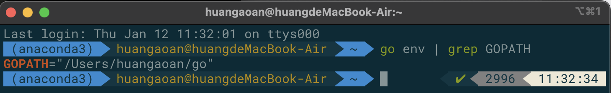
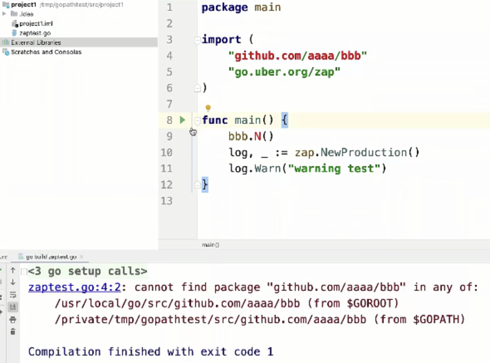
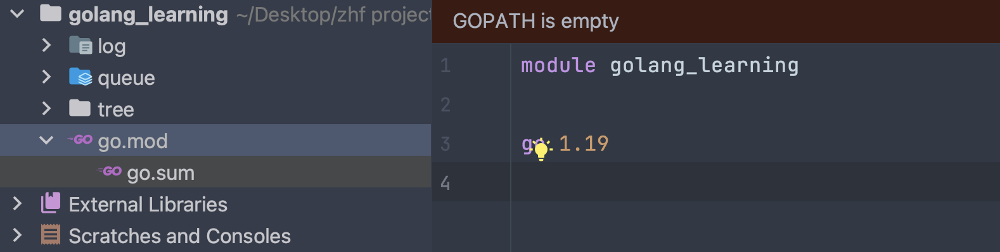
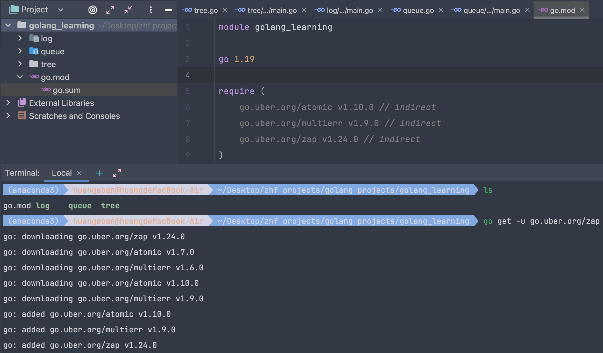
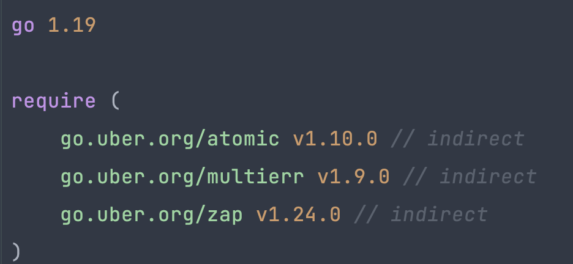
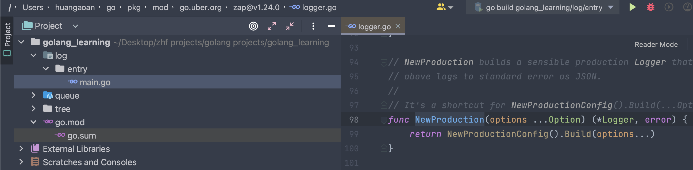

# 1. Go 语言的依赖管理

## 1.1 依赖的概念

别人已经实现了一些库，我们想要进行使用，这就是依赖，类似于java之中的maven之中我们只需要创建一个pom.xml，然后就会自动的为我们进行依赖的下载。

比如下面这个uber创建的zap，是一个快速的，结构化的，分级别的日志系统。


## 1.2 依赖管理的三个阶段

- GOPATH
- GOVENDOR - 每个项目有自己的vendor目录，存放第三方库，idea之中有GO_PROJECT_PATH
- go mod 最好的，我们选择的依赖管理的方式

## 1.3 GOPATH

**默认路径：**～/go(unix, linux), %USERPROFILE%\go(windows) 



这个路径可以在idea之中进行配置。GOPATH是怎样一种依赖管理方式呢？简单来说，它就是不进行依赖管理。这样会造成所有的项目的所有的依赖都放在同一个目录下面。这样下去gopath就会非常的大。

**临时修改：**export GOPATH="路径" 改完之后，我们需要在这个路径下面新建一个src目录，然后我们的其他的依赖就都会放到这个地方了。在idea之中如果我们没有进行配置，会提示我们进行配置：其中global path对所有的项目生效，而project GOPATH对于当前项目生效，比如我们在这里进行project gopath的设置，在其他的项目之中是看不到的。


**进行库的获取：**使用go get 命令，github一般会给出命令。在idea之中我们只要import然后sync就可以了

**下面是实验结果：**

```go
package main

import "go.uber.org/zap"

func main() {
   log, _ := zap.NewProduction()
   log.Warn("warning test")
   // 输出结果：{"level":"warn","ts":1673495446.4691389,"caller":"entry/main.go:7","msg":"warning test"}
}
```

**下面是库的查找顺序：**首先是到GoRoot下面的src之中进行查找，然后是到我们的GoPath下面的src之中进行查找。在查找之前肯定是要先从github拉取到本地的。



## 1.4 GOVENDOR

我们还可以在我们的project之中创建一个vendor目录，并且在其中创建src目录，之后我们的首先的查找库文件的地方就是先vendor，然后gopath，最后才是GoRoot。我们一般不直接动vendor目录，我们引入第三方管理工具，我们只需要配置yaml配置文件即可。比如glide，dep

## 1.5 原生的依赖管理办法-go module

### 1.5.1 简单介绍

当我们以默认的方式创建go的项目的时候会出现一个go.mod



我们执行go get命令：从github上进行代码的拉取，从而能够进行拉取，拉取之后会发现go.mod多了require语句，并且go.sum多了出来，这是一个哈希校验机制，用来进行校验。



当我们有代码使用到了这个库的时候会使得require变成亮色：



当我们点击进入zap.newProduction这个函数内部之后，我们可以发现：这个从github上下下来的包位于GOROOT下面：即 ～/go/pkg/mod下面



并且在idea的external libraries之中我们也同样可以看到我们拉取的相关的依赖：


### 1.5.2 可以进行依赖版本的更换

**命令1：**go get go.uber.org/zap@v1.11.0 下载1.11.0版本

**命令2：**go mod tidy 清理整个依赖


### 1.5.3 如何进行依赖的增加

**方式1：**继续使用go get方法进行逐个依赖的添加

**方式2：**使用import方式直接导入，会自动帮助我们进行下载


### 1.5.4 如何将原来不是go module的转换为是go module的

我们需要进入到项目然后输入如下的命令：

**命令1：** go mod init 项目的名称 [这条命令用来创建go.mod]

**命令2：**go build ./... [这条命令会触发拉取所有的依赖]