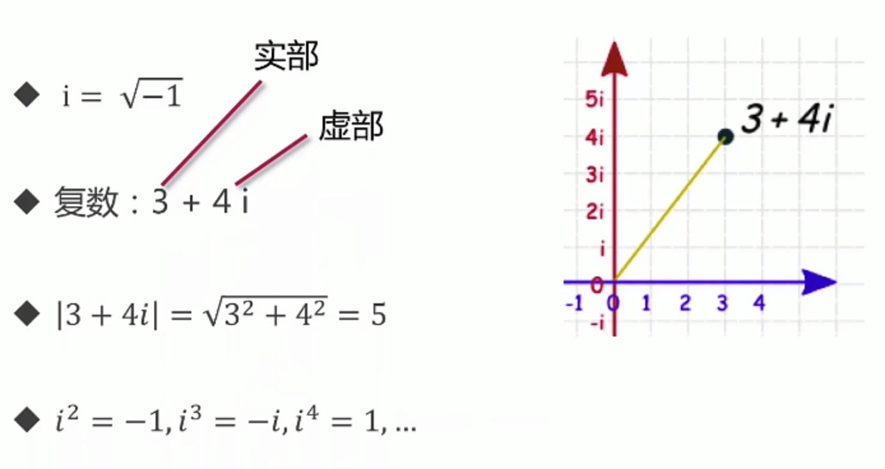

# 1.Go 语言变量与常量


## 1.1 函数内部定义的变量

**示例代码：**

```go
package main

import "fmt"

func variableInitializeAndAssign() {
	var a int
	var s string = "hello_world"
	a = 1
	s = "hello"
	fmt.Println(a, s) // 1 hello
}

func variableDefaultValue() {
	var a, b int
	var s string
	// %q 可以将空串打印出来
	fmt.Printf("%d %d %q\n", a, b, s) // 0 0 ""
}

func variableTypeDeduction() {
	var a, b = 1, 2 // 不用进行类型的指定自动进行类型的推断
	var s = "hello"
	fmt.Println(a, b, s) // 1 2 hello
}

func variableShorter() {
	a, b, s := 1, 2, "hello"
	fmt.Println(a, b, s) // 1 2 hello
}

func main() {
	variableInitializeAndAssign()
	variableDefaultValue()
	variableTypeDeduction()
	variableShorter()
}
```

**格式：**

- var 变量名 变量类型

**说明：**

- 变量声明出来之后必须进行使用否则会爆出编译错误，这样在做项目的时候可以让我们避免定义很多无用的变量
- 所有的变量即便没有赋值也有初始值，比如int为0，字符串为空串
- 可以自动类型推断，不用进行类型的生命
- 可以使用:=简化变量的定义


## 1.2 函数外部定义的变量

**示例代码：**

```go
package main

import "fmt"

var a int

var (
	b = 1
	c = 2
	d = 3
)

func main() {
	fmt.Println(b, c, d) // 1 2 3
}

```

**说明：**

- 一定要使用var，不能使用:=进行简化，但是可以var加小括号进行简化。
- 可以声明了但是不进行使用。
- 作用域不是全局变量，而是包内部的变量


## 1.3 内建变量的类型

- bool, string
- (u)int, (u)int8, (u)int16,(u)int32,(u)int64 - u代表无符号，如果没有u代表有符号，如果没有进行位数的规定，那么根据操作系统来。
- uintptr(go之中的指针类型)
- byte, rune(字符类型-32位)
- float32, float64, complex64(复数-实部和虚部都32位), complex128(复数-实部和虚部都64位)




## 1.4 仅仅存在强制类型转换

下面是一个勾股定理的计算：

```go
func calculateTriangle() {
	var a, b int = 3, 4
	var c int
  // 如果仅仅传入math.Sqrt(a*a + b*b)会报错，因为int不会隐式转为float
	c = int(math.Sqrt(float64(a*a + b*b)))
	fmt.Println(c)
}
```


## 1.5 go语言常量

**定义格式：**

const 变量名 类型 = 值

**示例代码：**

```go
package main

import (
   "fmt"
   "math"
)

func constTest() {
   const filename = "zhf.txt"
   const (
      a = 3
      b = 4
   )
   fmt.Println(filename, a, b) // zhf.txt 3 4
   // const数值可以作为各种类型使用，所以这里不需要强制类型转换
   fmt.Println(int(math.Sqrt(a*a + b*b))) // 5
}

func main() {
   constTest()
}
```


## 1.6 go语言特殊的常量-枚举类型

```go
package main

import (
	"fmt"
)

func enumTest() {
	const (
		cpp = iota // 当第一个变量被赋值为iota后,后面的被赋值的将依次递增
		python
		golang
		javascript
	)
	fmt.Println(cpp, python, golang, javascript) // 0 2 3 4
  
  // 结合iota还可以进行更加复杂的表达式的定义
	const (
		b = 1 << (10 * iota)
		kb
		mb
		gb
		tb
		pb
	)
	fmt.Println(b, kb, mb, gb, tb, pb) // 1 1024 1048576 1073741824 1099511627776 1125899906842624
}

func main() {
	enumTest()
}

```

