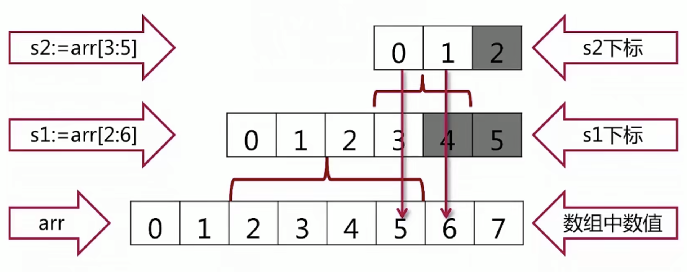
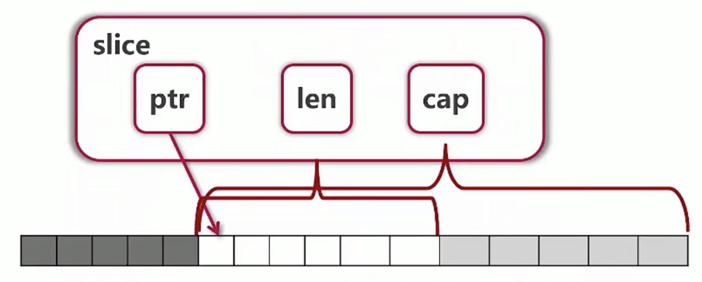

# 1.go 语言切片 Slice


## 1.1 **注意事项1：**go语言之中的slice类似于python之中的slice，左开右闭

**示例代码1：**

```go
package main

import "fmt"

func testSlice() {
	arr := [...]int{0, 1, 2, 3, 4, 5, 6, 7}
	sliceArr1 := arr[2:6]
	sliceArr2 := arr[2:]
	sliceArr3 := arr[:2]
	sliceArr4 := arr[:]
	fmt.Println(sliceArr1)
	fmt.Println(sliceArr2)
	fmt.Println(sliceArr3)
	fmt.Println(sliceArr4)
	// 输出结果
	/*
		[2 3 4 5]
		[2 3 4 5 6 7]
		[0 1]
		[0 1 2 3 4 5 6 7]
	*/
}

func main() {
	testSlice()
}
```


## 1.2 **注意事项2：**slice是被它切片的数组的一个视图，即我们对于视图进行的种种操作会反映到被我们切片的原始数组身上

**示例代码2：**

```go
package main

import "fmt"

func testSlice() {
   arr1 := [...]int{1, 2, 3, 4, 5, 6}
   slice1 := arr1[2:4]
   slice1[0] = 100
   fmt.Println(arr1) // 输出的结果为：[1 2 100 4 5 6] , 这里为什么索引[2]处的值为100呢？那是因为
  // 我们的 slice1[0] 对应的是 arr1[2]
}

func main() {
   testSlice()
}
```

## 1.3 **注意事项3：如果我们的函数参数之中使用数组的时候不传递参数，它代表切片**

**示例代码3：**

```go
package main

import "fmt"

func changeArrInFunction(arr []int) {
   arr[0] = 100
}

func printArr(arr []int) {
   fmt.Println(arr)
}

func main() {
   arr := [...]int{1, 2, 3, 4, 5}
   // 我们向其中传递的需要是数组的一个切片
   changeArrInFunction(arr[:])
   // 将修改完成的原数组进行打印
   printArr(arr[:]) // [100 2 3 4 5]
}
```

## 1.4 注意事项4：这里的slice还可以进一步的进行slice

**示例代码4：**

```go
package main

import "fmt"

func main() {
   arr := [...]int{1, 2, 3, 4, 5}
   arr[2:4][:1][0] = 100 // 在这里进行了两次slice, 一次index
   fmt.Println(arr) // [1 2 100 4 5]
}
```

## 1.5 一个较难的问题

**示例代码5：下面的代码不会进行报错的发生-即发生越界的情况，为什么呢？**

**原因：是对底层数组的一个view，虽然我超过了我该拿的部分，但是我底层还是有内容的，所以可以取出来**



```go
package main

import "fmt"

func main() {
	arr := [...]int{0, 1, 2, 3, 4, 5, 6, 7}
	s1 := arr[2:6]
	s2 := s1[3:5] // [2,3,4,5]
	fmt.Println(s2) // [5 6]
}
```

## 1.6 slice 的实现 - 三个重要的变量

ptr：指向了slice在原始数组之中起始的位置

len：存储了slice切片的长度，用来进行索引下标越界的判断。

cap：代表了从ptr开始到原始数组的末尾有多少个长度，所以只要我们不超过cap都可以进行扩展，cap可以通过cap(slice)进行获取。这也说明了slice可以向后进行扩展，但是不能够向前进行扩展。



通过下面的代码可以更加明显的看出：

```go
package main

import "fmt"

func main() {
   arr := [...]int{0, 1, 2, 3, 4, 5, 6, 7}
   s1 := arr[2:6]
   s2 := s1[3:5]
   fmt.Println(arr)
   fmt.Printf("s1: %v, len: %d, cap: %d\n", s1, len(s1), cap(s1))
   fmt.Printf("s2: %v, len: %d, cap: %d\n", s2, len(s2), cap(s2))
   // 输出结果
   /*
   [0 1 2 3 4 5 6 7]
   s1: [2 3 4 5], len: 4, cap: 6  从开始位置索引[2]到结尾一共6个元素所以cap = 6
   s2: [5 6], len: 2, cap: 3 从开始位置索引[5]到结尾一共3个元素所以cap = 3
   */
```

## 1.7  向slice之中进行元素的添加

**注意事项1：我们能够发现原数组后面的内容被覆盖了**

**注意事项2：slice却能够在超越原数组后自动向后进行扩展，这里的扩展的实现原理是，他们会将数组这一部分内容进行拷贝到新的地方，然后是对新的数组的一个视图，那么这样的话，修改视图就不能对原始数组进行连带修改了**

```go
package main

import "fmt"

func testAddElementsIntoSlice() {
	arr := [...]int{0, 1, 2, 3, 4, 5, 6, 7}
	s1 := arr[2:6]
	fmt.Println(s1) // [2 3 4 5]
	s2 := s1[3:5]
	fmt.Println(s2) // [5 6]
	s3 := append(s2, 10)
	fmt.Println(s3) // [5 6 10]
	s4 := append(s3, 11)
	fmt.Println(s4) // [5 6 10 11]
	s5 := append(s4, 12)
	s5[0] = 1000     // 修改s5的第一个元素
	fmt.Println(s5)  // [5 6 10 11 12]
	fmt.Println(arr) // [0 1 2 3 4 5 6 10] 即便s5的第一个元素被修改了，arr相应的元素也没有被修改
}

func main() {
	testAddElementsIntoSlice()
}

```

**总结一下：添加元素的时候如果超越cap，系统会重新分配更大的底层数组，由于值传递的关系，必须接收append的返回值，s=append(s,val)**


## 1.8 进行slice的创建-除了基于一个数组创建，就是我们一个不知道的数组的视图

### 1.8.1 方式1：通过append方法进行添加来进行创建-[下面打印了len和cap是如何添加的]

```go
package main

import "fmt"

func printSlice(slice []int) {
	fmt.Printf("len=%d cap=%d\n", len(slice), cap(slice))
}

func testAddElementsIntoSlice() {
	var s []int
	for i := 0; i < 10; i++ {
		s = append(s, 2*i+1)
		printSlice(s)
	}
	/*
		len=1 cap=1
		len=2 cap=2
		len=3 cap=4
		len=4 cap=4
		len=5 cap=8
		len=6 cap=8
		len=7 cap=8
		len=8 cap=8
		len=9 cap=16
		len=10 cap=16
	*/
}

func main() {
	testAddElementsIntoSlice()
}

```

### 1.8.2 方式2：通过[] type {....}进行创建

```go
package main

import "fmt"

func testCreateSlice() {
   s1 := []int{1, 2, 3, 4, 5, 6}
   fmt.Println(s1)
}

func main() {
   testCreateSlice()
}
```

### 1.8.3 方式3：通过make进行创建，我们可以指定len，和capacity

```go
package main

import "fmt"

func testCreateSlice() {
   // 创建一个len=5, cap=10的切片
   s1 := make([]int, 5, 10)
   s2 := s1[5:10]
   s2[1] = 100
   fmt.Println(s1)
   fmt.Println(s2)
}

func main() {
   testCreateSlice()
}
```

## 1.9 slice 进行拷贝

**调用的函数：copy(目的切片，源切片)**

```go
package main

import "fmt"

func testCopySlice() {
	// 创建一个len=5, cap=10的切片
	s1 := make([]int, 5, 10)
	s2 := make([]int, 5, 10)
	s1[0] = 100
	s1[1] = 200
	// 第一个参数是目标切片，第二个参数是源切片
	copy(s2, s1)
	fmt.Println(s1) // 输出结果 100 200 0 0 0
	fmt.Println(s2) // 输出结果 100 200 0 0 0
}

func main() {
	testCopySlice()
}

```


## 1.10 如何进行slice之中的某一个索引的元素的删除

**注意事项：slice之中没有专门的删除函数，我们可以通过索引来完成**

```go
package main

import "fmt"

func deleteSliceElementByIndex(slice []int, index int) []int {
   // ...类似于解包
   result := append(slice[:index], slice[index+1:]...)
   return result
}

func main() {
   result := deleteSliceElementByIndex([]int{1, 2, 3, 4, 5}, 2)
   fmt.Println(result)
}
```
