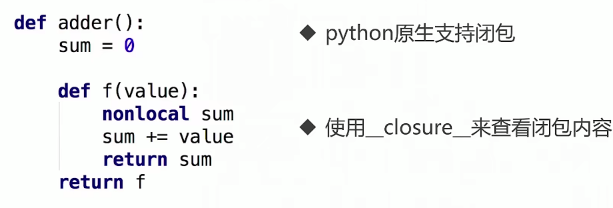
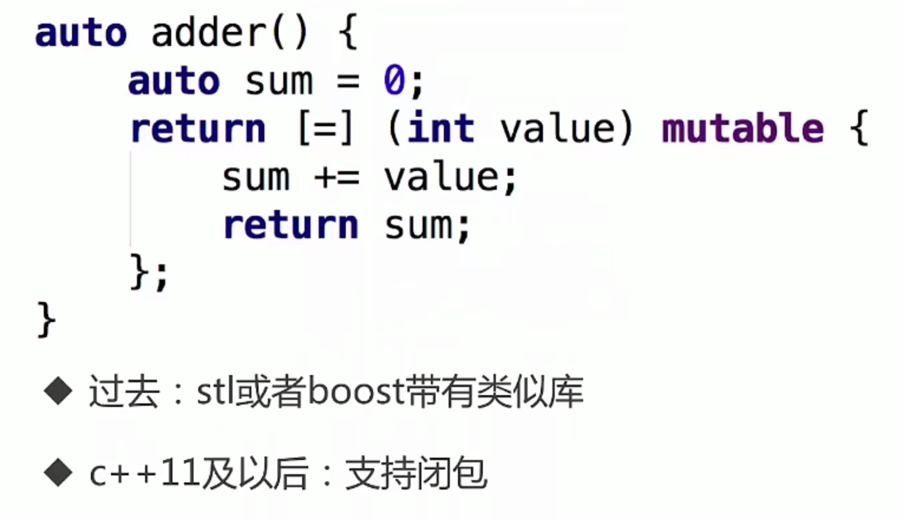
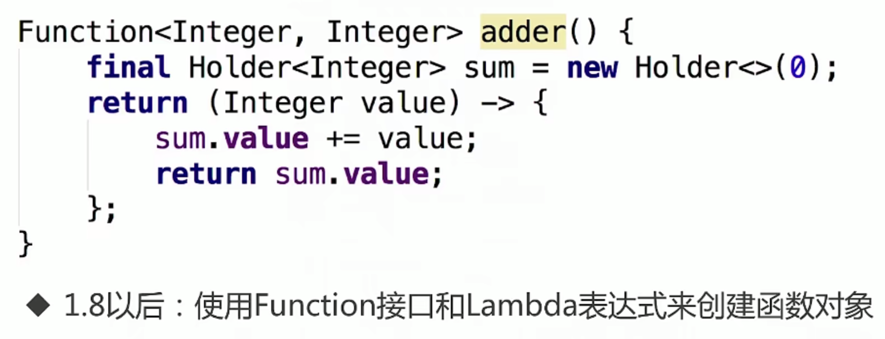

# 1. Go 语言函数与闭包


## 1.1 函数式编程到底是什么？要学习一些什么？

- 函数是一等公民：参数，变量，返回值等都可以是函数
- 高阶函数：函数的参数可以是函数比如我们的apply函数，我们可以传入一个函数，并且这个函数需要应用的参数
- 函数->闭包


## 1.2 正统的函数式编程

- 不可变性：不能有状态，只有常量和函数。
- 函数只能存在一个参数。
- 我们在学习的时候不做上述的规定。


## 1.3  闭包的功能

- 从函数的视角去看，将函数运行结束之后的状态能够保存下来，从而使得我们的函数拥有记忆的功能。
- 引用环境，可以认为是函数的一个状态，经过匿名函数处理之后会产生不同的值，从而函数能够拥有不同的状态


## 1.4 闭包的一个示例：累加器的实现

注意这里的return不能理解为返回代码，而应该理解为返回一个闭包，闭包包括了一个匿名函数+引用环境。

```go
package main

import "fmt"

func adder() func(int) int {
   // 函数的一个状态
   sum := 0
   // 匿名函数
   return func(x int) int {
      // x 是局部变量
      sum += x
      return sum
   }
}

func main() {
   a := adder()
   for i := 0; i < 10; i++ {
      fmt.Printf("0+...+%d = %d\n", i, a(i))
   }
   // 结果
   /*
   0+...+0 = 0
   0+...+1 = 1
   0+...+2 = 3
   0+...+3 = 6
   0+...+4 = 10
   0+...+5 = 15
   0+...+6 = 21
   0+...+7 = 28
   0+...+8 = 36
   0+...+9 = 45
   */
}
```


## 1.5 闭包的第二个示例：记录函数的调用次数

```go
package main

import "fmt"

// SayHello 注意这里要定义返回值的类型 func()
func SayHello() func() {
   // 用来记录函数被调用的次数
   count := 0
   // 注意这里要进行return
   return func() {
      count += 1
      fmt.Printf("Say Hello 被调用了 %d 次\n", count)
   }
}

func main() {
   sayHelloer := SayHello() // 这里返回的是一个闭包，包含了环境
   sayHelloer()
   sayHelloer()
   sayHelloer()
   /*
   Say Hello 被调用了 1 次
   Say Hello 被调用了 2 次
   Say Hello 被调用了 3 次
   */
}
```


## 1.6 其他语言之中的闭包

### 1.6.1 python 之中的闭包



### 1.6.2 c++ 之中的闭包



### 1.6.3 java 之中的闭包

