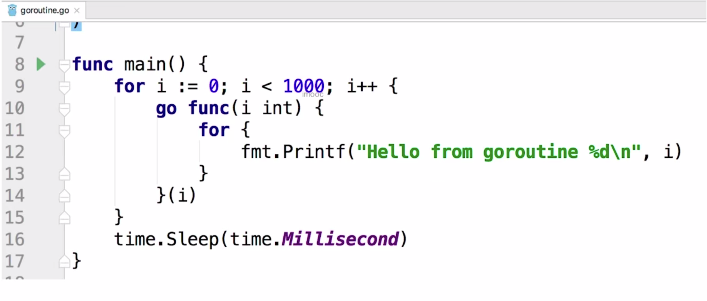
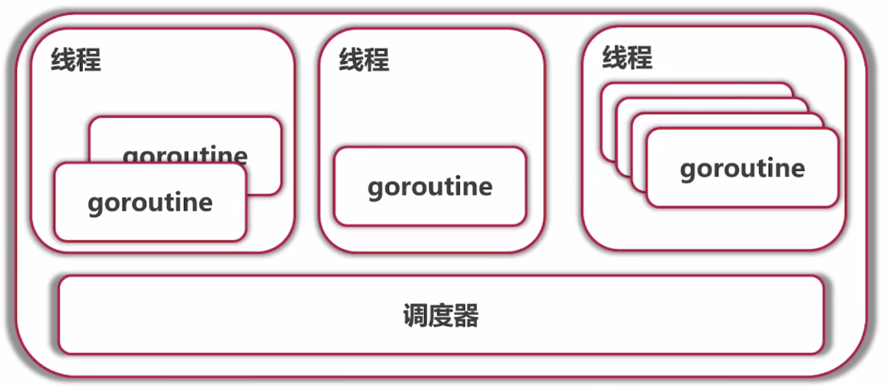

# 1. Go 语言 goroutine

## 1.1 示例代码

**注意事项1：**下面的主要注意点是 <font color="red"> go </font> 这个关键字，go 关键字让它所指明的 func 能够并发的进行执行。下面这个代码模拟了总共有1000个并发执行的协程，在不停的进行打印 Hello from goroutine 这一段语句。

**注意事项2：** 下面这行代码如果没有我们的time.Sleep(time.Millisecond)什么也不会输出，这是因为程序在启动时首先会为main函数创建一个默认的goroutine，当main函数执行完的时候该goroutine也就结束了，所以在main函数中启动的goroutine也就会随着main函数结束而一同结束。




## 1.2 goroutine 到底是什么?

它实际上是一个Coroutine协程，它是一个轻量级的线程。

- 非抢占式多任务处理，协程不会抱着资源不松手，而是只能靠协程自己主动进行控制权的交出。但是goroutine并不是完全不进行控制权的切换，而是会由调度器在合适的点进行切换。
- 编译器/解释器/虚拟机层面的多任务。
- 多个协程可以在一个或者多个线程上进行运行。
- 任何函数只需要加上go就能够送给调度器进行运行
- 不需要在定义的时候指明是否是goroutine


## 1.3 调度器

调度器上面负责进行协程的调度，即选择将哪几个协程放在一个物理线程之中去执行。在go语言之中，如果我们没有特殊的进行指定，最多开的线程的数量就是系统的核的数量。




## 1.4 什么是go语言的"非抢占式? "

**注意事项1：**就是一个协程如果自己不交出自己拿到的资源，别人就永远别想拿到，那么上面的Printf为什么能够正常呢？会有不同的人拿到控制权呢？因为是一个IO操作，携程必然会释放自己的控制权。

**注意事项2：**下面的示例代码在go1.13以及以前的版本之中，是无法获得结果的，会陷入到死循环之中，因为当主协程序sleep交出控制权之后，那么获得控制权的协程将会一直进行控制权的占有，主协程根本没有执行的机会。

**示例代码：**一个协程死循环的案例，我们指定只有一个核，并且main睡眠10ms，然后执行下面的代码，发现仅仅运行了一个协程，直到结束。

```go
package main

import (
	"fmt"
	"runtime"
	"time"
)

func main() {
	runtime.GOMAXPROCS(1) // 设置单核运行
	var a [10]int
	for i := 0; i < 10; i++ {
		go func(i int) {
			for {
				a[i]++
			}
		}(i)
	}
	time.Sleep(time.Millisecond * 10)
	fmt.Println(a) // 输出结果 [0 0 0 0 0 0 0 0 0 3118679]
}

```

如果我们将休眠的时间更改为100ms，那么其他的协程也会得到执行：因为这里go语言调度器发现了一个协程霸着不走了，那就忍不了了 ，只能够将控制权进行转移了。

```go
package main

import (
	"fmt"
	"runtime"
	"time"
)

func main() {
	runtime.GOMAXPROCS(1) // 设置单核运行
	var a [10]int
	for i := 0; i < 10; i++ {
		go func(i int) {
			for {
				a[i]++
			}
		}(i)
	}
	time.Sleep(time.Millisecond * 100)
	fmt.Println(a) // 输出结果 [6275969 8928355 11021818 11769681 0 0 0 0 0 3393392]
}
```


## 1.5 主动进行控制权的交出

**代码：**runtime.Gosched()

```go
package main

import (
   "fmt"
   "runtime"
   "time"
)

func main() {
   runtime.GOMAXPROCS(1) // 设置单核运行
   var a [10]int
   for i := 0; i < 10; i++ {
      go func(i int) {
         for {
            a[i]++
            runtime.Gosched() // 让出时间片
         }
      }(i)
   }
   time.Sleep(time.Millisecond * 10)
   fmt.Println(a) // 输出结果 [7056 7056 7056 7056 7056 7056 7056 7056 7056 8233]

}
```


## 1.6 goroutine 可能的切换点总结

- I/O, select
- channel
- 等待锁
- 函数调用
- runtime.Gosched()
- 循环调用时间过长

上述只是参考，不能保证切换，不能保证在其他地方不进行切换。