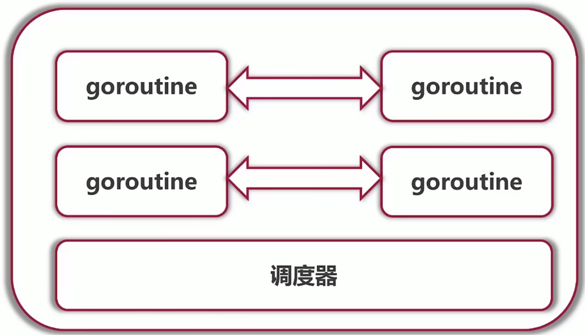

# 1. go 语言 channel


## 1.1 channel 到底是什么?

**goroutine 之间靠的就是 channel 进行相互的通信：**




## 1.2 示例代码1：无缓冲buffer

**注意事项：**下面的代码将会发生死锁的现象，因为没有给缓冲区。没有缓冲区的话，如果我们向channel之中写入了一个数据，而没有人读取的话，就会sleep，因为其没有多余的空间可以存储第二个数据。

**报错信息：**fatal error: all goroutines are asleep - deadlock!

```go
package main

import (
   "fmt"
   "runtime"
)

func channelDemo() {
   runtime.GOMAXPROCS(1) // 设置单核运行
   channel := make(chan int) // 使用这行代码我们可以创建出一个channel 第二个参数是缓冲区大小
   channel <- 2         // 我们可以向channel之中进行数据的写入
   channel <- 3         // 我们可以向channel之中进行数据的写入
   result1 := <-channel // 我们可以从channel之中进行数据的读取
   result2 := <-channel
   fmt.Println(result1, result2) // 输出结果为 2 3
}

func main() {
   channelDemo() 
}
```


## 1.3 示例代码2：带缓冲的buffer

```go
package main

import (
   "fmt"
   "runtime"
)

func channelDemo() {
   runtime.GOMAXPROCS(1) // 设置单核运行
   // 使用这行代码 var channel chan int , 我们可以得到 channel == nil
   channel := make(chan int, 2) // 使用这行代码我们可以创建出一个channel 第二个参数是缓冲区大小
   // 在go 1.13 版本以及以前发送1之后会导致死锁的发生。但是在go1.14 版本后能够正常执行
   // 从下面的输出结果之中我们可以感觉到这是一个输入输出的队列
   channel <- 2         // 我们可以向channel之中进行数据的写入
   channel <- 3         // 我们可以向channel之中进行数据的写入
   result1 := <-channel // 我们可以从channel之中进行数据的读取
   result2 := <-channel
   fmt.Println(result1, result2) // 输出结果为 2 3
}

func main() {
   channelDemo() // 输出的结果为1
}
```


## 1.4 示例代码3：多生产者多消费者的情况

**注意事项：**<- chan int 代表只能从这个channel之中读取数据，chan <- int 代表只能够向这个channel之中写入数据。

```go
package main

import (
	"fmt"
	"time"
)

type IntFunc = func() int
type IntChannel = chan int

// 数据递增的生成器 - 闭包 - 每次会 + 1
func numberGenerator() IntFunc {
	currentState := 0
	return func() int {
		currentState++
		return currentState
	}
}

// 向队列之中进行数据的插入，获得channel之后只能够向channel之中进行数据的读取
func createProducer(generator IntFunc, producerNumber int) <-chan int {
	// 创建自己的channel用来进行数据的产生
	channel := make(chan int)
	go func() {
		// 如果 channel 不满的话那么我们进行数据的写入
		for {
			genNumber := generator()
			channel <- genNumber
			fmt.Printf("producer %d produce %d \n", producerNumber, genNumber)
		}
	}()
	return channel
}

// 从channel之中进行数据的读取
func createConsumer(channel <-chan int, consumerNumber int) {
	go func() {
		for {
			fmt.Printf("consumer %d consume %d \n", consumerNumber, <-channel)
		}
	}()
}

func testInputAndOutput() {
	// 总共有两个生产者和两个消费者
	singleGenerator := numberGenerator()
	// channel1 channel2 我们可以用来进行数据的读取
	channel1 := createProducer(singleGenerator, 1)
	createConsumer(channel1, 1)
	createConsumer(channel1, 2)
}

func main() {
	testInputAndOutput()
	time.Sleep(time.Millisecond * 10)
}
```


## 1.5 如何告诉消费者，生产者的数据已经发完了

**代码：**使用close(channel)方法，一旦channel close之后我们就不能够想channel之中进行数据的写入了，不然会发生报错。但是虽然channel不能进行写入了，但是还是能够进行读出的，读出的将都是0

```go
package main

import (
	"fmt"
	"time"
)

type IntFunc = func() int
type IntChannel = chan int

// 数据递增的生成器 - 闭包 - 每次会 + 1
func numberGenerator() IntFunc {
	currentState := 0
	return func() int {
		currentState++
		return currentState
	}
}

// 向队列之中进行数据的插入，获得channel之后只能够向channel之中进行数据的读取
func createProducer(generator IntFunc, producerNumber int) <-chan int {
	// 创建自己的channel用来进行数据的产生
	channel := make(chan int, 10)
	go func() {
		// 如果 channel 不满的话那么我们进行数据的写入
		count := 1
		for {
			genNumber := generator()
			channel <- genNumber
			fmt.Printf("producer %d produce %d \n", producerNumber, genNumber)
			if count == 50 {
				close(channel)
				return
			} else {
				count++
			}
		}
	}()
	return channel
}

// 从channel之中进行数据的读取
func createConsumer(channel <-chan int, consumerNumber int) {
	go func() {
		for {
			fmt.Printf("consumer %d consume %d \n", consumerNumber, <-channel)
		}
	}()
}

func testInputAndOutput() {
	// 总共有两个生产者和两个消费者
	singleGenerator := numberGenerator()
	// channel1 channel2 我们可以用来进行数据的读取
	channel1 := createProducer(singleGenerator, 1)
	createConsumer(channel1, 1)
	createConsumer(channel1, 2)
}

func main() {
	testInputAndOutput()
	time.Sleep(time.Millisecond)
}

// 输出结果
// 打印出了很多
/*
...
consumer 1 consume 0 
consumer 1 consume 0 
...
*/
```

### 1.5.1 解决方案1：判断是否读取完毕

```go
package main

import (
	"fmt"
	"time"
)

type IntFunc = func() int
type IntChannel = chan int

// 数据递增的生成器 - 闭包 - 每次会 + 1
func numberGenerator() IntFunc {
	currentState := 0
	return func() int {
		currentState++
		return currentState
	}
}

// 向队列之中进行数据的插入，获得channel之后只能够向channel之中进行数据的读取
func createProducer(generator IntFunc, producerNumber int) <-chan int {
	// 创建自己的channel用来进行数据的产生
	channel := make(chan int, 10)
	go func() {
		// 如果 channel 不满的话那么我们进行数据的写入
		count := 1
		for {
			genNumber := generator()
			channel <- genNumber
			fmt.Printf("producer %d produce %d \n", producerNumber, genNumber)
			if count == 50 {
				close(channel)
				return
			} else {
				count++
			}
		}
	}()
	return channel
}

// 从channel之中进行数据的读取
func createConsumer(channel <-chan int, consumerNumber int) {
	go func() {
		for {
			value, ok := <-channel
			if ok {
				fmt.Printf("consumer %d consume %d \n", consumerNumber, value)
			} else {
				break
			}
		}
	}()
}

func testInputAndOutput() {
	// 总共有两个生产者和两个消费者
	singleGenerator := numberGenerator()
	// channel1 channel2 我们可以用来进行数据的读取
	channel1 := createProducer(singleGenerator, 1)
	createConsumer(channel1, 1)
	createConsumer(channel1, 2)
}

func main() {
	testInputAndOutput()
	time.Sleep(time.Millisecond * 10)
}

// 输出结果
/*
100 行的输出
producer 50行的输出
两个 consumer 50行的输出
*/

```

### 1.5.2 使用 range 命令

```go
package main

import (
	"fmt"
	"time"
)

type IntFunc = func() int
type IntChannel = chan int

// 数据递增的生成器 - 闭包 - 每次会 + 1
func numberGenerator() IntFunc {
	currentState := 0
	return func() int {
		currentState++
		return currentState
	}
}

// 向队列之中进行数据的插入，获得channel之后只能够向channel之中进行数据的读取
func createProducer(generator IntFunc, producerNumber int) <-chan int {
	// 创建自己的channel用来进行数据的产生
	channel := make(chan int, 10)
	go func() {
		// 如果 channel 不满的话那么我们进行数据的写入
		count := 1
		for {
			genNumber := generator()
			channel <- genNumber
			if count == 50 {
				close(channel)
				return
			} else {
				count++
				fmt.Printf("producer %d produce %d \n", producerNumber, genNumber)
			}
		}
	}()
	return channel
}

// 从channel之中进行数据的读取
func createConsumer(channel <-chan int, consumerNumber int) {
	go func() {
		for value := range channel {
			fmt.Printf("consumer %d consume %d \n", consumerNumber, value)
		}
	}()
}

func testInputAndOutput() {
	// 总共有两个生产者和两个消费者
	singleGenerator := numberGenerator()
	// channel1 channel2 我们可以用来进行数据的读取
	channel1 := createProducer(singleGenerator, 1)
	createConsumer(channel1, 1)
	createConsumer(channel1, 2)
}

func main() {
	testInputAndOutput()
	time.Sleep(time.Millisecond * 10)
}

// 输出结果
/*
100 行的输出
producer 50行的输出
两个 consumer 50行的输出
*/

```


## 1.6 如何去掉time.Millisecond这种不确定的方式

**解析：**由于主协程一掉，那么所有的协程都将停止运行，而不确定是否任务已经执行完毕，而导致我们通常需要分配更大的Sleep的时间

**解决方案：**在main之中同样执行一个消费者的逻辑，让main感知到消费者已经将生产者发布的任务执行完毕。

**注意事项：**对down的操作一定要放在最开始的位置，不要放在可能发生切换的位置之后，比如fmt.Println()

```go
package main

import (
	"fmt"
)

type IntFunc = func() int
type IntChannel = chan int

// 数据递增的生成器 - 闭包 - 每次会 + 1
func numberGenerator() IntFunc {
	currentState := 0
	return func() int {
		currentState++
		return currentState
	}
}

// 向队列之中进行数据的插入，获得channel之后只能够向channel之中进行数据的读取
func createProducer(generator IntFunc, producerNumber int, down chan<- bool) <-chan int {
	// 创建自己的channel用来进行数据的产生
	channel := make(chan int, 10)
	go func() {
		// 如果 channel 不满的话那么我们进行数据的写入
		count := 1
		for {
      down <- true
			genNumber := generator()
			channel <- genNumber
			fmt.Printf("producer %d produce %d \n", producerNumber, genNumber)
			if count == 50 {
				close(channel)
				return
			} else {
				count++
			}
		}
	}()
	return channel
}

// 从channel之中进行数据的读取
func createConsumer(channel <-chan int, consumerNumber int, down <-chan bool) {
	go func() {
		for value := range channel {
      <-down
			fmt.Printf("consumer %d consume %d \n", consumerNumber, value)
		}
	}()
}

func testInputAndOutput() {
	// 总共有两个生产者和两个消费者
	singleGenerator := numberGenerator()
	downChannel := make(chan bool)
	// channel1 channel2 我们可以用来进行数据的读取
	channel1 := createProducer(singleGenerator, 1, downChannel)
	createConsumer(channel1, 1, downChannel)
	createConsumer(channel1, 2, downChannel)
	// downChannel 之中如果没有数据了就代表结束了
	for value := range channel1 {
		fmt.Printf("consumer %d consume %d \n", 3, value)
		<-downChannel
	}
}

func main() {
	testInputAndOutput()
}
```


## 1.7 使用 waitGroup 完成上述的任务

使用的结构体：sync.WaitGroup

- Add(int) 进行任务的添加
- Done() 代表任务的完成
- Wait() 代表阻塞直到任务的完成

注意事项：我们的 waitGroup.Add(1) waitGroup.Done() 一定要放在切换的语句之前

```go
package main

import (
   "fmt"
   "sync"
)

type IntFunc = func() int
type IntChannel = chan int

// 数据递增的生成器 - 闭包 - 每次会 + 1
func numberGenerator() IntFunc {
   currentState := 0
   return func() int {
      currentState++
      return currentState
   }
}

// 向队列之中进行数据的插入，获得channel之后只能够向channel之中进行数据的读取
func createProducer(generator IntFunc, producerNumber int, waitGroup *sync.WaitGroup) <-chan int {
   // 创建自己的channel用来进行数据的产生
   channel := make(chan int, 10)
   go func() {
      // 如果 channel 不满的话那么我们进行数据的写入
      count := 1
      for {
         genNumber := generator()
         waitGroup.Add(1)
         channel <- genNumber
         fmt.Printf("producer %d produce %d \n", producerNumber, genNumber)
         if count == 50 {
            close(channel)
            return
         } else {
            // 新生成一个任务
            count++
         }
      }
   }()
   return channel
}

// 从channel之中进行数据的读取
func createConsumer(channel <-chan int, consumerNumber int, waitGroup *sync.WaitGroup) {
   go func() {
      for value := range channel {
         waitGroup.Done() // 解决一个任务
         fmt.Printf("consumer %d consume %d \n", consumerNumber, value)
      }
   }()
}

func testInputAndOutput() {
   // 总共有两个生产者和两个消费者
   singleGenerator := numberGenerator()
   waitGroup := &sync.WaitGroup{}
   // channel1 channel2 我们可以用来进行数据的读取
   channel1 := createProducer(singleGenerator, 1, waitGroup)
   createConsumer(channel1, 1, waitGroup)
   createConsumer(channel1, 2, waitGroup)
   waitGroup.Wait()
   for value := range channel1 {
      waitGroup.Done() // 解决一个任务
      fmt.Printf("consumer %d consume %d \n", 3, value)
   }
}

func main() {
   testInputAndOutput()
}
```
