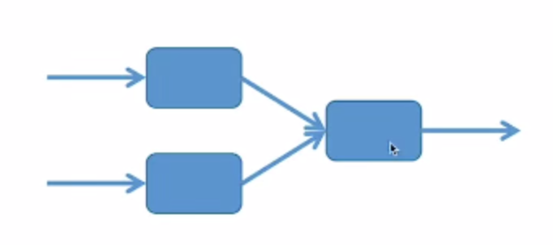

# 1. Go 语言并发编程模式

## 1.1 函数返回一个channel充当生成器

**示例代码：**一个消息生成器

**抽象理解：**生成器可以被认为是一种服务或者应用。

```go
package main

import "fmt"

// 返回一个只读的管道
func msgGen() <-chan string {
	msg := make(chan string)
	go func() {
		for i := 0; i <= 10; i++ {
			msg <- fmt.Sprintf("msg %d", i)
		}
		close(msg)
	}()
	return msg
}

func main() {
	msg := msgGen()
	for item := range msg {
		println(item)
		// 输出结果
		/*
			msg 0
			msg 1
			msg 2
			msg 3
			msg 4
			msg 5
			msg 6
			msg 7
			msg 8
			msg 9
			msg 10
		*/
	}
}
```

## 1.2 多个生成器如何并发处理收到的数据

增加一个中间的节点 fanIn

### 1.2.1 方式1：通过开多个线程的方式



```go
package main

import (
	"fmt"
)

// 返回一个只读的管道
func msgGen(service string) chan string {
	msg := make(chan string)
	go func() {
		for i := 0; i <= 5; i++ {
			msg <- fmt.Sprintf("service %s msg %d", service, i)
		}
		close(msg)
	}()
	return msg
}

func fanIn(service1, service2 chan string) chan string {
	c := make(chan string)
	service1Done := false
	service2Done := false
	go func() {
		for item := range service1 {
			c <- item
		}
		fmt.Println("end service1")
		service1Done = true
	}()
	go func() {
		for item := range service2 {
			c <- item
		}
		fmt.Println("end service2")
		service2Done = true
	}()
	go func() {
		for {
			if service1Done && service2Done {
				close(c)
				return
			}
		}
	}()
	return c
}

func main() {
	service1 := msgGen("service1")
	service2 := msgGen("service2")
	c := fanIn(service1, service2)
	for item := range c {
		fmt.Println(item)
	}
}
// 输出结果
/*
service service1 msg 0
service service1 msg 1
service service1 msg 2
service service2 msg 0
service service1 msg 3
service service2 msg 1
service service1 msg 4
service service2 msg 2
service service2 msg 3
service service1 msg 5
end service1
service service2 msg 4
service service2 msg 5
end service2
*/
```

### 1.2.2 方式2 通过select的方式

```go
package main

import (
   "fmt"
)

// 返回一个只读的管道
func msgGen(service string) chan string {
   msg := make(chan string)
   go func() {
      for i := 0; i <= 5; i++ {
         msg <- fmt.Sprintf("service %s msg %d", service, i)
      }
      close(msg)
   }()
   // 判断是否被关闭

   return msg
}

func fanInBySelect(service1, service2 chan string) chan string {
   c := make(chan string)
   service1Down := false
   service2Down := false
   go func() {
      for {
         select {
         // 从service1 之中读取数据
         case msg, ok := <-service1:
            if service1Down = !ok; ok {
               c <- msg
            } else {
               fmt.Println("service1 is down ", service1Down)
            }
         // 从service2 之中读取数据
         case msg, ok := <-service2:
            if service2Down = !ok; ok {
               c <- msg
            } else {
               fmt.Println("service2 is down ", service2Down)
            }
         }
         // 如果两个都关闭了，那么就退出
         if service1Down && service2Down {
            close(c)
            break
         }
      }
   }()
   return c
}

func main() {
   service1 := msgGen("service1")
   service2 := msgGen("service2")
   c := fanInBySelect(service1, service2)
   for item := range c {
      fmt.Println(item)
   }
}
```

