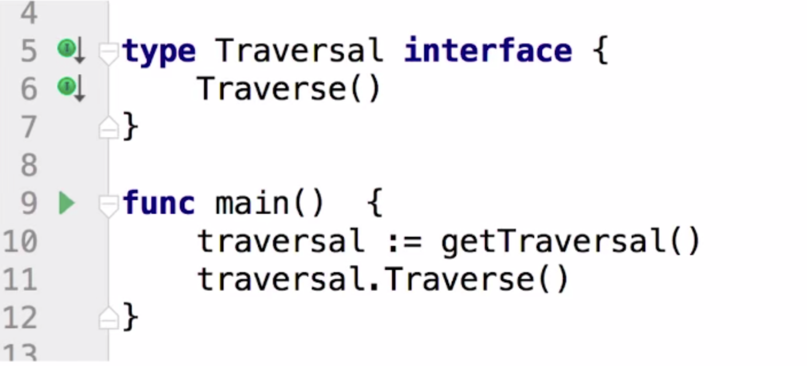
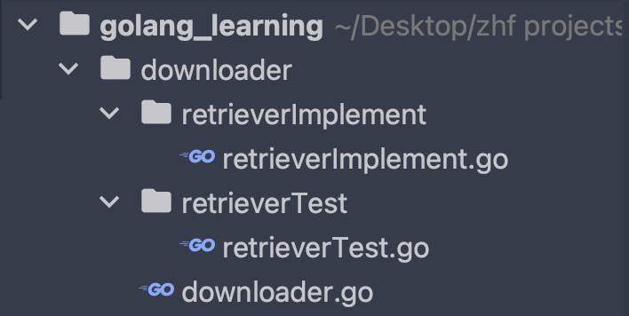

# 1. Go语言接口


## 1.1 接口的概念

**对强类型语言熟悉的同学：**熟悉接口的概念，因为在编译的时候确定类型，所以我们把类型写死之后，一改就需要全部修改。

**对弱类型语言熟悉的同学：**少（没）有接口的概念，因为在运行的时候确定类型。

**接口的概念：**接口是一个规范，规范下面可能有各个人各个团队的不同的实现，比如一个用来获取页面的retriver结构体对象，他可能内部的实现的get方法真的能够获取页面，也可能是测试组的一个测试的get方法，只返回一行测试的语句。但是他们共同的特点是可以调用get方法，这就是接口所要规范的内容。

**总结下来就是下面这张图的含义：**我们getTraversal的时候获取到的是实现了Traverse方法的结构体。因此可以实现所谓的多态。




## 1.2 示例代码

**目录结构：**



**各个文件的代码：**

retrieverImplement的代码：

```go
package retrieverImplement

import (
   "io/ioutil"
   "net/http"
)

type ImplementRetriever struct {
}

func (retriever ImplementRetriever) Get(url string) string {
   resp, err := http.Get(url)
   if err != nil {
      panic(err)
   }
   defer resp.Body.Close()
   bytes, _ := ioutil.ReadAll(resp.Body)
   return string(bytes)
}
```

retrieverTest.go的代码：

```go
package retrieverTest

type TestRetriever struct {
}

func (TestRetriever TestRetriever) Get(url string) string {
   return "Test Retriever"
}
```

downloader.go的代码：

```go
package main

import (
   "fmt"
   "golang_learning/downloader/retrieverImplement"
   "golang_learning/downloader/retrieverTest"
)

type Retriever interface {
   Get(url string) string
}

func getRetriever(name string) Retriever {
   if name == "test" {
      return retrieverTest.TestRetriever{}
   } else if name == "implement" {
      return retrieverImplement.ImplementRetriever{}
   } else {
      return nil
   }
}

func main() {
   retriever := getRetriever("test")
   if retriever == nil {
      fmt.Println("retriever is nil")
      return
   } else {
      result := retriever.Get("https://www.baidu.com")
      fmt.Println(result) // Test Retriever
   }
}
```
