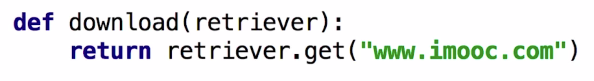
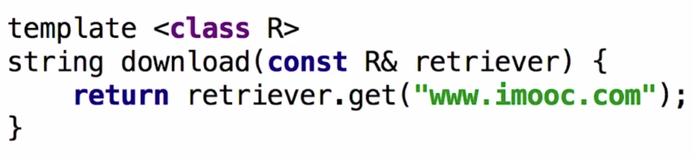
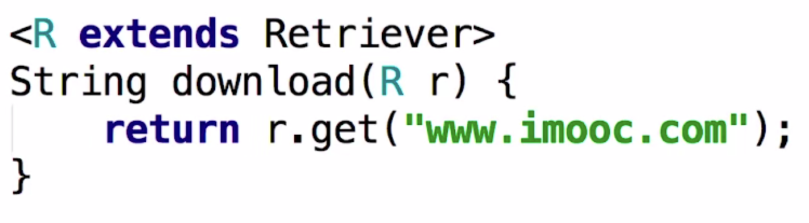

# 1. Go 语言duckTyping

## 1.1 一个问题

**大黄鸭是不是鸭子？**

传统类型系统：脊索动物门，脊椎动物亚门，鸟纲雁形目，从这些死板的类型之中，它连生命都没有，绝对不可能是一个鸭子

duck typing：是一个鸭子，因为他长得像鸭子，行为像鸭子。他描述事物的外部行为而非内部结构。

## 1.2 其他语言之中的duckTyping

### 1.2.1 python 之中的 duckTyping

- 运行的时候才能够知道传入的retriever之中含不含有get方法。
- 需要注释来说明接口

### 1.2.2 c++ 之中的 duckTyping

**第一种方式：通过模版的方式进行实现**

- 编译的时候才知道传入的retriever有没有get方法。[打代码的时候不知道]
- 需要注释来说明接口

**第二种方式：通过继承接口的方式进行实现**

- 我们编写一个接口， 其中有一个抽象方法。
- 然后我们可以编写多个实现类来继承这个接口，然后我们有一个方法，他的参数是这个接口，我们只要传入这个接口的实现类对象就可以了。
- 但是这个也不是duck typing

### 1.2.3 java 之中的 duckTyping

- 可以逼迫使用者必须实现Retriever接口，不会出现编译时或者运行时的错误，这个很好。
- 但是这个不是duckTyping，因为我们需要完整的实现一整个接口。
- 同时需要Readable, Appendable没办法。

## 1.3 go 语言之中我们想要的duck typing

- 同时能够拥有Readable，Appendable的功能。
- 同时具有python，c++的duck typing的灵活性
- 同时具有java的类型检查。

