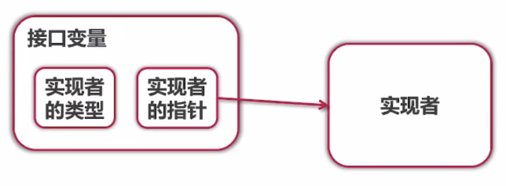

# 1. Go 语言接口的实现类型

## 1.1 获取接口的实现类型

方式1：我们可以通过 %T 进行类型的打印

方式2：我们可以通过 switch 对象.(type) 进行类型的确定

```go
package main

import (
   "fmt"
   "golang_learning/downloader/retrieverImplement"
   "golang_learning/downloader/retrieverTest"
)

type Retriever interface {
   Get(url string) string
}

func getRetriever(name string) Retriever {
   if name == "test" {
      return retrieverTest.TestRetriever{}
   } else if name == "implement" {
      return retrieverImplement.ImplementRetriever{}
   } else {
      return nil
   }
}

func main() {
   test := getRetriever("test")
   implement := getRetriever("implement")
   fmt.Printf("%T %v\n", test, test)
   fmt.Printf("%T %v\n", implement, implement)
   switch test.(type) {
   case retrieverTest.TestRetriever:
      fmt.Println("Test Retriever")
   case retrieverImplement.ImplementRetriever:
      fmt.Println("Implement Retriever")
   default:
      fmt.Println("Unknown Retriever")
   }
   switch implement.(type) {
   case retrieverTest.TestRetriever:
      fmt.Println("Test Retriever")
   case retrieverImplement.ImplementRetriever:
      fmt.Println("Implement Retriever")
   default:
      fmt.Println("Unknown Retriever")
   }
   // 输出结果
   /*
   retrieverTest.TestRetriever {}
   retrieverImplement.ImplementRetriever {}
   Test Retriever
   Implement Retriever
   */
}
```

## 1.2 进行类型断言 - [一个返回值=对象.(类型)]

如果对象不是括号内给定的类型将会报错：

```go
package main

import (
	"golang_learning/downloader/retrieverImplement"
	"golang_learning/downloader/retrieverTest"
)

type Retriever interface {
	Get(url string) string
}

func getRetriever(name string) Retriever {
	if name == "test" {
		return retrieverTest.TestRetriever{}
	} else if name == "implement" {
		return retrieverImplement.ImplementRetriever{}
	} else {
		return nil
	}
}

func main() {
	test := getRetriever("test")
	implement := getRetriever("implement")
	test = test.(retrieverTest.TestRetriever) // 正确的类型断言
	implement = implement.(retrieverTest.TestRetriever) // 错误的类型断言,因为只有一个接收返回值，发生错误会直接报错退出
}

```

报错如下：


## 1.3 类型转换 - [返回值1, 返回值2 = 对象.(类型)]

返回值1：转换完毕之后的对象

返回值2：是否转换成功的bool值

```go
package main

import (
   "fmt"
   "golang_learning/downloader/retrieverImplement"
   "golang_learning/downloader/retrieverTest"
)

type Retriever interface {
   Get(url string) string
}

func getRetriever(name string) Retriever {
   if name == "test" {
      return retrieverTest.TestRetriever{}
   } else if name == "implement" {
      return retrieverImplement.ImplementRetriever{}
   } else {
      return nil
   }
}

func main() {
   // 这里retriever的类型是Retriever，而不是retrieverImplement.ImplementRetriever
   retriever := getRetriever("implement")
   // 经过下面的语句后，如果成功，retriever的类型变成了retrieverImplement.ImplementRetriever
   implementRetriever, ok := retriever.(retrieverImplement.ImplementRetriever)
   implementRetriever.ImplementUnique = "Implement Retriever"
   if ok {
      fmt.Println(implementRetriever.ImplementUnique)
   } else {
      fmt.Println("convert failed")
   }
}
```

## 1.4 接口对象之中有什么?



如果实现的结构体实现的方法是指针接收者的话，那么我们要赋值给接口类型的时候，应该给的是实现者的地址，并且内部包含的就是实现者的指针

如果实现的结构体实现的方法是值接收者的话，那么内部包含的就是实现者，我们无论是传递实现者，还是实现者的地址都是可以的。

## 1.5 如何使用queue像python一样能够存储任何类型

只要将原来的type IntQueue []int改变为type Queue []interface{}即可，interface{}代表的匿名接口，并且做这个匿名接口的实现对象，不用实现任何方法，这就代表了所有类型都可以。

```go
package queue

type Queue []interface{}

func (q *Queue) PushBack(v interface{}) {
	*q = append(*q, v)
}

func (q *Queue) PopFront() interface{} {
	head := (*q)[0]
	*q = (*q)[1:]
	return head
}

func (q *Queue) IsEmpty() bool {
	return len(*q) == 0
}

```

```go
package main

import (
   "fmt"
   "golang_learning/queue"
)

func main() {
   temp := queue.Queue{1, 2, 3}
   temp.PushBack(4)
   temp.PushBack("abc")
   for !temp.IsEmpty() {
      fmt.Print(temp.PopFront(), ",")
   }
   // 输出结果
   // 1,2,3,4,abc,
}
```