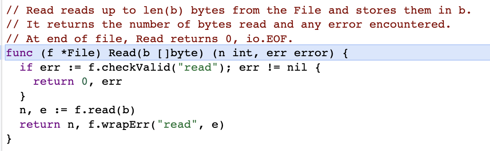
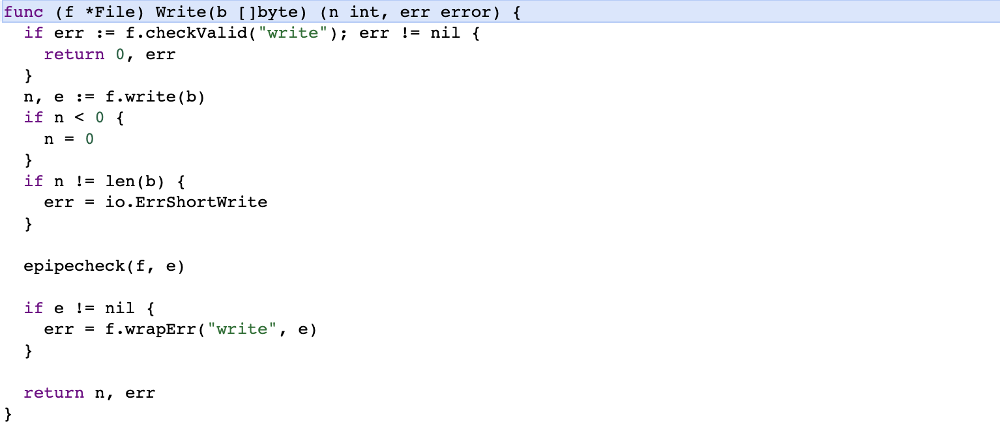

# 1. Go 语言常用系统接口

## 1.1 类似于 java 的 toString 方法 --  go语言有一个 Stringer 接口

**接口源代码：**

```go
type Stringer interface{
	String() string
}
```

在我们将对象进行打印的时候，默认将进行这个方法的调用。

**实现接口：**

```go
func (d Duck) String() string{
   return "My name is " + d.Name
}
```

```go
func main() {
   duckTemp := duck.Duck{Name: "duck"}
   fmt.Println(duckTemp) // My name is duck
}
```

## 1.2 Reader 和 Writer 接口

```go
type Reader interface {
   Read(p []byte) (n int, err error)
}
```

```go
type Writer interface {
   Write(p []byte) (n int, err error)
}
```

下面这是os.File实现的Reader接口的Read方法。



下面这是os.File实现的Writer接口的Write方法。



Fprintf要的第一个参数也是Writer，而不会直接是一个file

Fscanf要的第一个参数是Reader，而不会直接是一个file

所以我们倾向于将读写的结构体实现Writer或者Reader的方法，从而能够使用系统提供给我们的函数。