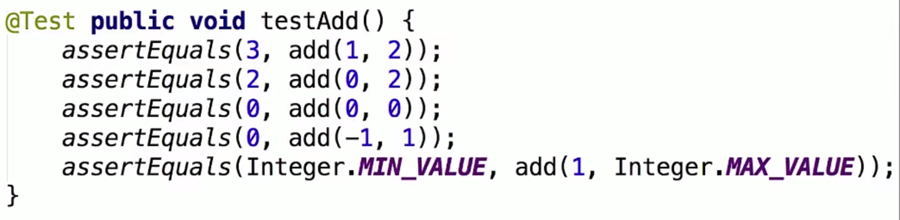
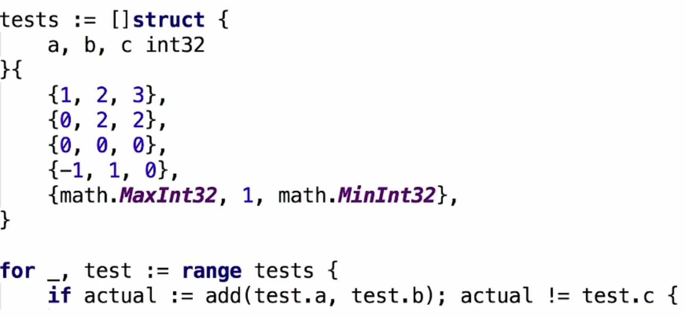
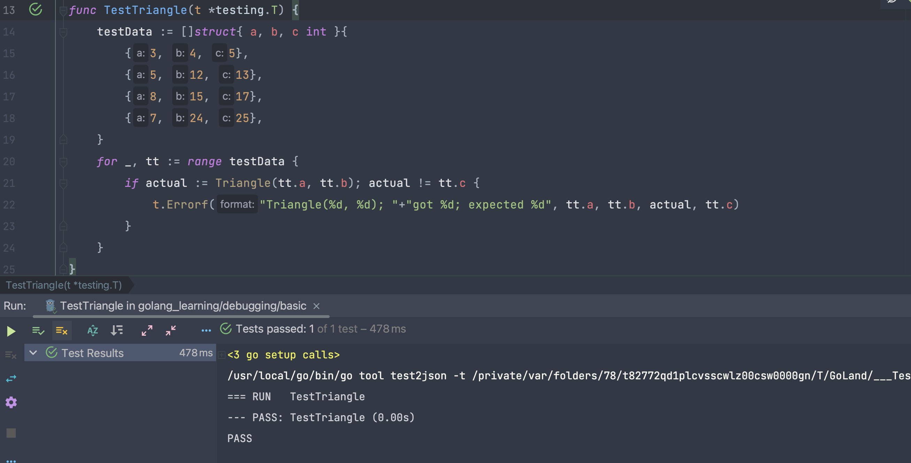
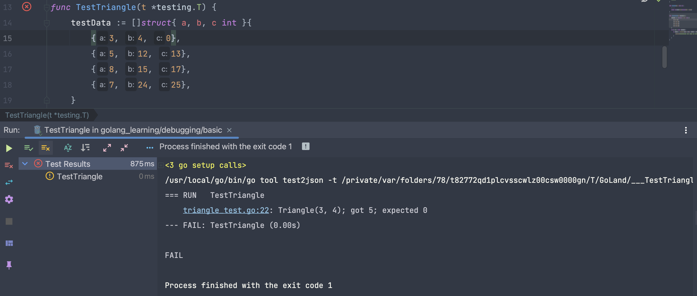
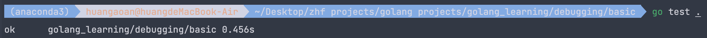

# 1. Go 语言测试

## 1.1 传统测试 vs 表格驱动测试

### 1.1.1 传统测试

**概念：**第一个参数是我们期待的值，第二个参数是计算出来的值，我们来看是否相等

**缺陷：**[1] 测试数据和测试逻辑混合在一起。[2] 出错信息不明确-不知道到底是哪一行出错了。[3] 一旦一个错了，测试全部解释



### 1.1.2 表格驱动测试

**优点：**[1] 分离的测试数据和测试逻辑 [2] 明确的出错信息 [3] 可以部分失败 [4] go语言的语法使得我们能够更加容易的实践表格驱动测试



## 1.2 表格驱动测试案例

### 1.2.1 在 pycharm IDE 之中完成测试

**说明：**已知三角形的两个直角边，求斜着的边。

```go
package add

import (
   "math"
   "testing"
)

func Triangle(a, b int) int {
   // 返回斜边
   return int(math.Sqrt(float64(a*a + b*b)))
}

func TestTriangle(t *testing.T) {
   // 使用struct数组进行测试数据的声明
   testData := []struct{ a, b, c int }{
      {3, 4, 5},
      {5, 12, 13},
      {8, 15, 17},
      {7, 24, 25},
   }
   for _, tt := range testData {
      if actual := Triangle(tt.a, tt.b); actual != tt.c {
         t.Errorf("Triangle(%d, %d); "+"got %d; expected %d", tt.a, tt.b, actual, tt.c)
      }
   }
}
```

如果我们的函数的参数只有一个t *testing.T，那么pycharm会自动生成运行的按钮：运行结果如下所示



如果出现失败的情况，具体如下图所示：会打印出具体的行



### 1.2.2 在命令行之中完成测试

