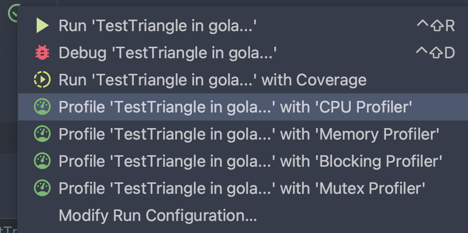
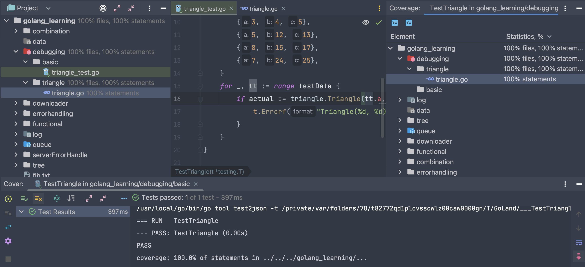
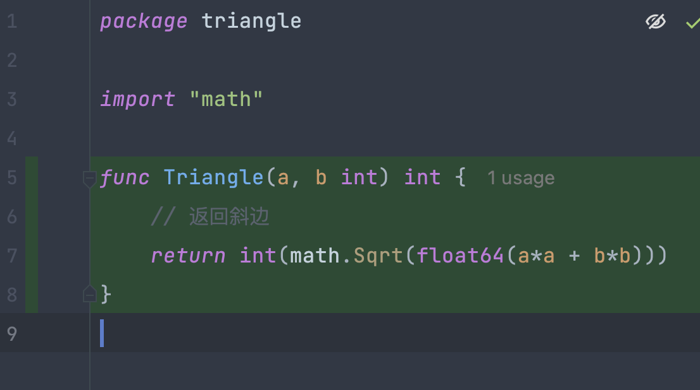
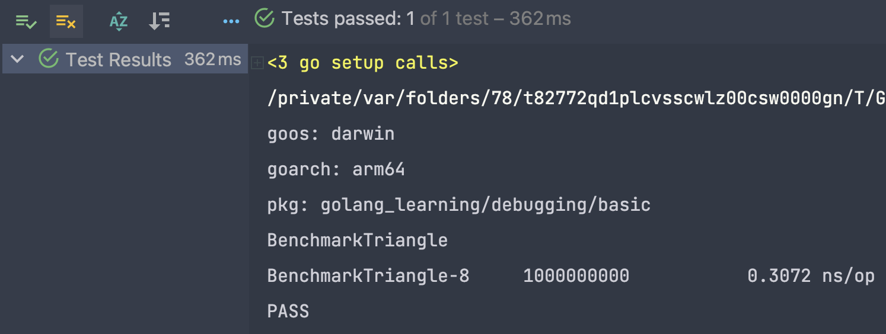
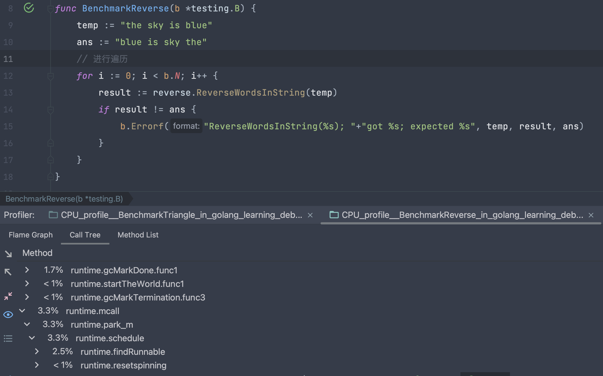

# 1. Go 语言对代码的测试覆盖率和性能测试

## 1.1 除了简单测试以外的其他一些测试

从下图来看，我们点击测试图标，可以发现，除了Run TestTriangle 以外，还有其他的 ... with Coverage / ... with CPU Profiler 等等。



## 1.2 测试我们测试的代码的比率 - 覆盖率

我们可以看到如下的代码，需要注意如果我们需要进行覆盖率的测试的话，测试代码和实现代码不要放在一个go源文件之中。



覆盖的代码在goland之中会使用绿色的进行覆盖：



## 1.3 性能测试与分析

**注意：**前面必须命名为Benchmark

```go
func BenchmarkTriangle(b *testing.B) {
   temp1 := 3
   temp2 := 4
   ans := 5

   for i := 0; i < b.N; i++ {
      result := triangle.Triangle(temp1, temp2)
      if result != ans {
         b.Errorf("Triangle(%d, %d); "+"got %d; expected %d", temp1, temp2, result, ans)
      }
   }
}
```

下面的是运行的结果：总共运行了1000000000次，每一次的时间的开销为0.3072ns，命令行上：go test -bench . 就可以了。



在benchamark之下我们还可以分析代码哪里运行的慢，哪里运行的快：只要点击cpu profiler就可以了。

