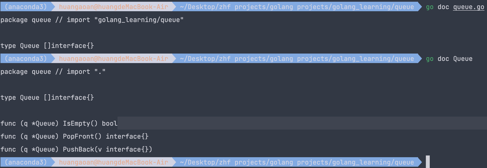
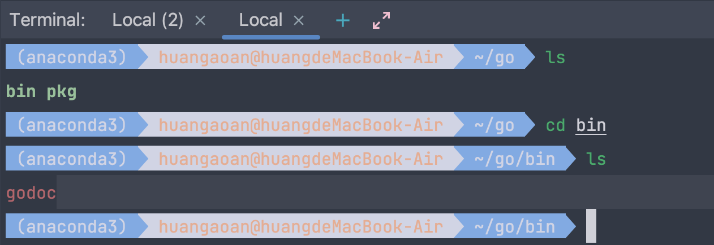
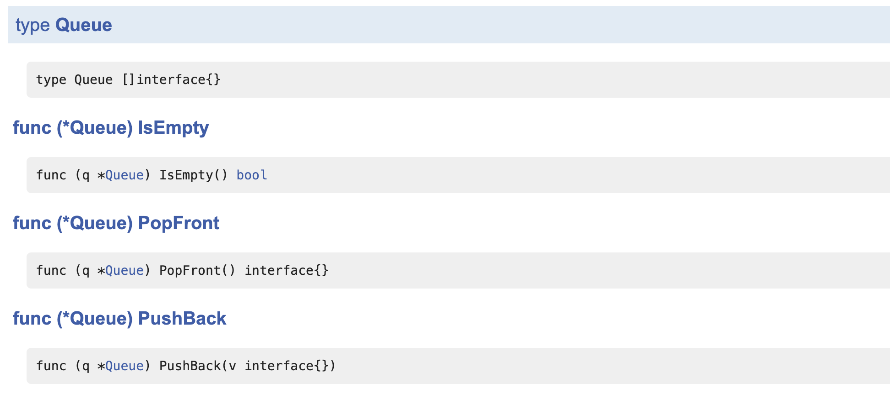
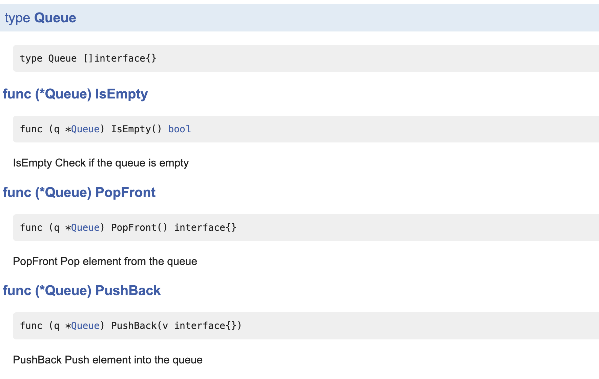
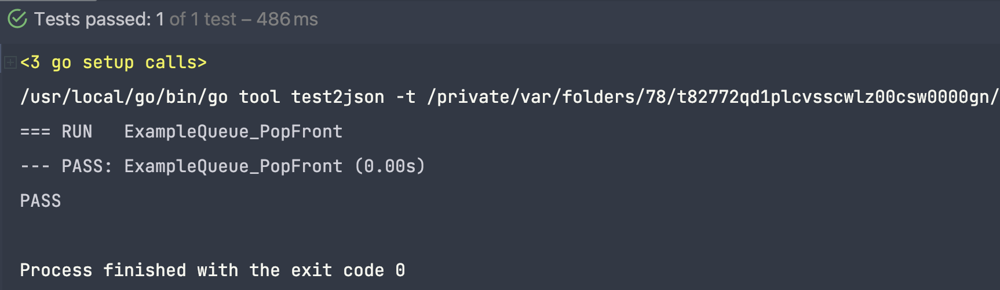
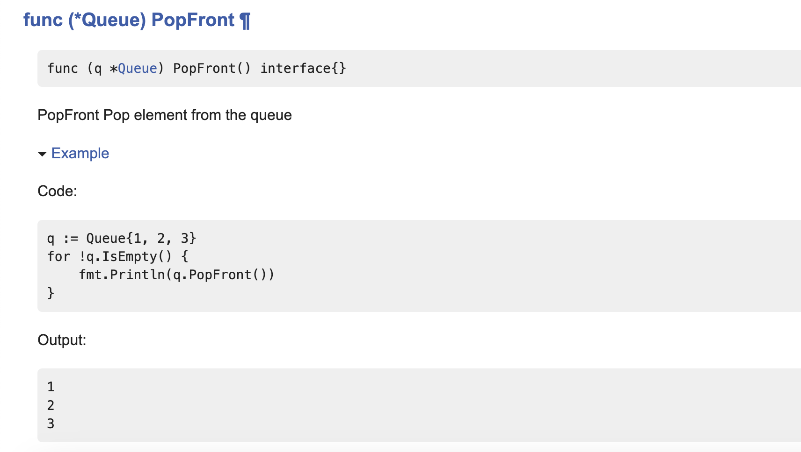

# 1.Go 语言文档和示例代码

## 1.1 Go 语言文档命令行 [go doc] 查询



## 1.2 服务器版本 godoc

**安装命令：**go install golang.org/x/tools/cmd/godoc@latest

**安装位置：**GOPATH 环境变量的位置 / bin

**具体目录如下图所示：**



**开启服务器的命令：**godoc -http :6060 我们发现除了一些包，也有一些我们自己实现的包，如下图所示


## 1.3 如何丰富我们的文档

### 1.3.1 添加简单的注释

当我们什么都没有添加的时候，结果如下所示：



当我们添加了顶层的注释之后：

```go
package queue

type Queue []interface{}

// PushBack Push element into the queue
func (q *Queue) PushBack(v interface{}) {
   *q = append(*q, v)
}

// PopFront Pop element from the queue
func (q *Queue) PopFront() interface{} {
   head := (*q)[0]
   *q = (*q)[1:]
   return head
}

// IsEmpty Check if the queue is empty
func (q *Queue) IsEmpty() bool {
   return len(*q) == 0
}
```

变成了如下：



### 1.3.2 添加示例代码

go 文件命名如下所示：


示例代码如下：

```go
func ExampleQueue_PopFront() {
   q := Queue{1, 2, 3}
   for !q.IsEmpty() {
      fmt.Println(q.PopFront())
   }
   // Output:
   // 1
   // 2
   // 3
}
```

这段代码也是可以运行的，不过我们需要严格遵照命名的格式：



之后在我们的http页面之中就可以看到我们的示例代码了：


