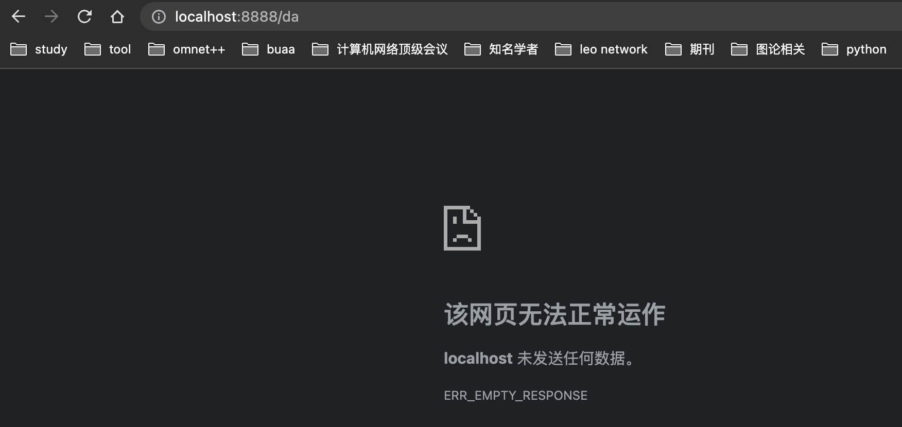

# 1.Go 语言如何实现统一错误逻辑处理-第一部分

## 1.1 服务器编程初步

http 是典型的 C/S 架构，客户端向服务端发送请求（request），服务端做出应答（response）。

golang 的标准库 `net/http` 提供了 http 编程有关的接口，封装了内部TCP连接和报文解析的复杂琐碎的细节，使用者只需要和 `http.request` 和 `http.ResponseWriter` 两个对象交互就行。也就是说，我们只要写一个 handler，请求会通过参数传递进来，而它要做的就是根据请求的数据做处理，把结果写到 Response 中。

`http.HandleFunc`接受两个参数：第一个参数是字符串表示的 url 路径，第二个参数是该 url 实际的处理对象。

## 1.2 编写服务器 [仅进行简单的错误处理]

```go
package main

import (
   "io/ioutil"
   "net/http"
   "os"
)

func main() {
   http.HandleFunc("/data/", func(writer http.ResponseWriter, request *http.Request) {
      // 把从path向后的内容进行截取
      path := request.URL.Path[len("/data/"):]
      // 然后利用这个path进行文件的打开
      file, err := os.Open(path)
      if err != nil {
         panic(err)
      }
      defer file.Close()
      all, err := ioutil.ReadAll(file)
      writer.Write(all)
   })
   err := http.ListenAndServe(":8888", nil)
   if err != nil {
      panic(err)
   }
}
```

fib.txt 就在当前项目之下：


## 1.3 编写服务器 [将内部的错误暴露return给用户]

```go
package main

import (
   "io/ioutil"
   "net/http"
   "os"
)

func main() {
   http.HandleFunc("/data/", func(writer http.ResponseWriter, request *http.Request) {
      path := request.URL.Path[len("/data/"):]
      file, err := os.Open(path)
      if err != nil {
         http.Error(writer, err.Error(), http.StatusInternalServerError)
         return
      }
      defer file.Close()
      all, err := ioutil.ReadAll(file)
      writer.Write(all)
   })
   err := http.ListenAndServe(":8888", nil)
   if err != nil {
      panic(err)
   }
}
```


## 1.4 写一个wrapper从而可以处理各种各样的报错，处理函数只要将错误返回出来即可

**Wrapper  和 main 的代码：**

```go
package main

import (
   handler "golang_learning/serverErrorHandle/filelisting"
   "net/http"
   "os"
)

type appHandler func(writer http.ResponseWriter, request *http.Request) error

func errWrapper(handler appHandler) func(http.ResponseWriter, *http.Request) {
   // 这里返回了一个函数
   return func(writer http.ResponseWriter, request *http.Request) {
      // 这是传递进来的函数
      err := handler(writer, request)
      // 为函数进行各种各样的错误的处理
      if err != nil {
         // 处理各种各样的错误
         code := http.StatusOK
         switch {
         case os.IsNotExist(err):
            // 报一个404错误，返回给用户
            code = http.StatusNotFound
         default:
            // 啥都不知道的错误，服务器内部错误
            code = http.StatusInternalServerError
         }
         http.Error(writer, http.StatusText(code), code)
      }
   }
}

func main() {
   http.HandleFunc("/data/", errWrapper(handler.HandleFileList))
   err := http.ListenAndServe(":8888", nil)
   if err != nil {
      panic(err)
   }
}
```

handler的代码：

```go
package handler

import (
   "io/ioutil"
   "net/http"
   "os"
)

func HandleFileList(writer http.ResponseWriter, request *http.Request) error {
   path := request.URL.Path[len("/data/"):]
   file, err := os.Open(path)
   if err != nil {
      return err
   }
   defer file.Close()
   all, err := ioutil.ReadAll(file)
   if err != nil {
      return err
   }
   writer.Write(all)
   return nil
}
```

实验结果：


## 1.5 更多的完善

在下面这里我们可以进行fib.txt的复制，但是使用的是管理员权限，那么我们访问的时候会出现没有访问权限的问题。


下面是wrapper的完整的代码：

```go
package main

import (
   handler "golang_learning/serverErrorHandle/filelisting"
   "log"
   "net/http"
   "os"
)

type appHandler func(writer http.ResponseWriter, request *http.Request) error

func errWrapper(handler appHandler) func(http.ResponseWriter, *http.Request) {
   // 这里返回了一个函数
   return func(writer http.ResponseWriter, request *http.Request) {
      // 这是传递进来的函数
      err := handler(writer, request)
      // 为函数进行各种各样的错误的处理
      if err != nil {
         // 进行日志的打印
         log.Printf("Error handling request: %s\n", err.Error())
         // 处理各种各样的错误
         code := http.StatusOK
         switch {
         case os.IsNotExist(err):
            // 报一个404错误，返回给用户
            code = http.StatusNotFound
         case os.IsPermission(err):
            // 没有权限，报一个403错误，返回给用户
            code = http.StatusForbidden
         default:
            // 啥都不知道的错误，服务器内部错误
            code = http.StatusInternalServerError
         }
         http.Error(writer, http.StatusText(code), code)
      }
   }
}

func main() {
   http.HandleFunc("/data/", errWrapper(handler.HandleFileList))
   err := http.ListenAndServe(":8888", nil)
   if err != nil {
      panic(err)
   }
}
```

下面是实验的结果：


 # 2. Go 语言如何实现统一错误逻辑处理-第二部分

## 2.1 一个问题的提出?

我们发现在上面的代码之中的main方法之中的"/data/"

以及在handler之中的/data/，这种对应非常不好，如果出现下面这样的情况则很有可能会出现问题：即用户访问的任何的localhost:8888都会被我们接收到。


那么如果用户发出的请求是localhost:8888/abc，那么我们还按照处理localhost:8888/data的方式进行处理就会出现问题，因为我们默认截获path的[len("/data/"):]，而"abc"只有三个字符，则会出现越界的情况，从而如下图所示：



这是服务器出现的问题：


那么为什么出现了这样的runtimeerror之后服务器还没有退出呢？因为我们这是一个服务器程序，其进行了保护，那么具体是在哪里进行的保护呢？我们可以看到/usr/local/go/src/net/http/server.go:1850之中的recover方法，进行了恢复。


那么我们不想要出现这种这么多层的stacktrace，我们就需要自己进行一层保护：比如这里加了一个defer func，如果出现了internal server error，那么我们就可以通过保底的defer func进行处理。

```go
package main

import (
	handler "golang_learning/serverErrorHandle/filelisting"
	"log"
	"net/http"
	"os"
)

type appHandler func(writer http.ResponseWriter, request *http.Request) error

func errWrapper(handler appHandler) func(http.ResponseWriter, *http.Request) {
	// 这里返回了一个函数
	return func(writer http.ResponseWriter, request *http.Request) {
		// 添加的defer保护
		defer func() {
			// 如果recover()返回的不是nil，说明有panic,这里就会捕获到,r将不会是nil
			if r := recover(); r != nil {
				log.Printf("Panic: %v", r)
				http.Error(writer, http.StatusText(http.StatusInternalServerError), http.StatusInternalServerError)
			}
		}()
		// 这是传递进来的函数
		err := handler(writer, request)
		// 为函数进行各种各样的错误的处理
		if err != nil {
			// 进行日志的打印
			log.Printf("Error handling request: %s\n", err.Error())
			// 处理各种各样的错误
			code := http.StatusOK
			switch {
			case os.IsNotExist(err):
				// 报一个404错误，返回给用户
				code = http.StatusNotFound
			case os.IsPermission(err):
				// 没有权限，报一个403错误，返回给用户
				code = http.StatusForbidden
			default:
				// 啥都不知道的错误，服务器内部错误
				code = http.StatusInternalServerError
			}
			http.Error(writer, http.StatusText(code), code)
		}
	}
}

func main() {
	http.HandleFunc("/", errWrapper(handler.HandleFileList))
	err := http.ListenAndServe(":8888", nil)
	if err != nil {
		panic(err)
	}
}
```

下面是实验的结果：


## 2.2 如果会出现 Internal Server Error 那么我们就应该进行优化

**解决方案：**如果我们的访问的url不以我们的prefix开头的话，那么我们将进行的是返回一个错误类型对象，从而可以彻底的解决这个问题。

```go
package handler

import (
   "errors"
   "io/ioutil"
   "log"
   "net/http"
   "os"
   "strings"
)

const prefix = "/data/"

func HandleFileList(writer http.ResponseWriter, request *http.Request) error {
   // 添加下面这一行代码
   if strings.Index(request.URL.Path, prefix) != 0 {
      return errors.New("path must start with " + prefix)
   }
   path := request.URL.Path[len(prefix):]
   log.Printf("path: %s", path)
   file, err := os.Open(path)
   if err != nil {
      return err
   }
   defer file.Close()
   all, err := ioutil.ReadAll(file)
   if err != nil {
      return err
   }
   writer.Write(all)
   return nil
}
```

但是上面的代码还是会出现 internalServerError ，因为switch无法识别这个internalServerError，这个时候我们就可以，定义一个userError类型，并且在handler之中返回这个实现类对象，返回了之后进行强制类型转换即可，具体代码如下所示：

```go
package handler

import (
   "io/ioutil"
   "log"
   "net/http"
   "os"
   "strings"
)

const prefix = "/data/"

type userErrorString string

func (e userErrorString) Error() string {
   return e.Message()
}

func (e userErrorString) Message() string {
   return string(e)
}

func HandleFileList(writer http.ResponseWriter, request *http.Request) error {
   // 添加下面这一行代码
   if strings.Index(request.URL.Path, prefix) != 0 {
      return userErrorString("path must start with " + prefix)
   }
   path := request.URL.Path[len(prefix):]
   log.Printf("path: %s", path)
   file, err := os.Open(path)
   if err != nil {
      return err
   }
   defer file.Close()
   all, err := ioutil.ReadAll(file)
   if err != nil {
      return err
   }
   writer.Write(all)
   return nil
}
```

```go
package main

import (
   handler "golang_learning/serverErrorHandle/filelisting"
   "log"
   "net/http"
   "os"
)

// 可以给用户看到的错误的类型的定义
type userError interface {
   // 实现error接口
   error
   // Message 实现Message接口
   Message() string
}

type appHandler func(writer http.ResponseWriter, request *http.Request) error

func errWrapper(handler appHandler) func(http.ResponseWriter, *http.Request) {
   // 这里返回了一个函数
   return func(writer http.ResponseWriter, request *http.Request) {
      // 添加的defer保护
      defer func() {
         // 如果recover()返回的不是nil，说明有panic,这里就会捕获到,r将不会是nil
         if r := recover(); r != nil {
            log.Printf("Panic: %v", r)
            http.Error(writer, http.StatusText(http.StatusInternalServerError), http.StatusInternalServerError)
         }
      }()
      // 这是传递进来的函数
      err := handler(writer, request)
      // 为函数进行各种各样的错误的处理
      if err != nil {
         // 进行日志的打印
         log.Printf("Error handling request: %s\n", err.Error())
         // 进行强制类型转换
         if userErr, ok := err.(userError); ok {
            http.Error(writer, userErr.Message(), http.StatusBadRequest)
            return
         }
         // 处理各种各样的错误
         code := http.StatusOK
         switch {
         case os.IsNotExist(err):
            // 报一个404错误，返回给用户
            code = http.StatusNotFound
         case os.IsPermission(err):
            // 没有权限，报一个403错误，返回给用户
            code = http.StatusForbidden
         default:
            // 啥都不知道的错误，服务器内部错误
            code = http.StatusInternalServerError
         }
         http.Error(writer, http.StatusText(code), code)
      }
   }
}

func main() {
   http.HandleFunc("/", errWrapper(handler.HandleFileList))
   err := http.ListenAndServe(":8888", nil)
   if err != nil {
      panic(err)
   }
}
```

结果如下所示：


# 3. error vs panic

- 意料之中的：使用error，如文件打不开。
- 意料之外的：使用panic，比如数组越界，就是程序员的编码导致的问题。