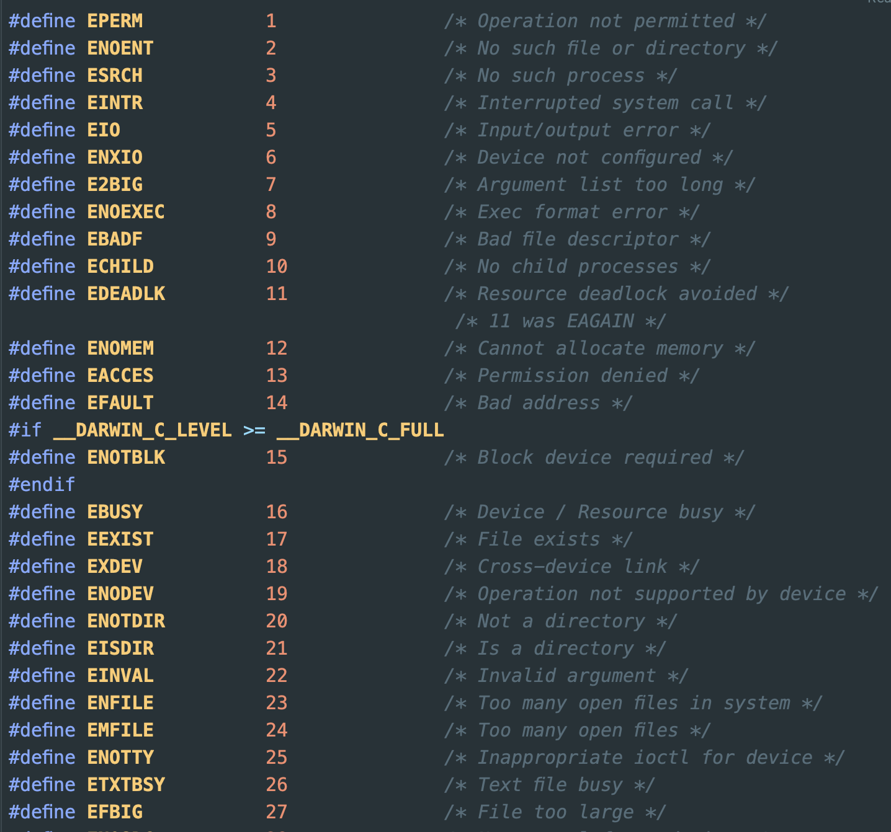
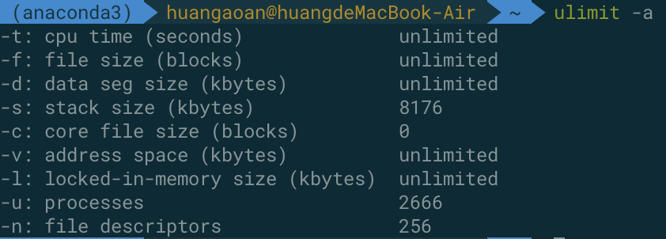
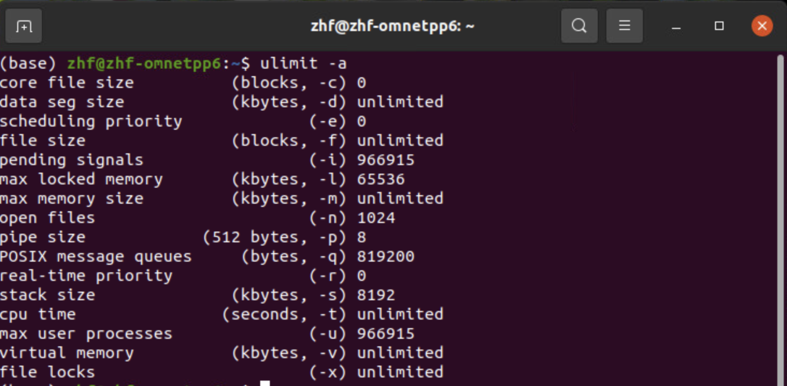
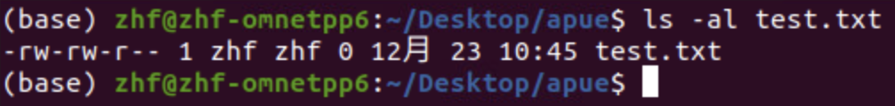

# 1.I/O 是一切实现的基础

没有I/O我们程序产生的数据都无法保存，并且我们程序也无法利用数据


**sysio 系统调用io**

我们是用户态，用户态的底下是kernel态，我们要调用kernel态提供给了我们一组函数让我们能够进行kernel的调用，这样的一组函数就称为系统调用io。他和操作系统有关，这个时候我们就要顾及到我们当前是在哪个环境下面进行编程，给程序员造成了困扰。


**stdio 标准io**

那么我们提供一套标准I/O来进行系统调用的封装，然后进行kernel的调用，从而在所有的操作系统上，我们都可以使用标准io，fopen在linux环境下依赖的系统调用是open，在windows环境下依赖的系统调用是openfile


**stdio 标准io 和 sysio系统调用io 优先选择 stdio 标准io**

因为标准io可移植性强。

标准io还能够合并系统调用，并且有buffer/cache能够为读写进行加速。


# 2. 标准I/O

文件打开关闭：fopen fclose

文件读写操作：

[进行字符的读写] fgetc fputc  

[进行字符串的读写] fgets fputs

[进行二进制块的读写] fread fwrite

[prinf scanf]printf scanf sprintf scans fprintf fscanf

[文件指针操作] fseek ftell rewind

[buffer cache相关] flush


# 3. FILE 类型贯穿始终

```c
typedef struct
{
	short           level;	//缓冲区"满"或者"空"的程度 
	unsigned        flags;	//文件状态标志 
	char            fd;		//文件描述符
	unsigned char   hold;	//如无缓冲区不读取字符
	short           bsize;	//缓冲区的大小
	unsigned char   *buffer;//数据缓冲区的位置 
	unsigned        ar;	 //指针，当前的指向 
	unsigned        istemp;	//临时文件，指示器
	short           token;	//用于有效性的检查 
}FILE;
```

在C语言之中用一个指针变量指向一个文件，这个指针称之为文件指针，这个指针的类型是FILE*类型，FILE是系统使用typedef定义出来的有关文件信息的一种结构体类型，结构中含有文件名、文件状态和文件当前位置等信息。


# 4. fopen 函数介绍

**函数原型：**

```c
FILE *fopen(const char *path,const char *mode);
FILE *fdopen(int fd,const char *mode);
FILE *freopen(const char *pathmconst char *mode,FILE *)
```

path是文件的路径, mode是读写的权限, const char* 代表指针指向的内容是不能够进行更改的，这就是在告诉开发者，你放心用，我不会修改传入参数的内容，成功的时候返回FILE指针，失败的时候返回NULL指针，并且设置errno，这可以理解为一个全局变量[大家一起用]，使用完了就要马上打印，否则会被覆盖。

**mode是文件的权限，比如**

r代表以只读的模式进行文件的打开，流的位置位于文件的开头。

r+代表以读写模式进行打开，流的位置位于文件的开头。

w代表将文件以只写的形式打开，并将文件的长度截断到0，或者创建一个新的文件来写，流的位置位于文件的开头。

w+代表将文件以可读可写的形式打开，如果文件不存在就创建这个文件，否则文件将被截断到0，流的位置位于文件的开头。

a代表以追加只写形式打开文件，文件如果不存在的时候就将进行创建，流将定位到文件的末尾[文件的最后一个字节的下一个位置]。

a+代表以追加可读写的形式打开文件，如果文件不存在的时候将进行创建，文件的指针在哪取决于你下一个操作是什么，如果文件指针在读取的时候在文件开头，如果在追加则在文件末尾。

权限字符串之中也可以加入一个字母b，因为在windows环境下是区分两种流的，一种是二进制流一种是字节流。在所有的posix系统之中b是被忽略的，因为linux之中只有一个stream的概念。

**验证errno并将errno通过perror或strerror转换为error msg：**

```c
//
// Created by huang aoan on 2022/12/23.
//
#include <stdio.h>
#include <stdlib.h>
#include <errno.h>
#include <string.h>
int main()
{
    FILE* fp = fopen("./file/non_exist.txt", "r");
    if (fp == NULL)
    {
        fprintf(stderr, "open file failed, errno=%d\n", errno);
        // 方式1:perror 函数将errno转换为error message
        perror("出错信息为");
        // 出错信息为: No such file or directory
        // 方式2: strerror 函数将errno转换为error message,返回的是char*
        fprintf(stderr, "出错信息为: %s\n",strerror(errno));
        // 出错信息为: No such file or directory
        exit(1);
    }
    puts("ok");
}
```

**在下面这个头文件之中我们可以看到errno的意义：**

```c
#include <sys/errno.h>
```



# 5.文件指针指向的内存在哪里

1.首先分析他是否可能在栈之中？

```c
FILE* fopen(const char* path, const char* mode)
{
	FILE * tmp;
	tmp.xxx = xxx;
	...
	...
	return &tmp;
}
```

从上面的代码分析，我们首先创建一个全局变量然后试图返回一个全局变量的地址，执行完这个函数后就释放了内存，造成外面接受函数返回值的变量指针空悬。

2.然后分析他是否可能存在于静态区之中

```c
FILE* fopen(const char* path, const char* mode)
{
	static FILE * tmp;
	tmp.xxx = xxx;
	...
	...
	return &tmp;
}
```

从上面的代码分析是不可能的，因为static局部变量只被声明一次，当重复调用的时候就会出错。

3.然后分析他是否可能存在于堆区之中

```C
FILE* fopen(const char* path, const char* mode)
{
	FILE * tmp = NULL;
	tmp = malloc(sizeof(FILE))
	tmp->xxx = xxx;
	...
	...
	return tmp;
}
```

所以我们知道fclose函数之中肯定有相应的free操作将FILE*占据的内存进行释放。

# 6. fclose方法

**函数功能：**

进行文件指针的释放。

**函数原型**:

```c
int fclose(FILE* fp)
```

成功的时候返回值为0，失败的时候返EOF，一般不用去进行校验。

# 7. 能够打开的最多的文件的个数

一个进程启动默认将打开三个流：stdin stdout stderr,

所以在macos最多能够打开的为10237 + 3 = 10240个文件

所以在ubuntu最多能够打开的为1021+3 = 1024个文件

```c
void testMaxFileOpen() {
    int count = 0;
    FILE *fp = NULL;
    while (1)
    {
        fp = fopen("/Users/huangaoan/Desktop/zhf projects/c++ projects/apue/io操作/file/test1.txt", "r");
        if(fp == NULL)
        {
            perror("fopen()");
            break;
        }
        count++;
    }
    printf("count = %d\n", count);// macos count = 10237 ubuntu 1021
}
```

ulimit -a 可以查看这些限制条件：下面是macos结果



下面是ubuntu的结果，open files进行了限制：



# 8. 文件的权限

我们的linux文件的权限是怎么来的，下面是我们新创建的一个文件，发现其权限为664，r对应于4，w对应2，x对应于1



实际上是由0666和～umask按位进行与操作的来的，若umask=0002，那么相当于0666&(~0002)=0664

```c
0666 & ~umask 
```

而umask的值如下：


umask的出现就是为了防止我们创建的文件的权限过大，我们umask越大对文件的限制越高。

# 9. fgetc  和 fputc 字符输入输出相关函数


## 9.1 getchar getc fgetc

```c
int getchar(void);
int getc(FILE* stream);
int fgetc(FILE* stream);
```

getchar() 等价于 getc(stdin)。

getc 等价于fgetc() 。

他们的不同是，fgetc一开始被当作函数来进行实现，getc一开始被当作宏来进行实现。内核态之中都是要节约一点一丁的时间，所以使用的是宏，不用占据函数的调用时间。我们在用户态进行编程追求的是稳定性所以一般使用fgetc()。


## 9.2 putchar putc fputc

```c
int putchar(int c);
int putc(int c, FILE* stream);
int fputc(int c, FILE* stream);
```

putchar(c) 等价于 putc(c, stdout) 。

putc 等价于 fputc , 区别和getc和fgetc的区别相同。

 

## 9.3 复制文件

```c
void testMyCopy(const char *source, const char* dest)
{
    int ch;
    FILE* fps = fopen(source, "r");
    if(fps == NULL)
    {
        perror("fopen()");
        exit(1);
    }
    FILE* fpd = fopen(dest, "w");
    if(fpd == NULL)
    {
      	// 注意这里的fps，如果第一个文件打开成功，但是第二个打开失败，那么需要关掉第一个文件。后面会写勾子函数，把失败就要释放的资源放到勾子函数上。
        fclose(fps);
        perror("fopen()");
        exit(1);
    }
    while(1) {
        ch = fgetc(fps);
        if (ch == EOF)
        {
            break;
        }
        fputc(ch, fpd);
    }
    fclose(fpd);
    fclose(fps);
}

int main(int argc, char** argv)
{
    // 如果命令行参数不为3，打印提示信息
    // argv[0] 为程序名
    if(argc < 3)
    {
        fprintf(stderr, "Usage: %s source dest",argv[0]);
    }
    testMyCopy(argv[1], argv[2]);
    exit(0);
}
```

## 9.4 统计文件的大小

```c
int main(int argc,char **argv)
{
    FILE *fp = NULL;
    int count = 0;

    if (argc < 2){
        fprintf(stderr,"Usage:\n");
        exit(1);
    }

    fp = fopen(argv[1],"r");
    if (fp == NULL){
        perror("fopen()");
        exit(1);
    }

    while(fgetc(fp) != EOF){
        count++;
    }
    printf("%d\n",count);
    fclose(fp);
    return 0;
}
```

# 10. fgets 和 fputs 字符串输入输出相关函数


## 10.1 gets和fgets

```c
char *gets(char * s);// 存在bug不要轻易使用
char *fgets(char* s, int size ,FILE* stream);
```

gets 的作用是从stdin之中读入一行到s指向的buffer之中，直到遇到一个结束的换行或者EOF [但是存在bug - 没有对buffer是否会溢出检查，一旦发生了溢出他会继续向buffer后面的内存进行覆盖造成问题]


fgets 从stream之中读取最多size大小的内容到s指定的buffer之中去，返回值是指向buffer的指针。注意，读取到文件尾部的时候返回的是NULL


**fgets会遇到两种结束的情况**

- 第一种情况读取了size-1个字符，最后一个字符留给'\0'。
- 第二种情况读到了'\n'，会将\n\0放到buffer之中然后结束读取。


**如果一个文件只有abcd四字符采用下面的代码读取需要读取几次**

```c
#define SIZE 5
char buf[SIZE];
fgets(buf,SIZE,stream);
1-> 'a' 'b' 'c' 'd' '\0'
2-> '\n' '\0'
我们需要注意，可以理解为文件默认存在一个换行符
```


## 10.2 puts 和 fputs

```c
int puts(const char* s); // 输出到stdout
int fputs(const char*s ,FILE* stream); // 输出到任意一个打开的流
```


## 10.3 mycopy 的 fgets fputs 版本

```c
#include <stdio.h>
#include <stdlib.h>
#include <string.h>
#include <errno.h>

#define SIZE 1024

int main()
{
    FILE *fps,*fpd;
    fps = fopen("./tmp","r");
    if (fps == NULL){
        strerror(errno);
        exit(1);
    }

    fpd = fopen("./copy","w");
    if (fpd == NULL){
        fclose(fps);
        strerror(errno);
        exit(1);
    }

    char buf[SIZE];
    while(fgets(buf,SIZE,fps)!=NULL){
        fputs(buf,fpd);
    }
    fclose(fps);
    fclose(fpd);
    return 0;
}
```


# 11. fread 和 fwrite 块读写函数

```c
size_t fread(void * ptr,size_t size size_t nmemb, FILE*stream);

size_t fwrite(const void *ptr, size_t size,size_t nmemb,FILE* stream);
```

**fread：函数解析**

从指定的stream之中读取，放到ptr指针指向的buffer，我要读取多少内容呢？读取总共nmemb个对象，每个对象size大小。返回的是成功读取的对象的个数

**fwrite：函数解析**

向指定的stream之中写入，数据从ptr指向的内存空间来，我要写的数据的个数为nmemb个，每个对象的大小为size，加const的原因还是告诉我们我们不会对要写入的原数据进行修改。返回的是成功写入的对象的个数

**致命的缺陷：**

这个函数并没有进行边界的验证，连续读取过程之中只要有一个错了就全错了。

**理解一种案例：**

现在有两种读取的情况：

第一种情况：fread(buf,1,10,fp); 每个对象1个字节，读取10个对象

第一种情况：fread(buf,10,1,fp); 每个对象10个字节，读取1个对象

假设数据量足够的情况下：两者都没问题，一个返回值为10，一个为1

假设数据量只有5：第一种情况，我们可以确定返回值为5，成功读取5个对象，但是第二种情况，我们到底还剩下多少个字节没有读取是尚不可知的，这就存在问题。

**最终解决思想：**

对于fread和fwrite我们都将按照size=1的方式来使用。

## 11.1 fread fwrite 实现 myCopy

```c
#include <stdio.h>
#include <stdlib.h>
#include <string.h>
#include <errno.h>

#define SIZE 1024
/***************
 *fread fwrite实现文件复制
 *
 **************/
int main()
{
    FILE *fps,*fpd;
    fps = fopen("./tmp","r");
    if (fps == NULL){
        strerror(errno);
        exit(1);
    }

    fpd = fopen("./copy","w");
    if (fpd == NULL){
        fclose(fps);
        strerror(errno);
        exit(1);
    }

    char buf[SIZE];

    int n = 0;
    // 这里需要收集正确读取到的对象的个数，因为文件大小不一定是SIZE的整数倍。
    while ((n = fread(buf,1,SIZE,fps)) > 0){
        printf("%d\n",n);
        fwrite(buf,1,n,fpd);
    }
    fclose(fps);
    fclose(fpd);
    return 0;
}
```

# 12. printf 和 scanf函数族讲解


## 12.1 printf 函数族详解

 ```c
 int printf(const char* format, ...);
 int fprintf(FILE* stream, const char* format, ...);
 int sprintf(char * str, const char* format, ...);
 int snprintf(char* str, size_t size, const char* format, ...);
 ```

printf ：确定向stdout进行输出

fprintf：使用stream指定输出的流

sprintf：输出到字符串str之中，可能会面临buffer溢出的问题，buffer写不下会继续往后写覆盖所以又出现了snprintf

snprintf：输出到字符串str之中，最多往里面放size-1个字符，最后一个字符为'\0'

**atoi小函数：**

```c
#include<stdio.h>
#include<stdlib.h>
int main()
{
  char str[] = "123456";
  printf("%d",atoi(str));
  exit(0);
}
```

**sprintf案例：**

```c
#include <stdio.h>
/*****************
 *sprintf atoi fprintf
 *sprintf 可以看作是 atoi的反向操作
 * **************/
int main()
{
    char buf[1024];
    int y = 2020;
    int m = 12;
    int d = 24;
    sprintf(buf,"%d/%d/%d",y,m,d);
    printf("%s",buf);
    return 0;
}
```


## 12.2 scanf 函数族详解

```c
int scanf(const char* format, ...);
int fscanf(FILE * stream, const char* format, ...);
int sscanf(const char* str, const char* format, ...);
```

scanf函数族要慎用%s，因为不知道源有多大，目的缓存有多大。

scanf： 是stdin作为输入

fsacnf：是特定流作为输入

sscanf：是一个字符串作为输入。


# 13. 文件指针操作

文件指针就类似于我们读书看报的眼睛，也类似于电脑的光标。下面是和文件指针有关的操作。

```c
int fseek(FILE* stream, long offset, int whence);
long ftell(FILE* stream);
void rewind(FILE* stream);
int fgetpos(FILE* stream,fpos_t* pos);
int fsetpos(FILE* stream,fpos_t* pos);
```

**fseek：**stream指定要操作哪个流的文件指针，offset指的是相对偏移量，whence指的是相对的基准是谁。whence存在三种可能的取值，分别是SEEK_SET SEEK_CUR SEEK_END,分别代表文件开头，文件当前位置，文件尾部位置。如果成功返回0，失败返回-1，并且设置errno

**ftell：** stream指定要返回哪个流的文件指针的位置。

**rewind：** 返回值是void，他的功能是 (void)fseek(stream, 0L, SEEK_SET),将文件指针重新指向文件的开头。


## 13.1 另外的方式进行文件的大小的获取

```c
fseek(fp,0,SEEK_END);// 首先定位到文件尾部
printf("%ld\n",ftell(fp));// 当前的文件指针位置就是文件大小
```


## 13.2 建立下载任务与空字符组成的文件

当我们使用百度网盘下载工具进行文件下载的时候，比如下载一个大型游戏20g，我们发现刚点击下载，我们的磁盘空间立马少了20g，这肯定不是立即下载完成的，而是通过fseek来占据位置完成的，他直接调用fseek从文件头延伸到20g大小。这20g的空间全部是空字符。然后是进行多线程的下载，一个线程负责下载其中的一块。


## 13.3 fflush

**linux都是行缓冲的模式。借助下面的例子进行理解：**

```c
#include<stdio.h>
#include<stdlib.h>
int main()
{
	int i;
	printf("before while()");
  // fflush(stdout); 加上这一句或者printf添加\n即可。
	while(1);
	printf("after while()");
	exit(0);
}
```

在linux下执行，一行也不会打印出来。因为没有printf没有碰到\n，不会刷新出来。所以我们的printf要想及时的输出，要在后面加上\n。

**fflush的介绍**：

```c
int fflush(FILE* stream);
```

我们可以指定进行哪个stream进行缓冲区的刷新。

也可以直接使用fflush()，那么将对所有的打开的流进行缓冲区的刷新。


## 13.4 缓冲区

缓冲区大多数情况下是好事，用来合并系统调用。

**行缓冲：**换行的时候进行刷新，满了的时候刷新，强制刷新[fflush]，我们使用的典型的标准输出是这样的。

**全缓冲：**满了的时候刷新，强制刷新（默认，只要不是终端设备）

**无缓冲：**如stderr，这是需要立即输出的内容

**如何修改缓冲区：**通过setvbuf进行修改即可。一般不用进行修改

```c
int setvbuf(FILE* stream, char* buf, int mode,size_t size);
```

setvbuf可以传递mode的参数值包括三种 _IONBF 无缓冲 _IOLBF 行缓冲 _IOFBF 全缓冲


## 13.5 fseek ftell存在的问题

fseek和ftell使用的是有符号的long类型，取值范围等于-2g ~ 2g-1,而我们的ftell只能够使用正值，所以如果使用fseek和ftell最多只能够操作2g-1大小的一个文件。

为了解决这个问题，我们有下面的两个方法，将long类型替换为了off_t，是一个typedef类型，可以根据需要设置他是64位还是32位

```c
// 位于stdio.h头文件之中
int fseeko(FILE* stream, off_t offset, int whence);
off_t ftello(FILE* stream);
```

在一些体系结构之中，off_t和long都是32位的整型值，我们可以通过 # define _FILE_OFFSET_BITS 64 来进行设置，让其转换为64位的整型

```c
gcc a.c -o a -D_FILE_OFFSET_BITS=64
```

另一种方式：在makefile之中写

```makefile
CFLAGS+=-D_FILE_OFFSET_BITS=64
```


**但是这存在问题，这是典型的方言之中存在的函数，C89 C99 标准之中根本没有这一点，只在posix里面有**


# 14. 完整的获得一行 getline

我们上面提到的一系列函数都无法获得完整的一行，因为他们都受到大小的限制。

我们要实现，很容易想到的是使用动态内存，不够了再进行动态的申请。即一开始使用malloc然后再使用realloc进行扩充。

```c
#include <stdio.h>
ssize_t getline(char** lineptr, size_t *n, FILE* stream);
```

在使用之前需要 -D_GNU_SOURCE

```c
gcc a.c -o a -D_FILE_OFFSET_BITS=64 -D_GNU_SOURCE
```

或者：

```makefile
CFLAGS+=-D_FILE_OFFSET_BITS=64  -D_GNU_SOURCE
```

**getline的作用：**

从stream之中读取完整的一行内容。第一个参数传递char*类型指针的地址，第二个参数传递一个size_t类型变量的地址，stream是读取的流。成功的话返回的是成功读取的字符的个数，包含分隔符[以及结尾的换行符]，但是不包含结束符\0。

返回-1代表读取失败。

```c
#include <stdio.h>
#include <errno.h>
#include <string.h>
#include <stdlib.h>

int main()
{
    FILE *fp = NULL;
    fp = fopen("./tmp","r");
    if (fp == NULL){
        strerror(errno);
        exit(1);
    }
		
  	// 这两句话非常有必要，需要进行初始化
    size_t linesize = 0; // 一定要进行初始化
    char *line = NULL;

    while(1){
      	// 第一个函数
        if (getline(&line,&linesize,fp) < 0){
            break;
        }
        printf("%ld\n",strlen(line)); // 实际字符串的长度
        printf("%ld\n",linesize); // 实际malloc的大小
    }
    return 0;
}
```

上述存在一个问题，即可控的[只有在我们调用getline的时候会出现，不像服务器运行的长久的守护进程，可能不断的在进行内存的泄漏]，即我们这个getline动态的进行了内存的申请但是却没有进行内存的释放。我们可以使用free(line)进行释放但是如果申请内存不是通过malloc或者realloc函数，那么可能会存在问题。

**CONFORMING TO 之中明确说明：**

他只存在在GNU libc 4.6.27 之中，是方言之中的方言。

所以我们可以自己进行实现。

# 15. 临时文件

我是一个server，用户会有请求，常用网址的链接点击，我会收到用户临时发过来的很多数据，对用户提交上来的数据我要暂时存起来，一部分我需要永久保存，一部分我可能分析完了就删除了。

**创建临时文件需要考虑到的问题**

1、那么我们如何不冲突的进行临时文件的创建。

2、及时销毁。

## 15.1 tmpnam 函数

```c
char * tmpnam(char* s);
```

tmpnam 方法用来产生一个可用的唯一的文件名，当s不为空的时候，可用的文件名将会被回填到s参数之中，当s为空的时候，将会返回。

返回值解析：

- 一个指向 C 字符串的指针，该字符串存储了临时文件名。如果 str 是一个空指针，则该指针指向一个内部缓冲区，缓冲区在下一次调用函数时被覆盖。
- 如果 str 不是一个空指针，则返回 str。如果函数未能成功创建可用的文件名，则返回一个空指针。

**并发存在的问题：**

这在并发的时候可能会出现问题，比如一个进程刚刚执行完成tmpnam，刚刚分配给我一个名字，我还没有用它进行fopen，另一个进程也获取了相同的名字，这就可能出现命名的冲突。tmpnam究其原因其会在并发中存在问题，因为其不是原子的操作，它的获取文件名创建文件不是一气呵成的。

## 15.2 tmpfile 函数

```c
FILE* tmpfile(void);
```

他不需要参数，直接返回给我们一个临时文件的文件指针。他将以(w+b)模式即二进制的读写方式打开这个文件。

这个文件是一个匿名文件，就是这个文件在磁盘之中产生了，并且打开了，然后将FILE*给到了我们，但是我们使用ls在磁盘上看不见，其也不是隐藏文件。那么这是绝对不会冲突的。

另外一个好处的时候，当我们fclose文件指针的时候，这块磁盘空间(因为链接数为0)就将被释放了，这样就及时销毁了。如果程序正常终止，即便我们忘了fclose，在程序结束的时候也将释放