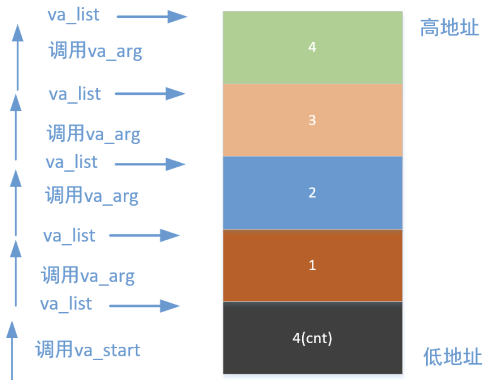
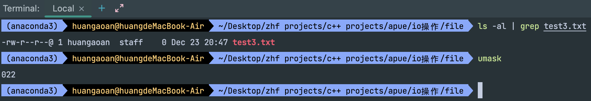
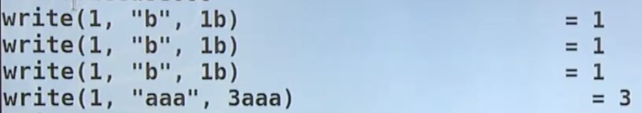

# 1. 系统调用I/O

系统调用I/O操作有：open,close,read,write,lseek

我们的标准I/O操作都是依赖于我们的系统调用I/O来进行实现的。


## 1.1 文件描述符[fd]的概念

当我们打开一个文件的时候会出现一个结构体[类似于我们的FILE*]，我们将这个结构体的地址存放到一个数组之中，然后返回这个结构体地址在数组之中的索引给我们就可以了，这个东西就是文件描述符。

我们提前会打开**标准输入，标准输出，标准错误**三个文件，他们对应0，1，2三个文件描述符，所以后面我们打开的文件的文件描述符是从3开始的。

注意点：**文件描述符优先使用当前可用范围内最小的**，比如我们打开了1，2，3，4四个文件，占据了3，4，5，6四个，然后这个时候我们关掉了第一个文件，释放了文件描述符3，这个时候假设我们又打开了一个文件，文件描述符将为3

每当我打开一次文件，不管是相同的文件还是不同的文件，都会出现一个结构体，并且返回一个文件描述符，这个结构体之中肯定含有文件指针，还有一个东西我们需要注意，比如出现了这样一种情况，一个结构体指针复制了一份，他们指向的是相同的结构体，这样一侧进行了释放，那么会不会出现野指针的情况呢？答案是不会的，因为我们结构体是引用计数的，只有当引用计数为0的时候才会释放掉内存。


## 1.2 文件I/O操作相关函数


### 1.2.1 open 和 close 函数

```c
#include <sys/types.h>
#include <sys/stat.h>
#include <fcntl.h>
int open(const char* pathname,int flags);
int open(const char* pathname,int flags, mode_t mode);
```

其中flags可以理解为位图。位图必须包含下面这些权限[O_RDONLY,O_WRONLY_ORDWR]之中的一个，分别代表只读，只写，和读写。

额外的，0个或多个**文件创建选项**和**文件状态选项**可以以按位或放到选项之中去，比如：

[O_CREAT, O_TRUNC, O_EXCL, O_APPEND, O_ASYNC, O_DIRECT, O_DIRECTORY, O_LARGEFILE,O_NOFOLLOW,O_NONBLOCK]

**下面是fopen和open之中的选项的对应关系**：

| 序号 | fopen中的选项 | open中的选项                 |
| ---- | ------------- | ---------------------------- |
| 1    | r             | O_RDONLY                     |
| 2    | r+            | O_RDWR                       |
| 3    | w             | O_WRONLY\|O_CREATE\|O_TRUNC  |
| 4    | w+            | O_RDWR\|O_CREATE\|O_TRUNC    |
| 5    | a             | O_WRONLY\|O_CREATE\|O_APPEND |
| 6    | a+            | O_RDWR\|O_CREATE\|O_APPEND   |

**一个问题-两个同名的open是如何进行实现的**：

open有相同的名字，却有不同的参数，这是通过重载实现的吗？不是，因为c语言之中没有重载，其实他是通过变参实现的。当存在O_CREATE的使用第二个形式，当不存在O_CREATE的时候使用第一个形式。

**变参是如何使用的：**

```c
#include <stdio.h>
#include <stdarg.h>
void simpleMultipleVariables(int params,...)
{
    va_list arg_ptr = NULL;
    int arg_count = params;
    va_start(arg_ptr, params);
    for (int i = 0; i < arg_count; ++i) {
        int arg = va_arg(arg_ptr, int);
        printf("arg = %d\n", arg);
    }
    va_end(arg_ptr);
}
int main(int argc, char** argv)
{
    simpleMultipleVariables(4, 1, 2, 3, 4);
    exit(0);
}
```

一个重要类型，三个重要函数：

- va_list args;这一条语句即定义一个va_list类型(可以看成是一种特殊的指针类型)的变量args，args变量指向的对象是栈上的数据
- va_start(args,cnt);这一条语句是初始化args，args指向第一个被压栈的参数，即函数的最后一个参数，而cnt则是栈上最后一个参数，系统由此确定栈上参数内存的范围。
- va_arg(args,int); 这个函数需要传入两个参数，一个是指向栈上参数的指针args，这个指针每取出一个数据移动一次，总是指向栈上第一个未取出的参数，int指代需要取出参数的类型，CPU根据这个类型所占地址空间来进行寻址。
- va_end(args);当args使用完之后，要将args置为空。
  整个函数实现的过程就是我们不需要通过形参来获取实参的值，而是直接从栈上将一个个参数取出来。

具体调用过程如下：



**mode_t的可选项：**

| 序号 | 参数    | 说明                 |
| ---- | ------- | -------------------- |
| 1    | S_IRUSR | 所有者拥有读权限     |
| 2    | S_IWUSR | 所有者拥有写权限     |
| 3    | S_IXUSR | 所有者拥有执行权限   |
| 4    | S_IRGRP | 群组拥有读权限       |
| 5    | S_IWGRP | 群组拥有写权限       |
| 6    | S_IXGRP | 群组拥有执行权限     |
| 7    | S_IROTH | 其他用户拥有读权限   |
| 8    | S_IWOTH | 其他用户拥有写权限   |
| 9    | S_IXOTH | 其他用户拥有执行权限 |

我们实际创建出来的文件的权限为mode_t & ~umask，现在我们来进行一下测试：

```c
#include <unistd.h>
#include <fcntl.h>
#include <stdio.h>
void testCreateFileWithOpen()
{
    int fd = open("/Users/huangaoan/Desktop/zhf projects/c++ projects/apue/io操作/file/test3.txt", O_CREAT | O_WRONLY | O_TRUNC, 0666);
    if(fd < 0)
    {
        perror("open()");
        exit(1);
    }
    close(fd);
}
int main(int argc, char** argv)
{
    testCreateFileWithOpen();
    exit(0);
}
```

结果发现创建出来的文件的权限如下：发现确实为666-022=644



**注意**

close函数使用前需要引入#include<unistd.h>头文件。

### 1.2.2 read 和 write 函数

```c
ssize_t read(int fd, void* buf, size_t count);
```

从fd指向的文件进行读取，读取count个bytes到buf之中。如果成功的话返回成功读取的字节数，如果返回0，代表读到了文件的末尾。如果失败，那么会返回-1，并且会设置errno从而表征失败的原因。

```c
ssize_t write(int fd, const void* buf, size_t count)
```

向fd指向的文件进行写入，从buf之中读取count个字节然后写入到文件之中。如果成功写入成功的字节个数会返回，如果失败，那么会返回-1，并且会设置errno从而表征失败的原因。


### 1.2.3 lseek 函数

```c
#include <unistd.h>
off_t lseek(int fd, off_t offset, int whence)
```

whence同样存在三个取值,分别是SEEK_SET SEEK_CUR SEEK_END,分别代表文件开头，文件当前位置，文件尾部位置

offset代表偏移量

返回值是从文件开始处到这里的字节个数。


### 1.2.4 使用系统调用I/O实现mycopy

```c
#include <stdio.h>
#include <stdlib.h>
#include <sys/types.h>
#include <sys/stat.h>
#include <fcntl.h>
#include <unistd.h>
#define BUFSIZE 1024
int main(int argc, char** argv)
{
  int sfd,dfd;
  char buf[BUFSIZE];
  int len,ret,pos;
  if(argc < 3)
  {
    fprintf(stderr,"Usage....%s source dest",argv[0]);
    exit(1);
  }
  sfd = open(argv[1],O_RDONLY);
  if(sfd < 0)
  {
    perror("open()");
    exit(1);
  }
  dfd = open(argv[2],O_WRONLY|O_CREAT,O_TRUNC,0600);
  if(dfd < 0)
  {
    close(sfd);
    perror("open()");
    exit(1);
  }
  while(1)
  {
    len = read(sfd,buf,BUFSIZE);
    // 如果读取错误
    if(len < 0)
    {
      perror("read()");
      break;
    }
    // 读到末尾
    if(len == 0)
    {
      break;
    }
    pos = 0;
    // 可能write我们要他写len，但是他一下没写完
    // 坚持写够len个字节
    while(len > 0)
    {
      ret = write(dfd,buf+pos,len);
      if(ret < 0)
      {
        perror("write()");
        exit(1);
      }
      pos += ret;
      len -= ret;
    }
  }
  close(dfd);
  close(sfd);
}
```


## 1.3 系统调用 I/O 与标准 I/O 的区别

|          | 系统调用I/O | 标准I/O |
| -------- | ----------- | ------- |
| 响应速度 | 快          | 慢      |
| 吞吐量   | 低          | 高      |
| 有无缓冲 | 无          | 有      |
| 可移植性 | 坏          | 好      |

系统调用I/O和标准I/O是不可以混用的。

标准I/O整合系统调用I/O的代码。

```c
#include<unistd.h>
#include<stdio.h>
#include<stdlib.h>
int main()
{
  putchar('a');
  write(1,"b",1); // 向标准输出之中进行输出
  
  putchar('a');
  write(1,"b",1);
   
 	putchar('a');
  write(1,"b",1);
}
```

发现输出的结果是aaabbb，我们使用strace ./xxx.exel来进行跟踪系统调用，结果如下：




## 1.4 I/O 的效率问题

随着buffersize的初始增大我们的读取或者写入的效率肯定是先增大，然后后面会减少。并且超过某个数值的时候会出现段错误，爆栈的情况。


## 1.5 文件共享

### 1.5.1 一个例子

**例子：**我们想要删除一个文件之中的第10行

**解决方案1：**我们使用lseek定位到第11行，读取一行，定位到第10行，覆盖写一行。接着定位到第12行，读取一行，然后定位到第11行，覆盖写一行，最后还需要缩减文件的长度。

**解决方案2：**将文件打开两次，第一个文件描述符定位到第11行开始读取，然后另一个文件描述符定位到第10行并将读取到的内容覆盖第10行，接着一个文件描述符顺序往下读，另一个文件描述符顺序往下写就可以了。

**解决方案3：**开两个进程，然后进程间通信，processA读一块，传给processB写一块。

**解决方案4：**开两个线程，然后多线程。

**截断的方法：**

```c
// 将一个未打开的文件截断到多长
int truncate(const char* path, off_t length);
// 将一个已经打开的文件截断到多长
int ftruncate(int fd, off_t length);
```


## 1.6 原子操作

**原子：**不可分割的最小单位

**原子操作：**不可分割的操作

**原子操作的作用：**解决竞争和冲突

**什么时候会用到原子操作：**多线程并发的时候


## 1.7 程序之中的重定向 dup dup2

```c
int dup(int oldfd);
int dup2(int oldfd, int newfd);
```

dup：将文件描述符拷贝一份，然后使用当前没有使用的最小的文件描述符作为新的文件描述符，两个文件描述符指向的是同一个结构体。

dup2[原子操作]：将newfd指向的文件close，然后将oldfd复制一份放到newfd之中去。

## 1.8 同步 sync sync fdatasync


## 1.9 fcntl ioctl

