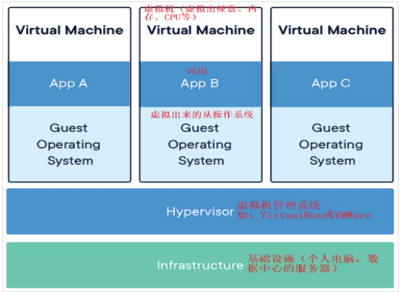
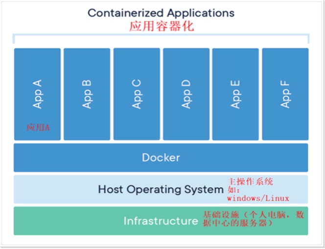
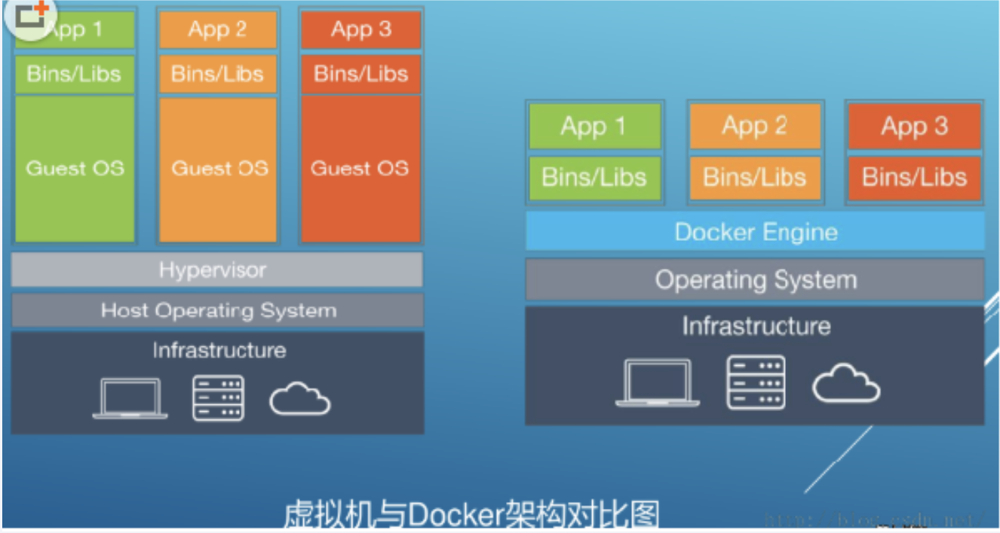
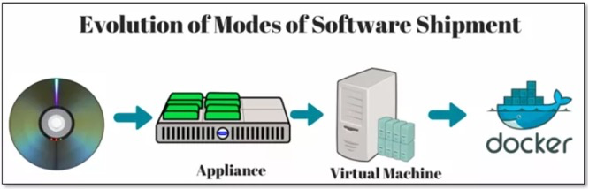

# 1.Docker 简介

## 1.1 Docker 是什么？

Docker是基于go语言实现的云开源项目，Docker 的目标是 "Build, Ship and Run Any App Anywhere"，也就是通过对应用组件的封装，分发，部署，运行等生命周期的管理，使用户的app[可以是一个WEB应用或者数据库应用]及其运行环境能够做到"一次镜像，处处运行"将应用打成镜像，通过镜像成为运行在Docker容器上的实例。

docker就是由linux容器技术发展而来的

只需要一次配置好环境，换到别的机器上就可以一键部署好，大大简化了操作。

## 1.2 Docker 简介

Docker 是一个应用打包，分发，部署的工具。

你也可以将它理解为一个轻量的虚拟机，它只虚拟你软件所需要的虚拟环境，多的一点都不需要。

他就是将 [1.运行文档。2.配置环境。3.运行环境。4.运行依赖包。5.操作系统发行版。6.内核] 打包成一个镜像文件（iso）。

而普通虚拟机则是一个完整而庞大的系统。

**虚拟机**

虚拟机 [virtual machine] 就是带环境安装的一种解决方案，它可以在一种操作系统里面运行另一种操作系统，比如在windows10之中运行Linux系统，在虚拟机上的应用程序对此毫无感知，因为虚拟机看起来和真实系统一样，对于底层系统来说，虚拟机就是一个普通文件，不需要了就删掉，对其他部分毫无影响。下面是虚拟机的架构：

**由于前面虚拟机存在某些缺点，linux发展出了另一种虚拟化技术：LXC**

linux容器是系统与其他部分隔离开的一系列进程，从另一个镜像运行，并由该镜像提供支持进程所需要的全部文件。容器提供的镜像包含了应用的所有依赖项，因而从开发到测试再到生产的整个过程中，它都具有可移植性和一致性。

linux容器不是模拟一个完整的操作系统，而是对于进程进行隔离，有了容器就可以将软件运行所需要的所有资源打包到一个隔离的容器之中。容器与虚拟机不同，不需要捆绑一整套操作系统，只需要软件工作所需要的库资源和设置。资源因此变得高效轻量并保证部署在任何环境中的软件都能够始终如一的运行。

Docker 容器是在操作系统层面上实现虚拟化，直接复用本地主机的操作系统，而传统的虚拟机则是在硬件层面实现虚拟化。与传统的虚拟机相比，Docker的优势体现为启动过速度快，占用体积小。

**Docker和普通虚拟机的对比：**

| 特性       | 普通虚拟机                                                   | Docker                                                       |
| ---------- | ------------------------------------------------------------ | ------------------------------------------------------------ |
| 跨平台     | 通常只能在桌面级系统运行，例如 Windows/Mac，无法在不带图形界面的服务器上运行 | 支持的系统非常多，各类 windows 和 Linux 都支持               |
| 性能       | 性能损耗大，内存占用高，因为是将整个完整的系统都虚拟出来了   | 性能好，只虚拟软件所需运行环境，最大化减少没用的配置         |
| 自动化     | 需要手动安装所有东西                                         | 一个命令就可以自动部署好所需环境                             |
| 稳定性     | 稳定性不高，不同系统差异大                                   | 稳定性好，不同系统都一样部署方式                             |
| 启动速度   | 启动速度慢[分钟]                                             | 启动速度快[秒]                                               |
| 资源占用   | 资源占用多                                                   | 资源占用少                                                   |
| 虚拟的层面 | 在硬件层面进行虚拟化，然后在其上运行一个完整的操作系统，在该系统上运行所需的应用进程 | 容器的应用进程直接运行在宿主机的内核，容器内没有自己的内核且没有进行硬件虚拟化，因此容器比传统的虚拟机更加轻便 |
| 存储大小   | 镜像庞大vmdk                                                 | 镜像小，便于存储和传输                                       |

**最终总结为什么docker会比虚拟机更快：**

1. docker有着比虚拟机更少的抽象层

- 由于docker不需要Hypervisor(虚拟机)实现硬件资源虚拟化,运行在docker容器上的程序直接使用的都是实际物理机的硬件资源。因此在CPU、内存利用率上docker将会在效率上有明显优势。

2. docker利用的是宿主机的内核,而不需要加载操作系统OS内核

- 当新建一个容器时,docker不需要和虚拟机一样重新加载一个操作系统内核。进而避免引寻、加载操作系统内核返回等比较费时费资源的过程,当新建一个虚拟机时,虚拟机软件需要加载OS,返回新建过程是分钟级别的。而docker由于直接利用宿主机的操作系统,则省略了返回过程,因此新建一个docker容器只需要几秒钟。

**打包、分发、部署**

打包：就是将你软件运行所需要的依赖，第三方库，软件打包到一起，变为一个安装包

分发：你可以将你打包好的安装包上传到一个镜像仓库，其他人可以非常方便的获取和安装

部署：拿着安装包就可以一个命令运行起来你的应用，自动模拟出一模一样的运行环境，不管是在windows/mac/linux🧐

**docker部署的优势**

常规应用开发部署方式：自己在windows上开发，测试，然后到linux服务器配置运行环境部署

<table> <tr> <td bgcolor=orange>问题：我机器上面跑都没有问题，怎么到服务器上就出现了各种问题。 </td> </tr> </table>

用docker开发部署的流程：自己在windows上开发，测试，然后打包为docker镜像（可以理解为软件安装包），在各种服务器上运行起来只需要一个docker命令即可。

<table> <tr> <td bgcolor='#54FF9F'>优点：确保了不同机器上跑都是一致的运行环境，不会出现我机器上跑正常，你机器跑就有问题的情况。 </td> </tr> </table>

**docker通常用来做什么**

- 应用分发、部署、方便传播给他人安装，或者说搭建集群的时候方便。特别是开源软件和提供私有部署的应用。
- 快速安装测试/学习软件，用完就丢弃，不必将时间浪费在软件的安装上。比如redis/Mongodb/ElasticSearch/ELK
- 多个版本共存，不污染系统，例如python2，python3，redis4.0，redis5.0
- windows上可以体验/学习各种linux系统
- 方便进行扩容和缩容，比如我流量大的时候我需要三主三从，我流量少的时候只需要一主二从，docker可以快速的进行扩容和缩容
- 可以非常方便的进行移植，之前的从开发到运维类似于搬家，docker类似于搬楼，而不会出现运维层面的问题。
- 总结：一次镜像，处处运行，从搬家到搬楼。

**镜像和容器的概念：**

镜像：可以理解为软件安装包，可以方便的进行传播和安装

容器：可以理解为软件安装后的状态，每个软件运行环境都是独立，隔离的，称之为容器。

## 1.3 容器发展简史

容器发展历史是：首先是光盘，然后是卡片机，接着是虚拟机的iso镜像，最后是docker

## 1.4 docker 带来了什么改变

- 技术职级的变化：
  - coder->programmer->software engineer->devops engineer[开发兼运维工程师]

- 更快速的应用交付和部署
  - 传统的应用开发完成后，需要提供一堆安装程序和配置说明文档，安装部署后需根据配置文档进行繁杂的配置才能正常运行。Docker化之后只需要交付少量容器镜像文件，在正式生产环境加载镜像并运行即可，应用安装配置在镜像里已经内置好，大大节省部署配置和测试验证时间。

- 更便捷的升级和扩缩容
  - 随着微服务架构和Docker的发展，大量的应用会通过微服务方式架构，应用的开发构建将变成搭乐高积木一样，每个Docker容器将变成一块“积木”，应用的升级将变得非常容易。当现有的容器不足以支撑业务处理时，可通过镜像运行新的容器进行快速扩容，使应用系统的扩容从原先的天级变成分钟级甚至秒级。

- 更简单的系统运维
  - 应用容器化运行后，生产环境运行的应用可与开发、测试环境的应用高度一致，容器会将应用程序相关的环境和状态完全封装起来，不会因为底层基础架构和操作系统的不一致性给应用带来影响，产生新的BUG。当出现程序异常时，也可以通过测试环境的相同容器进行快速定位和修复。

- 更高效的计算资源利用
  - Docker是内核级虚拟化，其不像传统的虚拟化技术一样需要额外的Hypervisor支持，所以在一台物理机上可以运行很多个容器实例，可大大提升物理服务器的CPU和内存的利用率。
