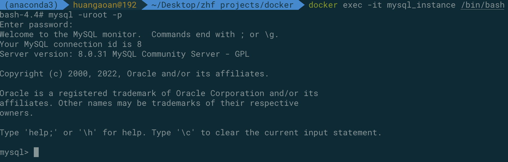
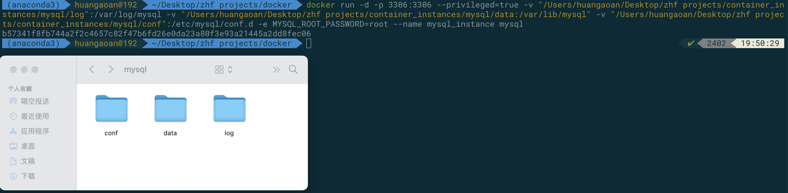
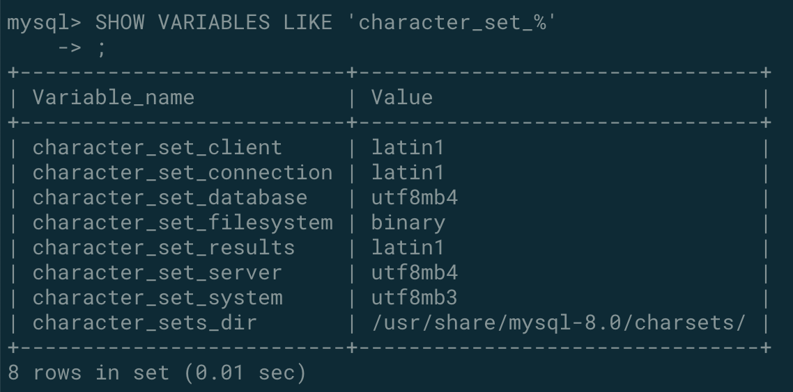
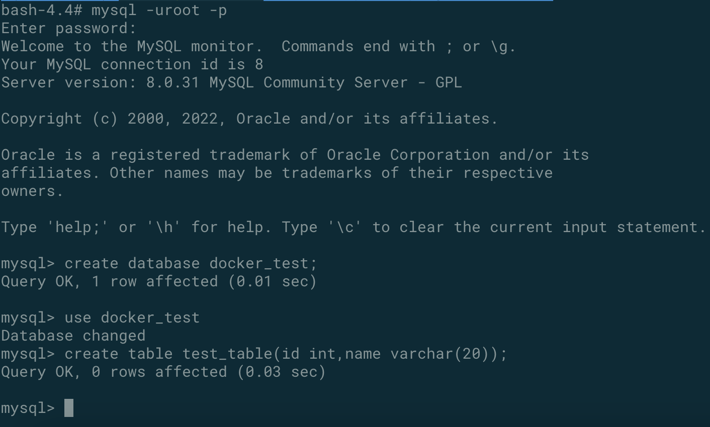
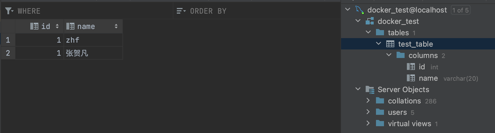
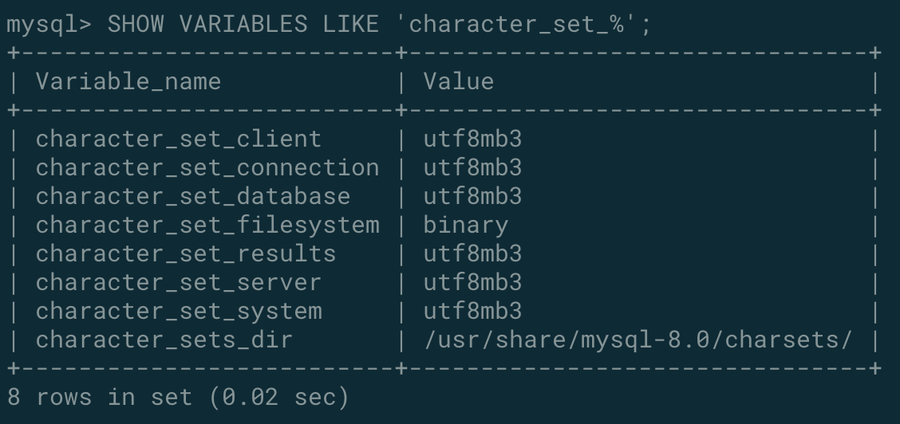

# 1.docker常规软件安装


## 1.1 mysql 安装


### 普通安装


在官网我们可以进行命令的查看，发现命令如下：

```console
docker run --name 实例的名称 -p 3306:3306 -e MYSQL_ROOT_PASSWORD=my-secret-pw -d mysql:tag
```


然后我们可以docker exec -it 实例的名称 /bin/bash 进入到容器之中进行查看，并使用自己指定的密码可以进行登录：




### 进行容器数据卷的同步[从而删除容器后不会丢失数据]：

命令如下：

```
docker run -d -p 3306:3306 --privileged=true -v "/Users/huangaoan/Desktop/zhf projects/container_instances/mysql/log":/var/log/mysql -v "/Users/huangaoan/Desktop/zhf projects/container_instances/mysql/data:/var/lib/mysql" -v "/Users/huangaoan/Desktop/zhf projects/container_instances/mysql/conf":/etc/mysql/conf.d -e MYSQL_ROOT_PASSWORD=root --name mysql_instance mysql
```

结果如下：




### 字符集的修改以至于可以进行中文的插入

运行命令查看服务器字符集：

```mysql
SHOW VARIABLES LIKE 'character_set_%';
```

发现是拉丁文，我们要将其改为utf-8：



我们通过修改在宿主机的文件来完成对于容器的配置文件的修改：

我们在conf之中新建my.cnf： 注意这里的my代表的是mysql，而不是任意的东西，所以不能够进行替换

```ini
[client]
default_character_set=utf8
[mysqld]
collation_server = utf8_general_ci
character_set_server = utf8
```

然后docker restart 重新进行实例的启动，并且进入到我们的容器实例之中常见数据库以及相应的表：



发现在idea之中能够进行成功的插入：



并且发现字符集进行了改变：




### 没有一些常用的命令

首先进行yum的安装

```
microdnf install yum
```

然后使用yum进行安装ncurses，从而可以使用clear命令

```
yum install ncurses
```

