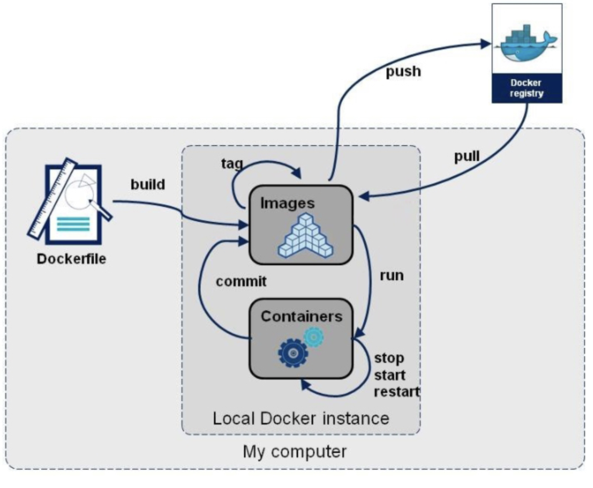

# 1. dockerfile 

## 1.1 dockerfile 是什么?

dockerfile 是用来构建 docker 镜像的文本文件，是由一条条构建镜像所需要的指令和参数构成的脚本

官网地址：https://docs.docker.com/engine/reference/builder

## 1.2 之前我们是怎么样构建新的镜像的?

之前我们首先拉下来一个新的ubuntu，然后进入到其中进行新的软件的安装，然后再进行commit形成新的镜像。但是以后的环境是经常变化的，那样意味着我们需要经常更新，然后commit，非常的麻烦。

那么我们能不能一次性搞定，给我个list清单，我以后需要加入任何功能，直接在list清单里面run，相当于进行多次的提交。比如对于我们之前的enhanced_ubuntu来说，通过dockerfile，就可以一次性添加vim, net-tools等等常用的工具。相当于画了一个图纸，我们的复杂的镜像可以照着这个图纸一键生成。

总结构建的三个步骤：编写dockerfile文件 --> docker build 命令进行镜像的构建 --> docker run 依照生成好的镜像创建容器实例

## 1.3 dockerfile 基础知识

- 每条保留字指令都必须为大写字母并且后面要跟随至少一个参数。
- 指令按照从上到下的顺序执行。
- \# 表示注释。
- 每条指令都会创建一个新的镜像层并对于镜像进行提交。

## 1.4 dockerfile 执行的大致流程

- docker 从基础镜像运行一个容器
- 执行一条指令并对容器作出修改
- 执行类似docker commit的操作提交一个新的镜像层
- docker再给予刚刚提交的镜像运行一个新的容器
- 执行dockerfile中的下一条指令直到所有指令都执行完成

## 1.5 小阶段总结dockerfile docker镜像 docker容器

从应用软件的角度来看，Dockerfile、Docker镜像与Docker容器分别代表软件的三个不同阶段，

\*  Dockerfile是软件的原材料

\*  Docker镜像是软件的交付品

\*  Docker容器则可以认为是软件镜像的运行态，也即依照镜像运行的容器实例

Dockerfile面向开发，Docker镜像成为交付标准，Docker容器则涉及部署与运维，三者缺一不可，合力充当Docker体系的基石。
