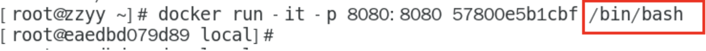
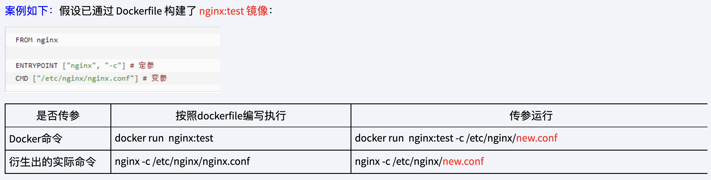

# 1. dockerfile 保留字指令


## 1.1 tomcat 8 dockerfile 入门

github上的地址：https://github.com/docker-library/docs/tree/master/tomcat

tomcat8的dockerfile地址：https://github.com/docker-library/tomcat/blob/9cad4b1a880782d3504d7c8723fccc667965cf29/8.5/jdk17/corretto-al2/Dockerfile

从 tomcat 8的 dockerfile ，我们可以看到，首先是FROM，然ENV设置环境变量，然后RUN了一堆命令，最后EXPOSE 8080端口


## 1.2 FROM 指令

**功能：**指定基础镜像，即当前新的镜像是基于哪一个镜像的，指定一个已经存在的镜像作为模版，第一条大概率是FROM


## 1.3 MAINTAINER 指令

**功能：**镜像维护者的姓名和邮箱地址


## 1.4 RUN 指令

**功能：**指定容器构建的时候需要运行的命令，拥有两种格式

**shell格式 ：RUN <命令行命令>** 

举例说明：RUN yum -y install vim

**exec格式：RUN ["可执行文件","参数1","参数2"]**

举例说明：RUN ["./test.php","dev","offline"] 等价于 RUN ./test.php dev offline


## 1.5 EXPOSE 指令

**功能：**当前容器对外暴露出的端口

**命令如下：**EXPOSE 8080


## 1.6 WORKDIR 指令

**功能：**指定在创建容器后，终端默认登录进来的工作目录，一个落脚点

**命令如下：**WORKDIR PATH


## 1.7 USER 指令

**功能：**指定该镜像以什么样的用户去执行，如果都不指定，默认是root

**命令如下：** 

```dockerfile
USER 用户名
```


## 1.8 ENV 指令

**功能：**用来在构建镜像过程之中进行环境变量的设置

**命令如下：**

```dockerfile
ENV MY_PATH /usr/mytest
```

这个环境变量可以在后续的任何RUN指令之中进行使用，也可以在其他指令之中直接使用这些环境变量，只需要在命令前面加上$

比如如下的命令：

```dockerfile
WORKDIR $MY_PATH
```


还比如 tomcat8 的 dockerfile 之中的内容：

```dockerfile
ENV CATALINA_HOME /usr/local/tomcat
ENV PATH $CATALINA_HOME/bin:$PATH
RUN mkdir -p "$CATALINA_HOME"
WORKDIR $CATALINA_HOME
```

我们可以看到 /usr/local/tomcat 是 CATALINA_HOME，所以后续再使用WORKDIR $CATALINA_HOME，那么我们创建实例后就可以进入到/usr/local/tomcat这个工作目录。


## 1.9 ADD 指令

**功能：**将宿主机陌路下的文件拷贝到镜像且会自动处理url和解压缩tar压缩包，相当于COPY指令+解压缩命令


## 1.10 COPY 指令

**功能：**类似于ADD，拷贝文件和目录到镜像之中。将从构建上下文目录<源路径>的文件/目录复制到新的一层的镜像内的<目标路径>位置

**命令如下：**

```dockerfile
COPY src dest
COPY ["src", "dest"]
```

**参数说明：**

src为源文件或者源目录，dest为目标路径


## 1.11 容器数据卷

**功能：**用于数据保存和持久化的工作


## 1.12 CMD 

**功能：**指定容器启动后要干的事情， CMD 指令的格式和 RUN 是相似的，也是两种格式：

- shell 格式：CMD <命令>
- exec 格式：CMD ["可执行文件","参数1","参数2"]

**注意：**dockerfile 中可以有多个CMD指令，但是只有最后一个生效，CMD会被docker run之后的参数替换，他是怎么进行替换的呢？我们可以看官网的最后一行的命令。

**官网最后一行命令：**CMD ["catalina.sh", "run"]，我们下面自己是使用/bin/bash进行替代的，那么CMD ["catalina.sh", "run"]是不会生效的，被我们自己的给覆盖了，那么tomcat是没有启动的，我们访问localhost:8080是不能进入欢迎界面的。



**它和前面的run命令的区别：**CMD是在docker run的时候运行，RUN是在docker build的时候运行。


## 1.13 ENTRYPOINT

**功能：**也是用来指定一个容器启动的时候要运行的命令

**说明：**类似于CMD指令，但是ENTRYPOINT不会被docker run后面的命令所覆盖，而且这些命令行参数会被当作参数传送给ENTRY_POINT指令指定的程序

**命令格式和案例的说明：**

ENTRYPOINT 可以和 CMD 一起使用，一般是变参才会使用 CMD，这里的 CMD 等于是在给 ENTRYPOINT进行参数的传递

当指定了 ENTRYPOINT之后，CMD的含义就有了变化，不再是直接运行其命令而是将CMD的内容作为参数传递给ENTRYPOINT指令，两个组合起来就变成了\<ENTRYPOINT\> "\<CMD\>"


