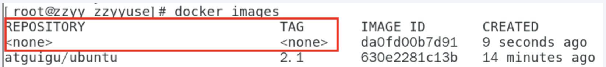
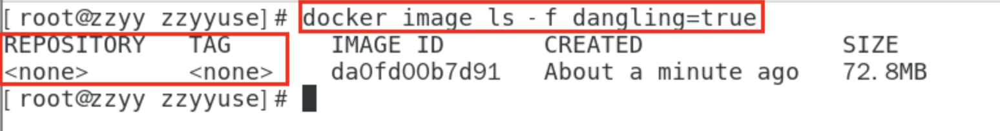
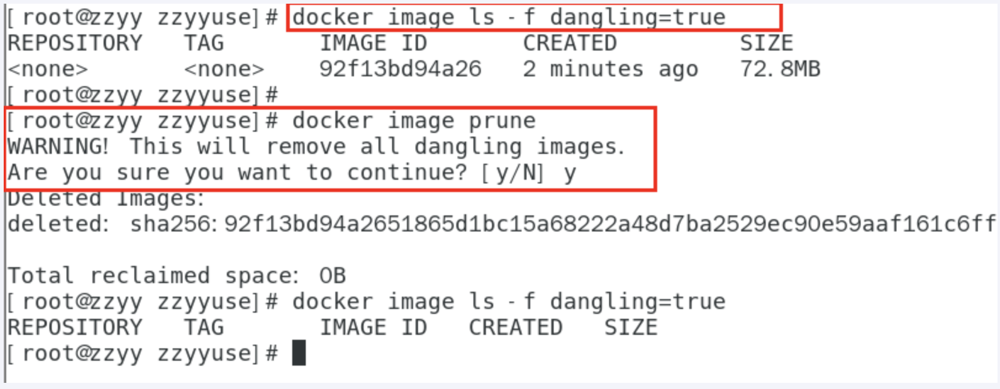

# 1.docker 虚悬镜像


## 1.1 是什么?

仓库名，标签都是\<none\>的镜像，俗称就是dangling image，虚悬镜像


## 1.2 如何生成虚悬镜像

方式1：我们可以通过docker commit但是不带仓库名和标签名，来生成虚悬镜像

方式2：我们可以通过dockerfile来生成，完整的代码如下：

```dockerfile
FROM ubuntu
CMD echo 'action is success'
```

然后我们直接docker build .

而没有docker build -t .

这样生成的最后的镜像就是虚悬的镜像




## 1.3 查看是否是虚悬镜像?

**命令：**

```
docker image ls -f dangling=true
```

**结果如下：**




## 1.4 如何一次性删除所有的虚悬镜像

**为什么要删除？**

由于虚悬镜像已经失去存在的价值，可以进行删除

**命令：**

```
docker image prune
```

**结果如下：**


