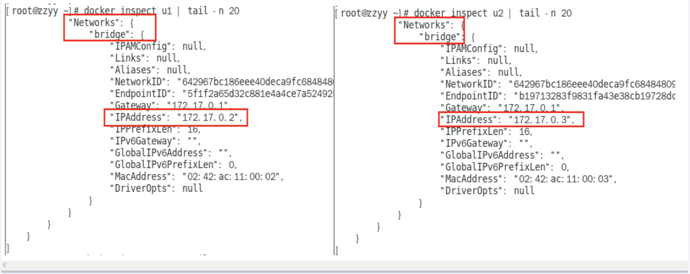

# 1. docker 网络介绍

## 1.1 docker 网络是什么?

**默认的网络情况**

在 macos 之中存在 en0 接口：它的地址是192.168.10.103

在 macos 之中存在 lo0 接口：它的地址是127.0.0.1

Docker 在 Mac 中的实现是通过 Hypervisor 创建一个轻量级的虚拟机，然后 将 docker 放入到虚拟机中实现。Mac OS 宿主机和 Docker 中的容器通过 /var/run/docker.sock 这种 socket 文件来通信，所以在 Mac OS 中 ping 容器的 IP，在容器中 ping 宿主机的 IP 就不通。

所以mac之中是没有docker0这块网卡的。

## 1.2 docker network 常用基本命令

**命令：docker network ls** 

功能：用来查看网络

**命令：docker network inspect xxx**

功能：用来查看 xxx 的网络的内容

**命令：docker network rm xxx** 

功能：用来进行网络的删除

**总结实战案例：**

## 1.3 docker network 能干什么

在以后，我们是要做docker网络管理和容器调用之间的规划的，现在其实我们在单个机器上其实还好，所有的容器都在同一个网段上。

那么docker network能具体干什么呢？主要是下面的两点：

- 容器之间的互联和通信以及端口的映射

- 容器IP变动的时候可以通过服务名直接网络通信而不受到影响，类似于服务是域名，而不能将服务和ip地址的映射写死，而应该将服务映射到多个容器的多个ip地址上。

## 1.4 docker 的网络模式介绍

- **bridge：**为每个容器分配，设置IP等，并将容器连接到一个docker0虚拟网桥，默认为这个模式。

- **host：**容器将不会虚拟出自己的网卡，配置自己的IP等，而是使用宿主机的IP和端口。

- **none：**容器有独立的network namespace，但并没有对其进行任何网络配置，如分配veth pair和网桥连接，IP等。**[工作之中几乎不会使用]**

- **container：**新创建的容器不会创建自己的网卡和配置自己的IP，而是和一个指定的容器共享IP，端口范围等。

## 1.5 容器实力内默认网络IP生成的规则

**举例说明：**

首先docker run出两个ubuntu的实例：

然后docker inspect 可以查看两个容器的ip地址：

关闭u2实例，新建u3实例，查看ip的变化：

**结论：**

docker 容器内部的ip地址是有可能会发生变化的。

## 1.6 案例演示

### 1.6.1 bridge 桥接模式 [--network bridge 指定]

Docker 服务默认会创建一个 docker0 网桥（其上有一个 docker0 内部接口），该桥接网络的名称为docker0，它在内核层连通了其他的物理或虚拟网卡，这就将所有容器和本地主机都放到同一个物理网络。Docker 默认指定了 docker0 接口 的 IP 地址和子网掩码，**让主机和容器之间可以通过网桥相互通信，mac是不可以的, mac 只能让容器之间相互通信**

Docker使用Linux桥接，在宿主机虚拟一个Docker容器网桥(docker0)，Docker启动一个容器时会根据Docker网桥的网段分配给容器一个IP地址，称为Container-IP，同时Docker网桥是每个容器的默认网关。因为在同一宿主机内的容器都接入同一个网桥，这样容器之间就能够通过容器的Container-IP直接通信。

docker run 的时候，没有指定network的话默认使用的网桥模式就是bridge，使用的就是docker0。在宿主机ifconfig,就可以看到docker0和自己create的network(后面讲)eth0，eth1，eth2……代表网卡一，网卡二，网卡三……，lo代表127.0.0.1，即localhost，inet addr用来表示网卡的IP地址

网桥docker0创建一对对等虚拟设备接口一个叫veth，另一个叫eth0，成对匹配。

- 整个宿主机的网桥模式都是docker0，类似一个交换机有一堆接口，每个接口叫veth，在本地主机和容器内分别创建一个虚拟接口，并让他们彼此联通（这样一对接口叫veth pair）；
- 每个容器实例内部也有一块网卡，每个接口叫eth0；
- docker0上面的每个veth匹配某个容器实例内部的eth0，两两配对，一一匹配。

通过上述，将宿主机上的所有容器都连接到这个内部网络上，两个容器在同一个网络下,会从这个网关下各自拿到分配的ip，此时两个容器的网络是互通的。 

在ubuntu上安装docker是能够做到一一对应的：上面的是宿主机，下面的两张是容器，红色和红色进行对应，蓝色和蓝色进行对应，即我们的veth<-->eth0

### 1.6.2 主机模式 [--network host 指定]

直接使用宿主机的IP地址和外界进行通信，不再需要额外的NAT转换。容器将不会获得一个独立的Network Namespace， 而是和宿主机共用一个Network Namespace。容器将不会虚拟出自己的网卡而是使用宿主机的IP和端口。

**问题说明：**

docke启动时总是遇见标题中的警告

**原因：**

docker启动时指定--network=host或-net=host，如果还指定了-p映射端口，那这个时候就会有此警告，并且通过-p设置的参数将不会起到任何作用，端口号会以主机端口号为主，重复时则递增。

**解决:**

解决的办法就是使用docker的其他网络模式，例如--network=bridge，这样就可以解决问题，或者直接无视。。。。O(∩_∩)O哈哈~，或者不添加端口映射，那么我们不添加端口映射之后，访问的时候就只要访问默认端口就行，比如tomcat就是8080

### 1.6.3 无网络模式 [--network none 指定]

**是什么：**

禁用了网络功能，即在none模式下，并不为docker容器进行任何的网络配置，也就是说，这个docker容器没有网卡，ip，路由等信息，只有一个lo即回环口，需要我们自己为docker容器添加网卡，配置ip等。

### 1.6.4 container网络模式 [--network containter:NAME或者容器ID 指定]

新建的容器和已经存在的一个容器共享一个网络ip配置而不是和宿主机共享。新创建的容器不会创建自己的网卡，配置自己的IP，而是和一个指定的容器共享IP、端口范围等。同样，两个容器除了网络方面，其他的如文件系统、进程列表等还是隔离的。

