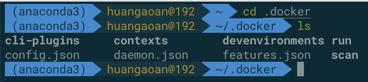
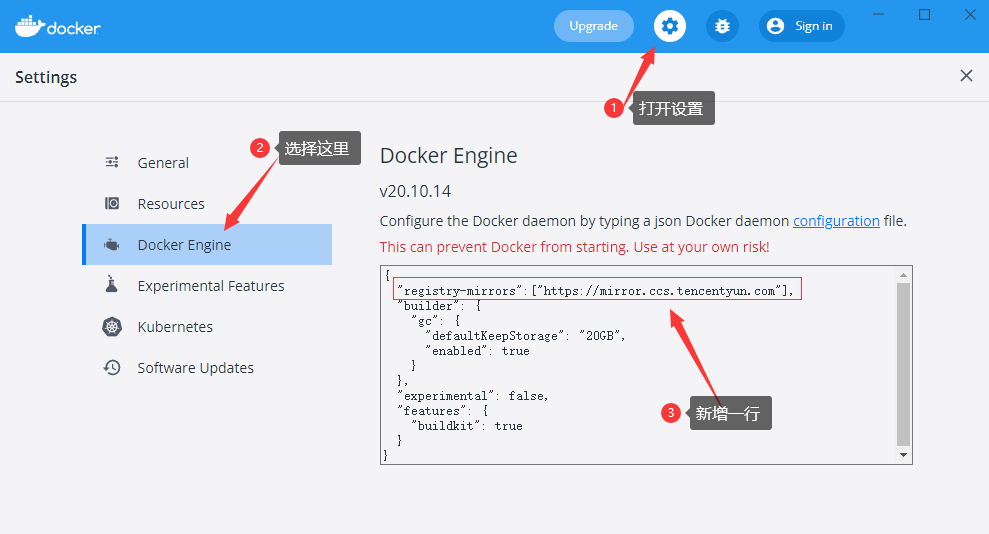

# 1.docker 安装

## 1.1 重要的网站

**docker官网 - 用来进行docker的安装：**

https://www.docker.com/

**docker仓库-安装docker镜像的仓库：**

https://hub.docker.com/

## 1.2 docker的基本组成-三要素

**镜像[image]：**详细来说，docker镜像就是一个只读的模版，镜像可以用来创建docker容器，一个镜像可以创建很多容器。

它也相当于是一个root文件系统。比如官方镜像centos7就包含了一套centos7最小系统的root文件系统。

类似于java之中的类模版

**容器[container]:** 详细来说，docker利用容器独立运行一个或者一组应用，应用程序或者服务运行在容器里面，容器就类似于一个虚拟化的运行环境，容器是用镜像创建的运行实例。容器它可以被启动，开始，停止，删除。每个容器都是相互隔离的，保证平台的安全。

类似于java之中的类模版new出来的实例化的对象。在docker之中容器就是将镜像run起来产生的。

从镜像容器角度可以将容器看作一个简易linux环境（包括root用户权限，进程空间，用户空间和网络空间等）和运行在其中的应用程序。

**仓库[repository]:** 是集中存放镜像的地方，docker公司提供的官方的registry被称之为docker hub，仓库分为公开库和私有库，最大的公开仓库就是docker hub。国内用阿里云和网易云。我们可以将镜像发布到仓库之中，需要的时候再从仓库之中拉取下来即可。

## 1.3 镜像加速源及其设置

| 镜像加速器          | 镜像加速器地址                          |
| ------------------- | --------------------------------------- |
| Docker 中国官方镜像 | https://registry.docker-cn.com          |
| DaoCloud 镜像站     | http://f1361db2.m.daocloud.io           |
| Azure 中国镜像      | https://dockerhub.azk8s.cn              |
| 科大镜像站          | https://docker.mirrors.ustc.edu.cn      |
| 阿里云              | https://<your_code>.mirror.aliyuncs.com |
| 七牛云              | https://reg-mirror.qiniu.com            |
| 网易云              | https://hub-mirror.c.163.com            |
| 腾讯云              | https://mirror.ccs.tencentyun.com       |

下面这个是通过app来进行配置，我们也可以直接修改mac底下的这个配置文件：

daemon.json所对应的就是下面这个app方式配置的json的文件。

