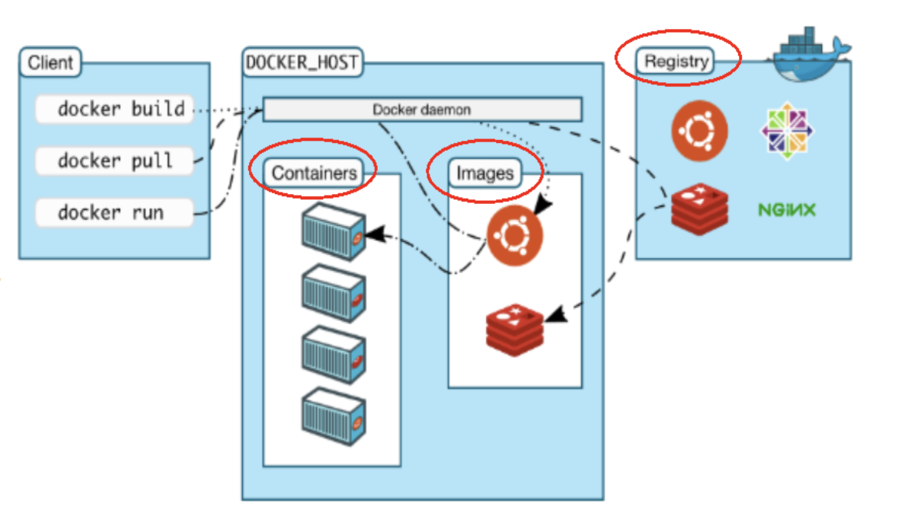

# 1.docker平台架构[入门版]

- client 为客户端

- docker_host 为宿主机

- registry 为镜像仓库

docker客户端连接到宿主机的后台程序即docker daemon，并执行相关的命令，来进行镜像的拉取，运行。如果本地有镜像则直接实例化容器即可。如果本地没有镜像则向仓库进行拉取到本地然后进行容器的实例化。

build操作的含义是，我们可以将本地的运行环境build成为一个我们的镜像，当构建完成后我们也可以将其发布到仓库之中。

**总结：**docker是一个cs架构的系统，docker守护进程运行在主机上，然后通过socket连接从客户端接受命令并管理运行在主机上的容器。