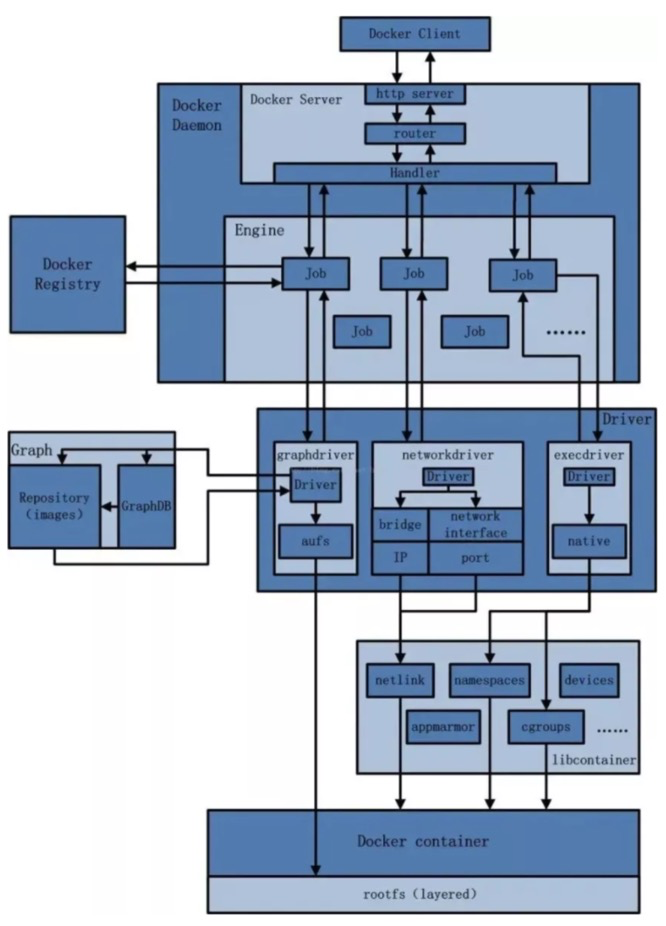

# 1. docker 平台架构图解[架构版]

**docker是一个C/S模式的架构，后端是一个松耦合的架构，众模块各司其职**

**docker的基本运行流程为：**

1. 用户是使用docker client 和 docker daemon 建立socket套接字通信，并发送请求给后者。
2. docker daemon 作为 docker 架构中的主体部分，首先提供docker server的功能使其可以接受docker client的请求。
3. docker engine 执行 docker 内部的一系列工作，每一项工作都是以一个 job的形式存在，每一个容器就是一个job。
4. job的运行过程之中，当需要容器镜像的时候，则从docker registry中下载镜像，并通过镜像管理驱动 graph drive 将下载镜像以 graph的形式存储。
5. 当需要为docker创建网络环境的时候[docker容器之间可以进行通信，多个docker之间也可以进行通信]，通过网络管理驱动network driver创建并配置docker容器网络环境。
6. 当需要限制docker容器运行资源或者执行用户指令等操作的时候，通过exec driver来完成。
7. libcontainer是一项独立的容器管理包，network driver以及exec driver都是通过libcontainer来实现具体对容器进行的操作。
8. rootfs是最小最核心的linux内核