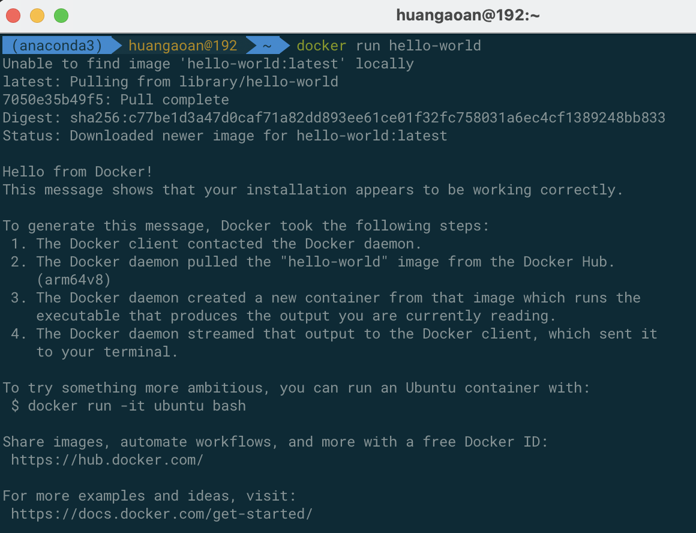
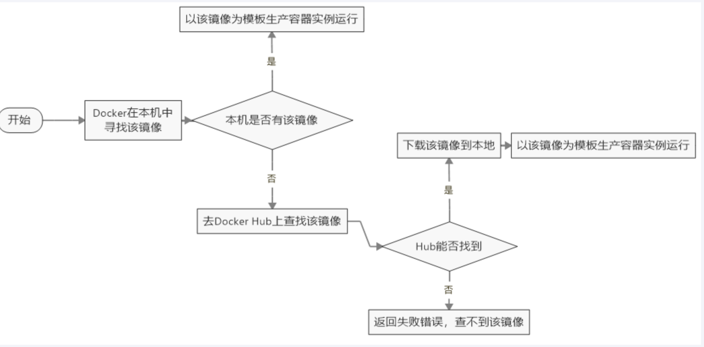
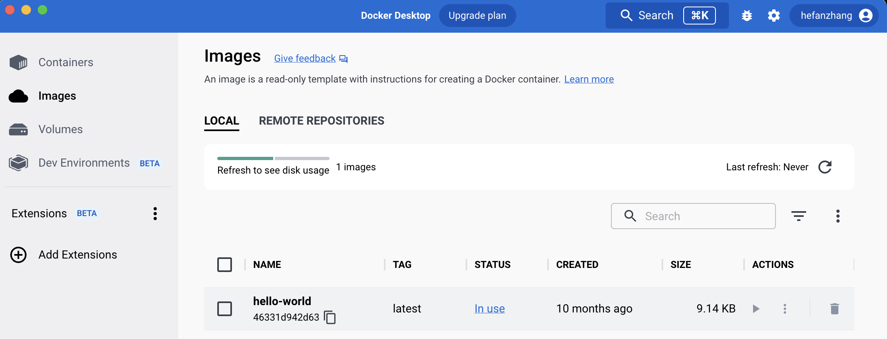
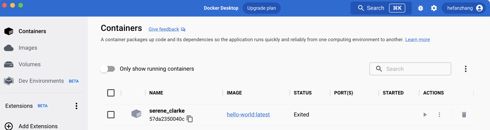

# 1.hello world

命令：docker run hello-world

因为本地没有镜像，所以先进行了拉去，然后输出了一段内容

Hello from Docker!

This message shows that your installation appears to be working correctly.

然后hello world 就会停止运行，容器自动终止。

**下面是docker run的运行流程图：**

**在mac的image上也可以看到结果：**

**在mac的containers上可以看到停止运行的容器：**

