# 1. docker 常用命令

## 1.1 启动与帮助命令

**linux环境下, mac环境下不需要：**

启动docker：systemctl start docker

停止docker：systemctl stop docker

重启docker：systemctl restart docker

查看docker状态：systemctl status docker

开机启动：systemctl enable docker

**所有环境下：**

查看docker概要信息：docker info

查看docker总体帮助文档：docker --help

查看docker命令帮助文档：docker 具体命令 --help

**解析一下docker info：**

当我们还没有打开macos上的docker desktop的时候会出现如下的docker info提示信息。发现无法连接到服务器。

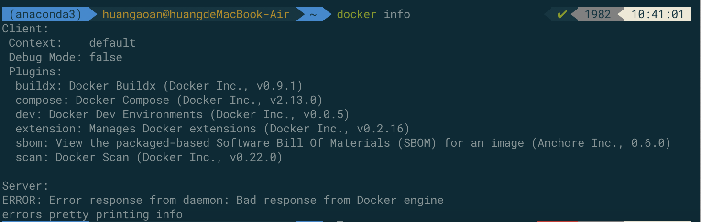

当我们打开了我们的macos上的docker desktop的时候会出现如下的docker info提示信息，会显示我们连接到的服务器的docker daemon的信息，比如服务器存在的镜像数量，服务器存在的容器数量等等。

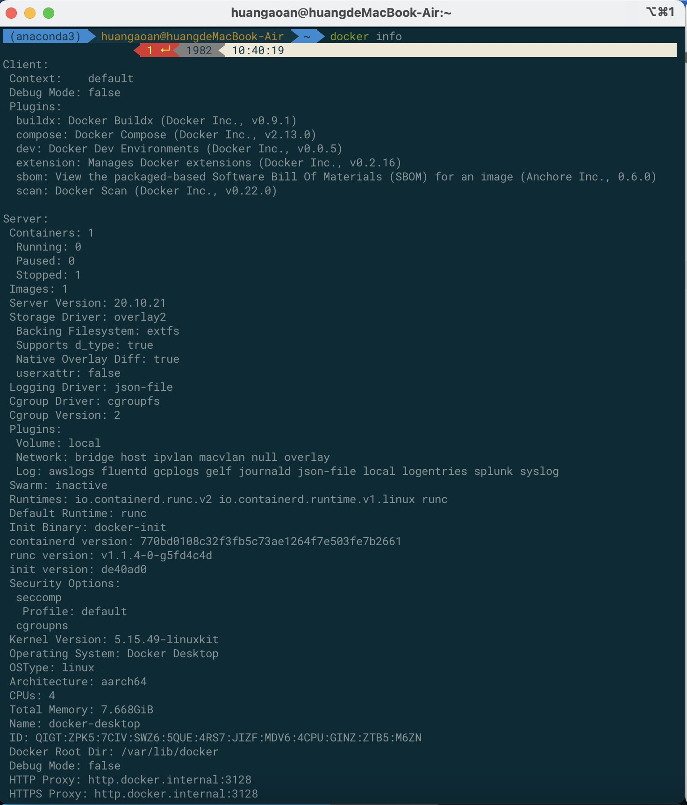

## 1.2 镜像命令

**命令1：docker images**

功能：列出本地主机上的镜像

显示字段说明：

| 序号 | 字段       | 含义                                                         |
| ---- | ---------- | ------------------------------------------------------------ |
| 1    | REPOSITORY | 表示镜像的仓库源                                             |
| 2    | TAG        | 同一个仓库源可以有多个TAG版本，代表这个仓库源的不同版本，这个TAG其实就是版本号，比如我们不想装最新版latest，我们可以指定版本。我们一般使用REPOSITORY:TAG来进行我们想要使用的镜像的定位。 |
| 3    | IMAGE ID   | 镜像ID                                                       |
| 4    | CREATED    | 什么时候创建的镜像                                           |
| 5    | SIZE       | 镜像大小                                                     |

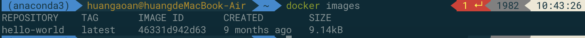

选项说明：

| 序号 | 选项 | 含义                             |
| ---- | ---- | -------------------------------- |
| 1    | -a   | 列出本地所有镜像[含有历史镜像层] |
| 2    | -q   | 只显示镜像ID                     |
| 3    | -q a | 列出本地所有镜像的主键ID         |

**命令2：docker search 某个xxx镜像的名字**

功能：查询某个镜像是否在远程仓库，而不是在本地仓库

显示字段说明：

| 序号 | 选项        | 含义                     |
| ---- | ----------- | ------------------------ |
| 1    | NAME        | 镜像名称                 |
| 2    | DESCRIPTION | 镜像描述                 |
| 3    | STARS       | 在docker-hub被star的数量 |
| 4    | OFFICIAL    | 是否是官方镜像           |
| 5    | AUTOMATED   | 是否是自动构建编译的     |

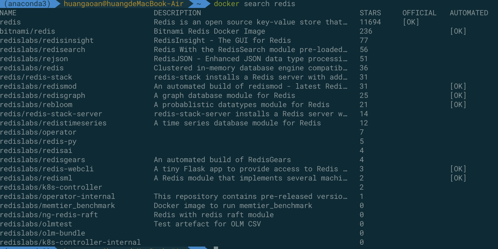

选项说明：

| 序号 | 选项      | 含义                                                |
| ---- | --------- | --------------------------------------------------- |
| 1    | --limit N | 感觉列出的镜像数量太多了，这里只列出查询到的N个镜像 |

**命令3：docker pull 某个xxx镜像的名字[:TAG]** 中括号代表可选项

功能：从远程仓库拉取某个镜像，如果不加:TAG则代表默认下载最新版本的。

**命令4：docker system df** 

功能：查看镜像/容器/数据卷所占用的空间

字段说明：

| 序号 | 名称        | 含义       |
| ---- | ----------- | ---------- |
| 1    | TOTAL       | 总共数量   |
| 2    | ACTIVE      | 是否活跃   |
| 3    | SIZE        | 大小       |
| 4    | RECLAIMABLE | 可回收内存 |

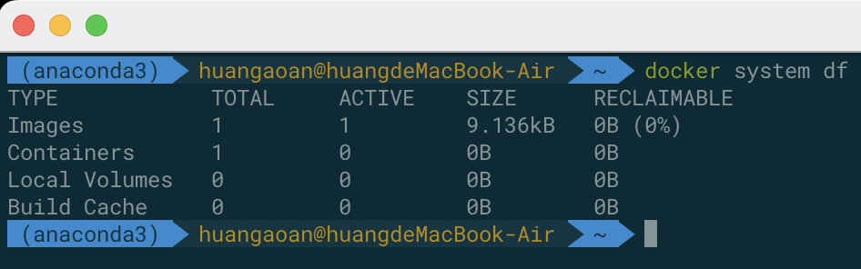

 TYPE说明：

| 序号 | 类型          | 含义       |
| ---- | ------------- | ---------- |
| 1    | Images        | 镜像       |
| 2    | Containers    | 容器       |
| 3    | Local Volumes | 本地卷     |
| 4    | Build Cache   | 构建的缓存 |

**命令5：docker rmi 某个镜像名字ID**

功能：进行某个镜像的删除

注意事项：当存在停止的或者运行的由该镜像生成的容器，我们应该强制将镜像删除。

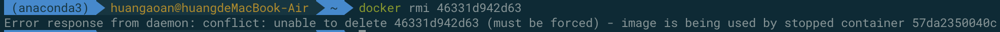

选项说明：

| 序号 | 选项 | 含义     |
| ---- | ---- | -------- |
| 1    | -f   | 强制删除 |

结合使用[强制删除所有的镜像]：docker rmi -f $(docker images -qa) 

**问题：docker的虚悬镜像是什么？**

仓库名，标签都是<none>的镜像，俗称虚悬镜像 dangling images

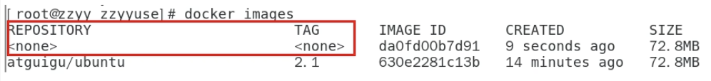

后续到dockerfile的时候再进行介绍。

## 1.3 容器命令

### 1.3.1 新建+启动容器

**命令：docker run [OPTIONS] IMAGE_NAME [COMMAND] [ARG...]**

**选项说明：**

| 序号 | 参数   | 说明                                                         |
| ---- | ------ | ------------------------------------------------------------ |
| 1    | --name | 为容器进行名称的指定，如果不进行指定，将会使用系统随机分配的名字 |
| 2    | -d     | 后台运行容器并返回容器id，即启动守护式容器[后台运行]         |
| 3    | -i     | 以交互模式运行容器，通常与-t同时进行使用，i 代表interactive  |
| 4    | -t     | 为容器重新分配一个伪输入终端，通常与-i同时使用，t代表tty     |
| 5    | -P     | 随机端口映射                                                 |
| 6    | -p     | 指定端口映射，将容器的端口暴露到宿主机的端口                 |

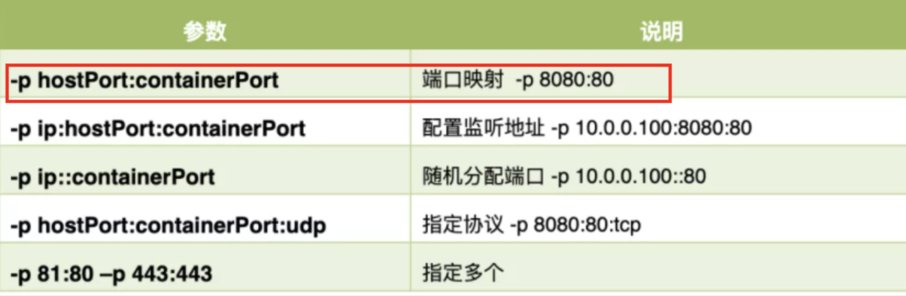

**重要操作：启动交互式容器[前台命令行]**

对应的命令：docker run -it ubuntu /bin/bash   

放在镜像名后面的是命令，这里我们希望有一个交互式的shell，所以使用的是/bin/bash

现在运行起来了一个ubuntu系统，并返回给我了一个终端命令行，我可以用这个终端去操作这个容器。

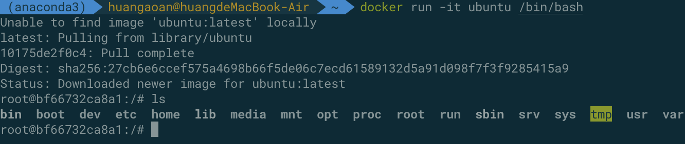

### 1.3.2 列出docker中所有正在运行的容器

**命令：docker ps [OPTIONS]**

**结果展示：**

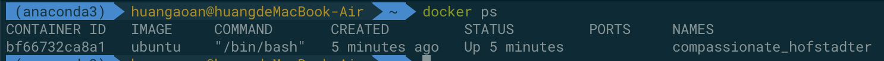

**字段说明：**

| 序号 | 名称         | 含义                                                         |
| ---- | ------------ | ------------------------------------------------------------ |
| 1    | CONTAINER_ID | 容器ID                                                       |
| 2    | IMAGE        | 创建容器的镜像名称                                           |
| 3    | COMMAND      | 执行的命令                                                   |
| 4    | CREATED      | 什么时候被创建的                                             |
| 5    | STATUS       | 容器状态                                                     |
| 6    | PORTS        | 暴露的端口                                                   |
| 7    | NAMES        | 自动分配的名称，因为我们没有指定名称 ，可以使用--name指定我们想要使用的名称即可。 |

**选项说明：**

| 序号 | 选项 | 含义                                               |
| ---- | ---- | -------------------------------------------------- |
| 1    | -a   | 查询运行过的和正在运行的所有容器，不包括删除的容器 |
| 2    | -l   | 显示最近创建的容器                                 |
| 3    | -n   | 显示最近n个创建的容器                              |
| 4    | -q   | 静默模式，只显示容器编号                           |

### 1.3.3 退出容器

使用exit可以进行退出，但是退出之后，容器也会变为停止的状态，并且不会再docker ps之中显示出来。

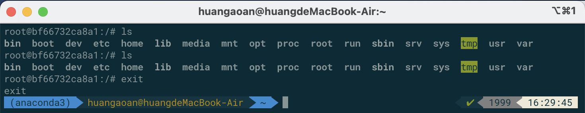

使用ctrl+p+q退出，容器不停止运行。

### 1.3.4 启动已经停止的容器

**命令：docker start 容器ID或者容器的名字**

### 1.3.5 停止容器

**命令：docker stop 容器ID或者容器名**

### 1.3.6 强制停止容器

**命令：docker kill 容器ID或者容器名**

### 1.3.7 删除已经停止的容器

**命令：docker rm 容器ID** [这个容器ID所对应的容器一定要是一个停止的容器，这个是rm对应于删除镜像的rmi]

**选项：**-f 代表进行强制删除

**一次性删除多个容器实例：**

方式1：docker rm -f ${docker ps -aq}

方式2：docker ps -aq | xargs docker rm

### 1.3.8 守护式容器的创建

大部分的场景下，我们希望docker的服务是在后台运行的，我们可以通过-d指定容器的后台运行模式

**命令：**docker run -d 容器名

**问题：**当我们docker run -d ubuntu 之后，然后使用docker ps -a 进行查看，会发现容器已经退出。这里有很重要的一点要进行说明：docker容器在后台运行就必须要有一个前台进程。容器运行的命令如果不是那些会一直挂起的命令，比如运行top，tail等，就是会自动退出的，因为它无事情可做。

**解决方案：**最佳的解决方案是，将你要运行的程序以前台进程的形式进行运行，常见的就是命令行模式，表示我还有交互操作，别自杀，即docker run -it 镜像的名字

**启动后台服务：**但是如果不是启动ubuntu，如果我们要启动redis，mysql，mongodb这样的服务，他们可以直接使用docker run -d 容器名，而不用使用docker run -it 镜像的名字，这样也有一个好处，在后台运行我们不会误把terminal关掉导致服务的停止。

### 1.3.9 查看容器的日志

**命令：**docker logs 容器ID

**功能：**我们的操作流程是：编码开发微服务，上线部署容器化，时时刻刻要监控，而监控就是通过这个命令来执行，后面高级部分有更完善的图形化的界面

### 1.3.10 查看容器内运行的进程

**命令：**docker top 容器ID

**运行案例：**

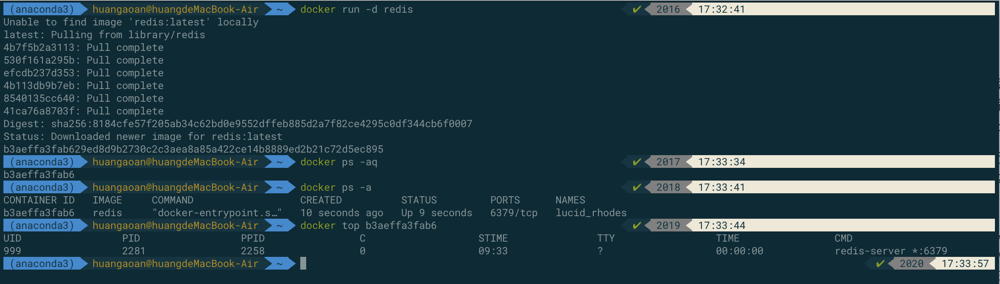

### 1.3.11 查看容器的内部细节

**命令：**查看容器的内部的细节，以json的格式，在高级部分[网络部分]可能会经常使用这个。

**运行案例：**

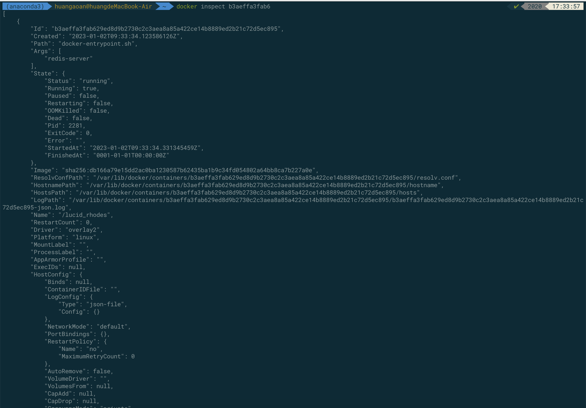

### 1.3.12 进入正在运行的容器并以命令行交互

**方式1-命令：**docker exec -it 容器ID /bin/bash

**方式2-命令：**docker attach 容器ID

**上述两个命令的区别：**

[1] attach 直接进入容器启动命令的终端，不会启动新的进程，用exit退出，会导致容器的停止。

[2] exec 是在容器中打开新的终端，并且可以启动新的进程用exit退出，不会导致容器的停止。

**推荐使用：**

推荐大家使用docker exec 命令，因为退出容器终端，不会导致容器的停止。

**推荐操作：**

一般用-d后台启动的程序，再使用exec -it进入后台干活

### 1.3.13 从容器拷贝文件到主机上

**命令：**docker cp 容器ID : 容器内路径 目的主机路径

### 1.3.14 导入导出容器

**需求：**我想要整个镜像整个容器来进行备份的操作

导出export：导出容器的内容流作为一个tar归档文件

导入import：从tar包中的内容创建一个新的文件系统再导入为镜像

导出命令：docker export 容器ID > 文件名.tar

导入命令：cat 文件名.tar | docker import - 仓库源/镜像名:镜像版本号

### 1.3.15 总结所有的命令

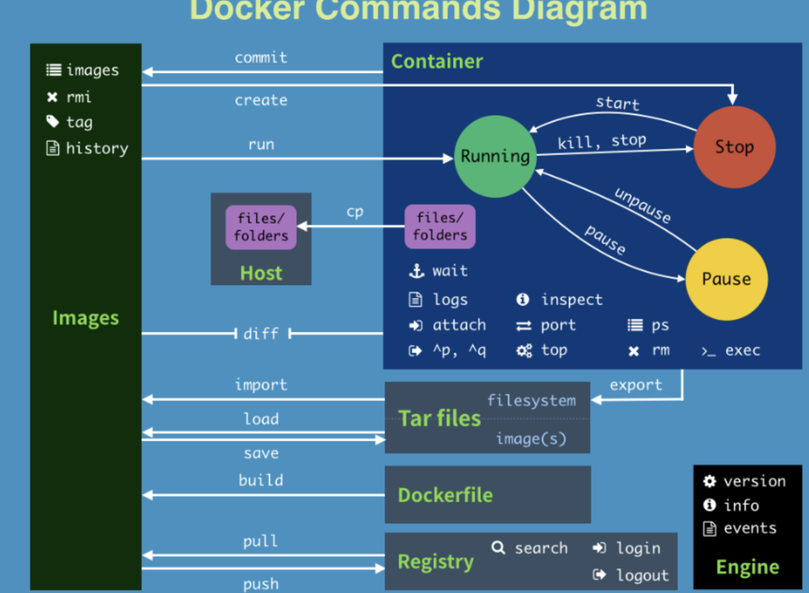

attach   Attach to a running container         # 当前 shell 下 attach 连接指定运行镜像

build   Build an image from a Dockerfile        # 通过 Dockerfile 定制镜像

commit   Create a new image from a container changes  # 提交当前容器为新的镜像

cp     Copy files/folders from the containers filesystem to the host path  #从容器中拷贝指定文件或者目录到宿主机中

create   Create a new container             # 创建一个新的容器，同 run，但不启动容器

diff    Inspect changes on a container's filesystem  # 查看 docker 容器变化

events   Get real time events from the server      # 从 docker 服务获取容器实时事件

exec    Run a command in an existing container     # 在已存在的容器上运行命令

export   Stream the contents of a container as a tar archive  # 导出容器的内容流作为一个 tar 归档文件[对应 import ]

history  Show the history of an image          # 展示一个镜像形成历史

images   List images                  # 列出系统当前镜像

import   Create a new filesystem image from the contents of a tarball # 从tar包中的内容创建一个新的文件系统映像[对应export]

info    Display system-wide information        # 显示系统相关信息

inspect  Return low-level information on a container  # 查看容器详细信息

kill    Kill a running container            # kill 指定 docker 容器

load    Load an image from a tar archive        # 从一个 tar 包中加载一个镜像[对应 save]

login   Register or Login to the docker registry server   # 注册或者登陆一个 docker 源服务器

logout   Log out from a Docker registry server      # 从当前 Docker registry 退出

logs    Fetch the logs of a container         # 输出当前容器日志信息

port    Lookup the public-facing port which is NAT-ed to PRIVATE_PORT   # 查看映射端口对应的容器内部源端口

pause   Pause all processes within a container     # 暂停容器

ps     List containers                # 列出容器列表

pull    Pull an image or a repository from the docker registry server  # 从docker镜像源服务器拉取指定镜像或者库镜像

push    Push an image or a repository to the docker registry server   # 推送指定镜像或者库镜像至docker源服务器

restart  Restart a running container          # 重启运行的容器

rm     Remove one or more containers         # 移除一个或者多个容器

rmi    Remove one or more images    # 移除一个或多个镜像[无容器使用该镜像才可删除，否则需删除相关容器才可继续或 -f 强制删除]

run    Run a command in a new container        # 创建一个新的容器并运行一个命令

save    Save an image to a tar archive         # 保存一个镜像为一个 tar 包[对应 load]

search   Search for an image on the Docker Hub     # 在 docker hub 中搜索镜像

start   Start a stopped containers           # 启动容器

stop    Stop a running containers           # 停止容器

tag    Tag an image into a repository         # 给源中镜像打标签

top    Lookup the running processes of a container  # 查看容器中运行的进程信息

unpause  Unpause a paused container           # 取消暂停容器

version  Show the docker version information      # 查看 docker 版本号

wait    Block until a container stops, then print its exit code  # 截取容器停止时的退出状态值
