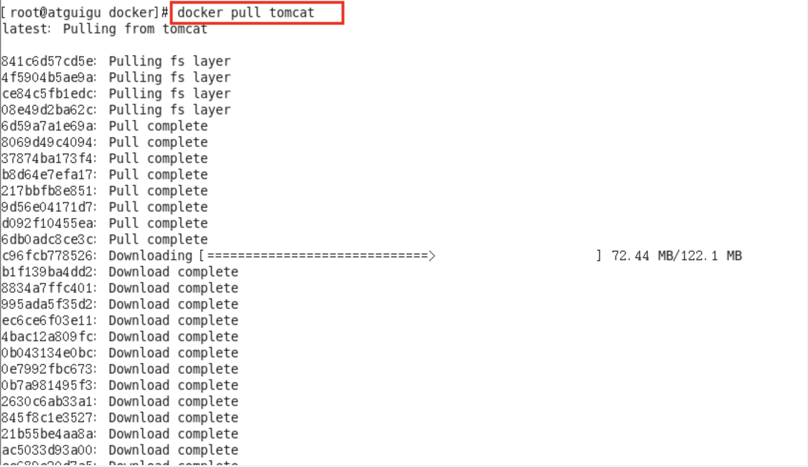
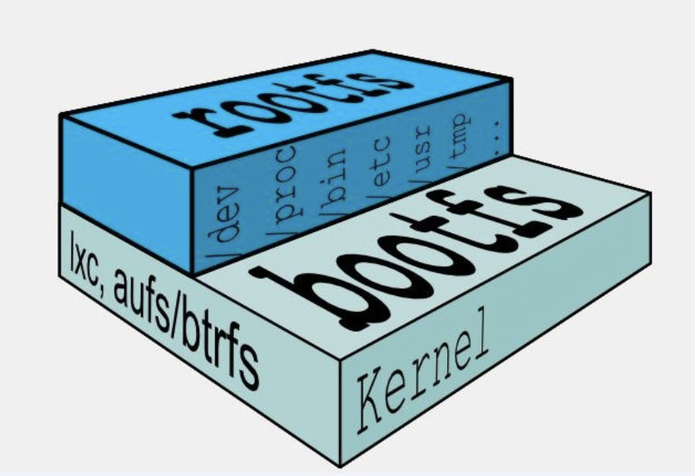
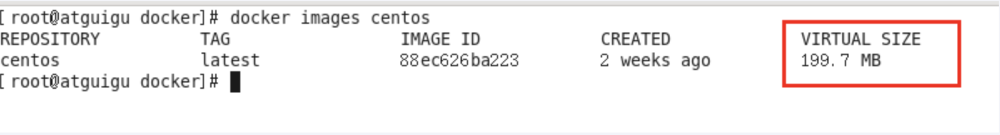
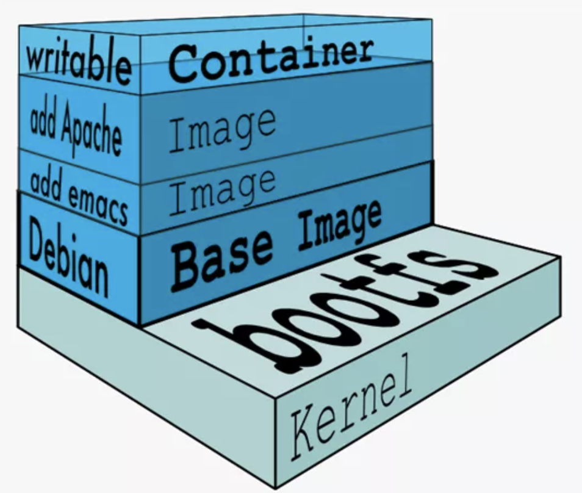
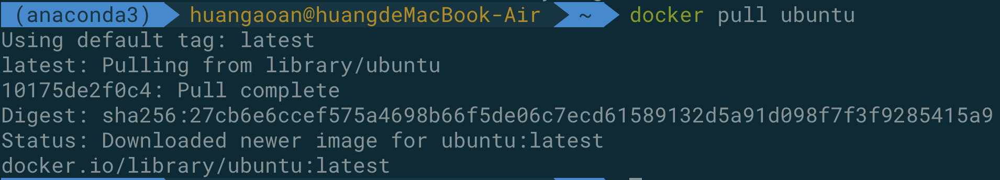
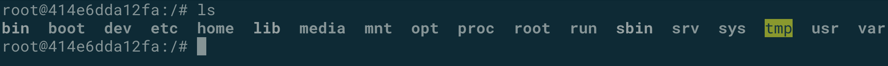
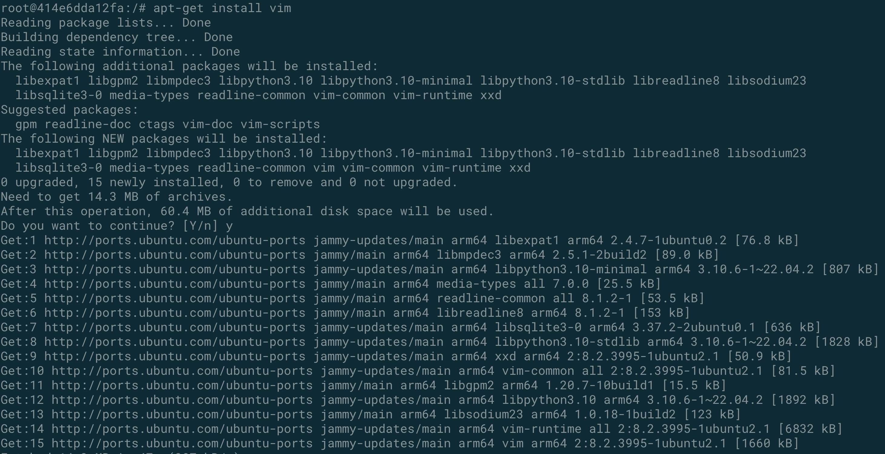
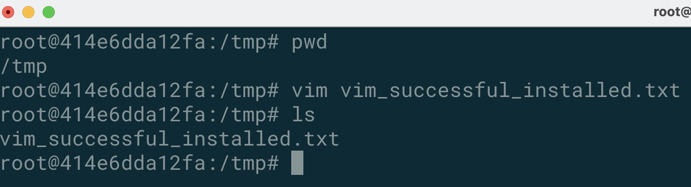
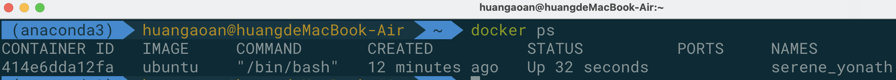
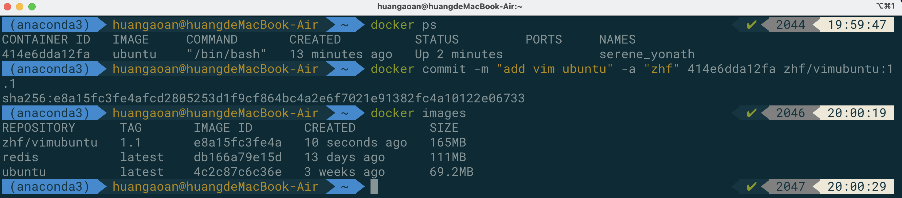

# 1. docker 镜像

## 1.1 什么是docker镜像

镜像是一种轻量级，可执行的独立软件包，它包含运行某个软件所需要的全部内容，我们将应用程序和配置依赖打包好形成一个可交付的运行环境（包括代码，运行时需要的库，环境变量，配置文件等），这个打包好的运行环境就是image镜像文件。只有通过这个镜像文件才能生成docker容器实例（类似java中new出来一个对象）。

## 1.2 镜像是分层的

以我们的docker pull命令为例，在下载的过程之中我们可以看到docker的镜像好像是一层层的在进行下载。

## 1.3 为什么镜像是分层的 ?  UnionFs 联合文件系统

UnionFs（联合文件系统）：是一种分层的，轻量级并且高性能的文件系统，它支持对文件系统的修改作为一次提交来一层层的叠加，同时可以将不同目录挂载到同一个虚拟文件系统下（unite several directories into a single virtual filesystem）。Union文件系统是docker镜像的基础。镜像可以通过分层来进行集成，基于基础镜像（没有父镜像），可以制作各种具体的应用镜像。

总结：docker的镜像堆叠起来，相当于一次同时加载多个文件系统，但是从外面看起来，只能够看到一个文件系统，联合加载会将各层的文件系统叠加起来，这样最终的文件系统会包含所有底层的文件和目录。

## 1.4 docker 镜像的加载的原理

docker的镜像实际上由一层一层的文件系统组成，这种层级的文件系统UnionFS。

下面是两个最基础的层，因为每个容器实例都是一个简易的linux环境，以及运行在其中的应用程序的组合。

bootfs(boot file system)：主要包含bootloader和kernel, bootloader主要是引导加载kernel, Linux刚启动时会加载bootfs文件系统，在Docker镜像的最底层是引导文件系统bootfs。这一层与我们典型的Linux/Unix系统是一样的，包含boot加载器和内核。当boot加载完成之后整个内核就都在内存中了，此时内存的使用权已由bootfs转交给内核，此时系统也会卸载bootfs。 

rootfs (root file system) ：在bootfs之上。包含的就是典型 Linux 系统中的 /dev, /proc, /bin, /etc 等标准目录和文件。rootfs就是各种不同的操作系统发行版，比如Ubuntu，Centos等等。 

**平时我们装一个ubuntu虚拟机很大，为什么这些很小？**

对于一个精简的OS，rootfs可以很小，只需要包括最基本的命令、工具和程序库就可以了，因为底层直接用Host的kernel，自己只需要提供 rootfs 就行了。由此可见对于不同的linux发行版, bootfs基本是一致的, rootfs会有差别, 因此不同的发行版可以公用bootfs。

## 1.5 docker 镜像为什么要采用这种分层的结构 ?

镜像分层的最大的一个好处就是共享资源，方便复制迁移，就是为了复用。

比如说多个镜像都从相同的base镜像构建而来，那么docker host只需要在磁盘上保存一份base镜像，同时内存中也只需要加载一份base镜像，就可以为所有容器服务了。而且镜像的每一层都可以被共享。

## 1.6 注意事项

docker的镜像层都是只读的，容器层是可写的 

当容器启动的时候，一个新的可写层被加载到镜像的顶部。这一层通常称之为容器层。容器层之下的都称之为镜像层。所有对于容器的改动，无论是添加删除还是修改文件都只会发生在容器层之中，只有容器层是可写的，容器层下面的所有镜像层都是只读的。就像我们吃鸡蛋，肯定先要剥掉鸡蛋壳吃鸡蛋白，然后才能够吃鸡蛋黄。

## 1.7 docker 镜像 commit 操作案例

**说明：**我们可以使用 docker commit 提交容器副本使得其成为一个新的叠加的镜像。

**完整命令：**docker commit -m="提交的描述信息" -a="作者" 容器ID 要创建的目标镜像名:[标签的名称]

**示范案例：**安装一个带有vim的ubuntu

**first step : 首先进行docker的pull**

**second step : 然后进行docker的运行**

输入的命令为：docker run -it ubuntu /bin/bash 进入到如下的界面

**third step ：进行vim的安装**

首先使用：apt-get update 更新包管理工具

然后使用：apt-get install vim 进行vim的安装

最终我们可以成功的进行vim的使用：

**fourth step：commit我们自己的新的镜像**

我们可以exit退出，然后容器会进入exited状态，然后start可以进行容器的启动，我们可以使用docker ps查看到我们的容器

接着我们开始进行commit的过程

从上图之中我们可以观察到，vimubuntu 的大小为165MB，比纯净的ubuntu要大挺多。

## 1.8 总结

docker之中的镜像分层，支持通过扩展现有的镜像，创建新的镜像，类似于java集成于一个base基础类，自己再按需进行扩展。新镜像是从base镜像一层一层叠加生成的，每安装一个软件，或者说每重新提交一次，就在现有的镜像的基础上增加一层。

