# 1. docker本地镜像发布到阿里云


## 1.1 阿里云ECS Docker 生态

**镜像有两种方式生成：**

方式1：通过dockerfile进行手工的编写，后面会进行介绍

方式2：通过编辑容器层，然后 docker commit，形成自己的新的镜像，然后进行提交。

**当我们生成了镜像之后该如何放到云端上去呢？**

我们只要将我们本地新创建的镜像push到云端上去就可以了，其他人只需要从远端pull下来我们的镜像就可以了。

**阿里云是公有云，我们还可以自建私有云**

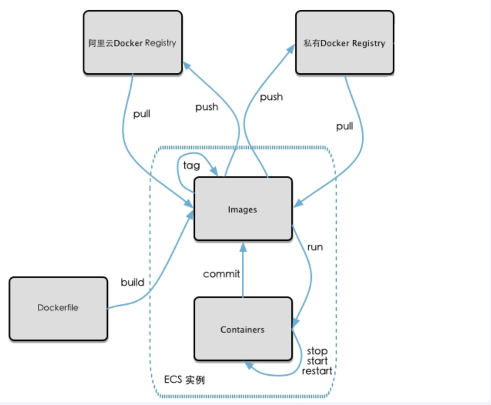


## 1.2 将本地镜像推送到阿里云

网址：https://aliyun.com

首先打开控制台


然后找到容器镜像服务

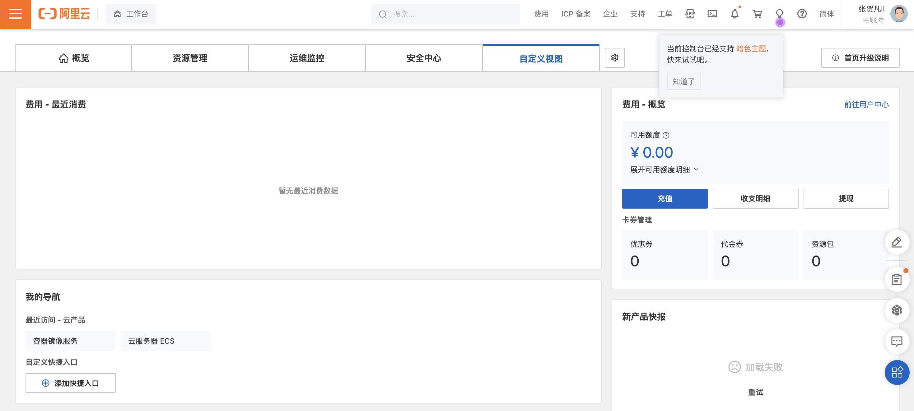

进入后界面如下：然后我们可以进行个人实例的选择

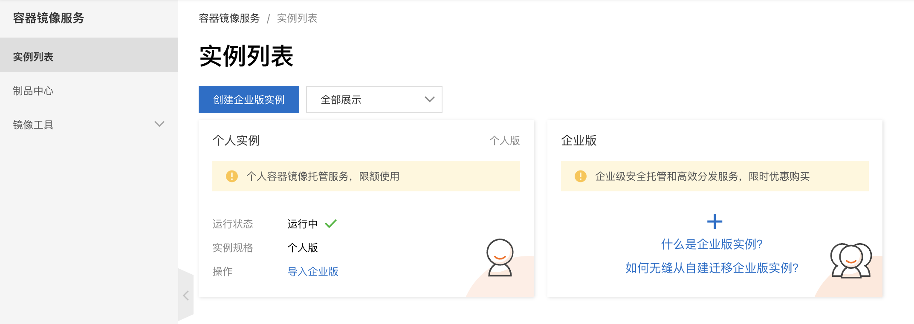

进入后发现分为镜像仓库和命名空间：镜像仓库相当于java的命名空间

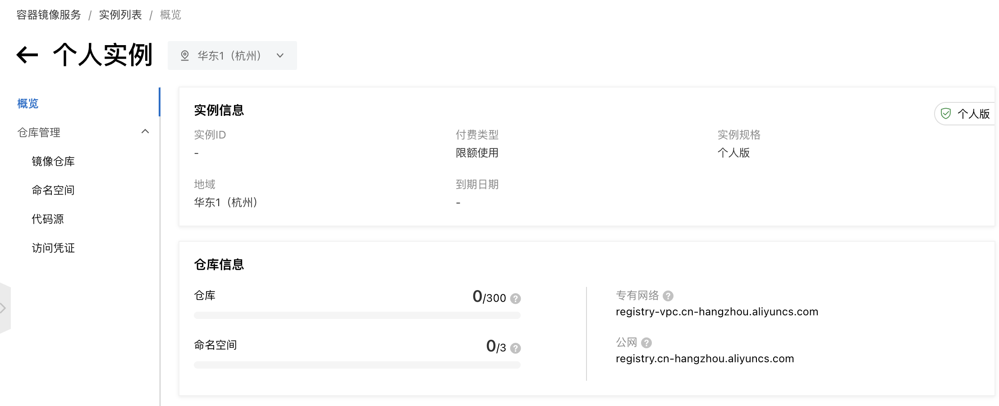

我们首先进行命名空间的创建，具体创建过程如下图所示：

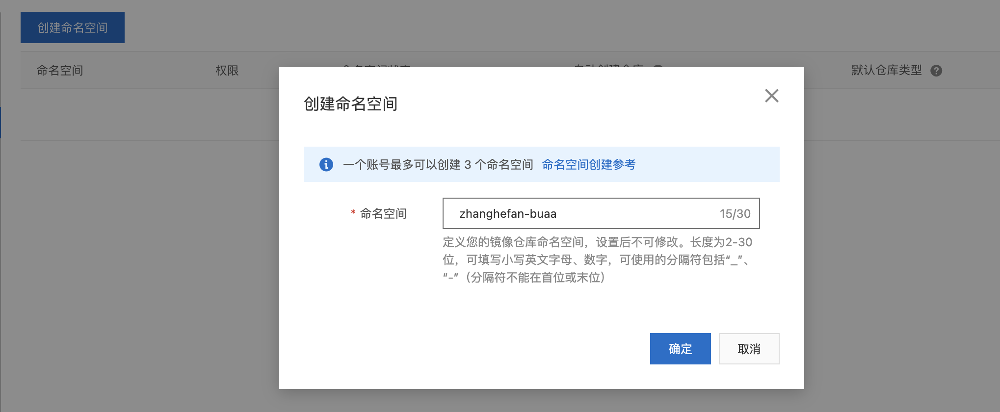

创建成功的结果如下图所示：我们可以点选公开或者私有

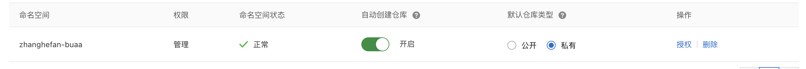

然后我们可以在命名空间下进行镜像仓库的创建：zhanghefan-buaa 即我们选定在这个命名空间下进行镜像仓库的创建

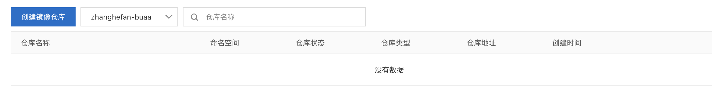

创建过程如下：

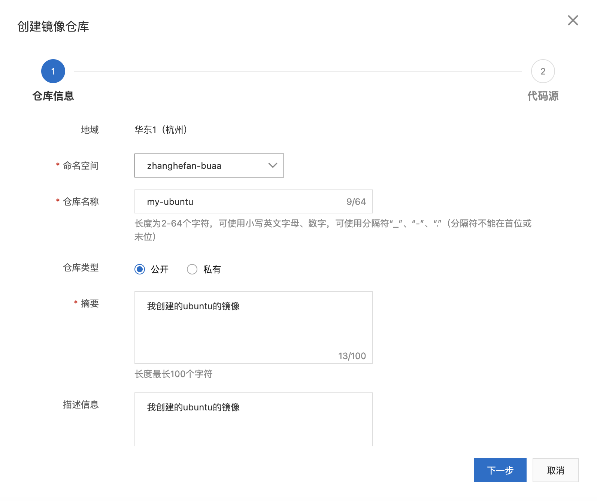

点击下一步选择代码源：

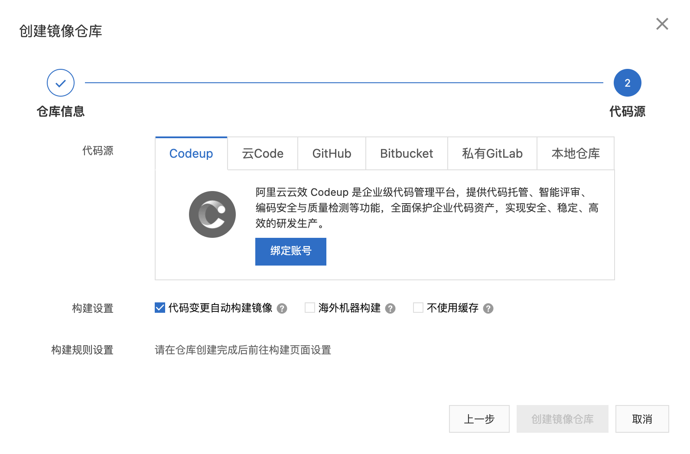

进一步选择本地仓库，之后点击创建镜像仓库：

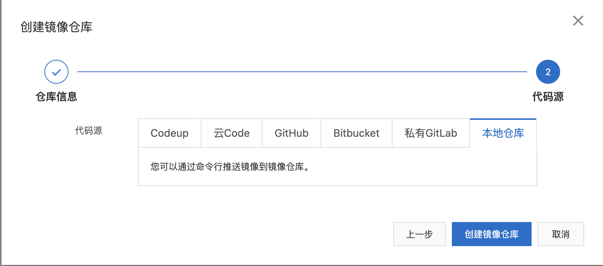


接着出现一系列的命令：这都是aliyun给我们自动生成的脚本命令，不需要我们自己去进行编写。我们只需要重点关注第3步，将镜像推送到远程仓库。

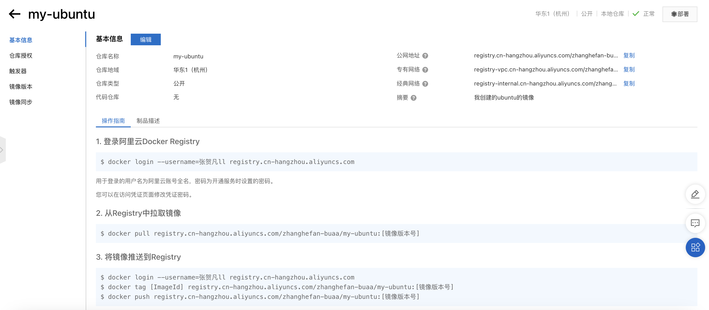


**具体命令如下：**

```
$ docker login --username=张贺凡ll registry.cn-hangzhou.aliyuncs.com
$ docker tag [ImageId] registry.cn-hangzhou.aliyuncs.com/zhanghefan-buaa/my-ubuntu:[镜像版本号]
$ docker push registry.cn-hangzhou.aliyuncs.com/zhanghefan-buaa/my-ubuntu:[镜像版本号]
```

下面说明本地成功链接到了阿里云仓库：

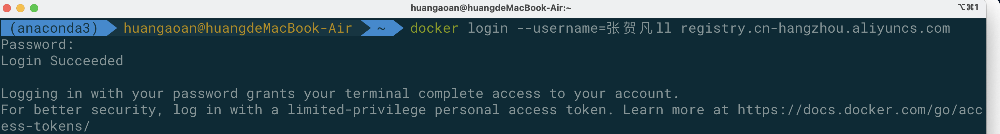

执行下面两条命令发现就能成功的push上去了：

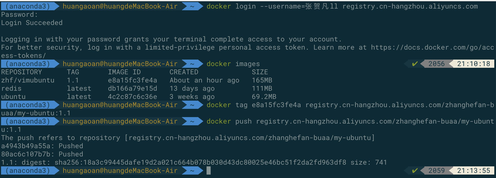


**接着我们查看是否已经成功的推送到了云端：**

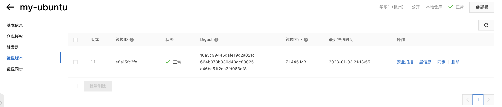


## 1.3 将阿里云云端镜像拉取到本地

使用的命令如下：

```
$ docker pull registry.cn-hangzhou.aliyuncs.com/zhanghefan-buaa/my-ubuntu:[镜像版本号]
```

运行结果如下：

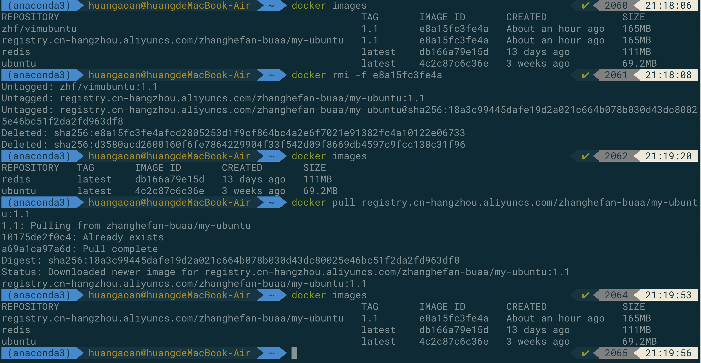


## 1.4 创建本地私有云，并将镜像推送到上面


### 1.4.1 为什么需要私有云：

官方docker hub地址，中国大陆访问太慢了且有被阿里云取代的趋势，不太推荐。

dockerhub 阿里云这样的公共镜像仓库可能不太方便，涉及机密的公司不可能提供镜像给公网，所以需要创建一个本地私人仓库供给团队使用，基于公司内部项目构建镜像。

docker registry 是官方提供的工具，可以用于构建私有镜像仓库。


### 1.4.2 执行步骤：

**下载镜像docker registry**

命令：docker pull registry

运行私有库registry，相当于本地有一个私有的docker hub 服务

创建一个我们自己的新的镜像，类似于安装了vim的ubuntu然后生成的镜像。


**进行容器的运行**

```
docker run -d -p 10000:5000 -v "./zhf_registry":/tmp/registry --privileged=true registry
```

默认情况，仓库被创建在容器的/var/lib/registry目录下，建议自行用容器卷映射，方便于宿主机联调，上面的-v选项是明确的写了容器卷映射，前面是我们宿主机的一个目录，后面是容器内的一个目录：

那么最终的命令就是：下面是将主机的10000端口映射到容器的5000端口，注意10000可以随便改变，但是容器的5000端口不能够随意的改变

发现能够成功的运行


**接着我们运用docker commit命令提交一个有vim和net-tools的ubuntu镜像：**

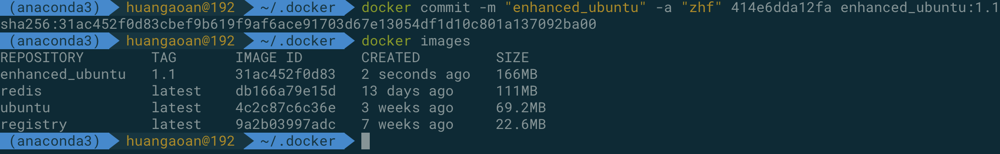


**使用macos查看本地地址：**

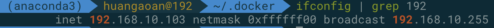


**使用curl验证私有服务器上存在什么镜像。**

命令：curl -XGET http://192.168.10.103:10000/v2/_catalog

发现返回的完全为空：

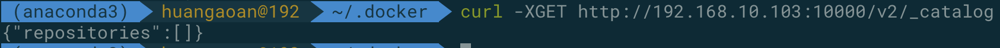


**将新的镜像修改为符合私服规范的tag**

命令：docker tag 镜像:Tag Host:Port/Repository:Tag

实际命令：docker tag enhanced_ubuntu:1.1 192.168.10.103:10000/enhanced_ubuntu:1.1


**修改配置文件使得其能够支持http**

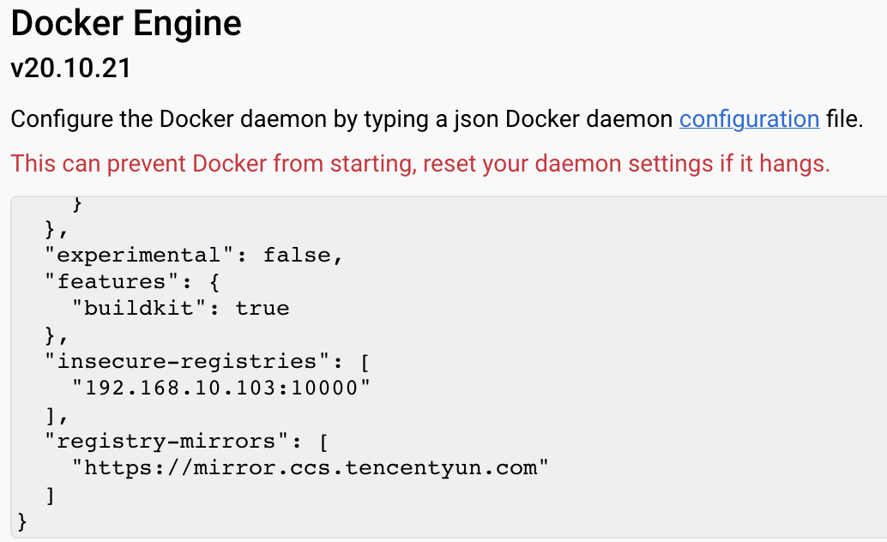

然后我们需要重新启动我们的docker服务


**push到私有库**

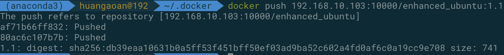


**curl验证私有库上有什么镜像**

命令：curl -XGET http://192.168.10.103:10000/v2/_catalog

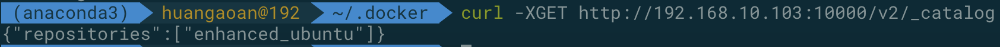


**pull到本地进行运行。**

命令：docker pull 192.168.10.103 :1000/enhanced_ubuntu:1.1

