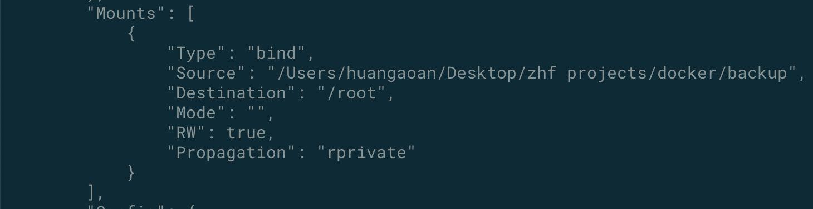
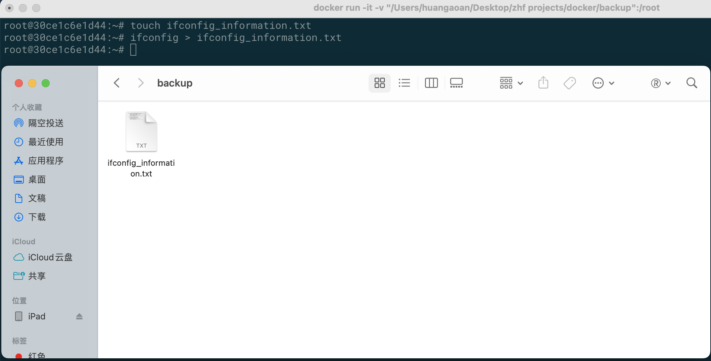
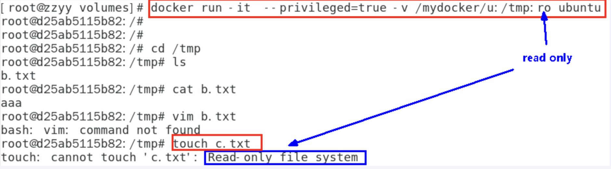

# 1. docker 容器数据卷

## 1.1 记得加入一个参数 👻

问题说明：docker 挂载主机目录访问如果出现 cannot Open Directory : Permission denied 

解决方案：在挂载目录后面多加一个--privileged=true参数就可以了

如果是centos7，安全模块会比之前系统版本加强，不安全的会先禁止，所以目录挂载的情况默认为不安全的行为。

在SELinux里面挂载目录被禁止掉了额，如果要开启，我们一般使用--privileged=true命令，扩大容器的权限解决挂载目录没有权限的问题，也即使用该参数，container内的root拥有真正的root权限，否则，container内的root只是外部的一个普通用户权限。

## 1.2 回顾上一节的-v选项的内容

命令：docker run -d -p 10000:5000 -v "./zhf_registry":/tmp/registry  --privileged=true registry

命令解释：docker run -it --privileged=true -v /宿主机绝对路径目录:/容器内目录 镜像名

含义：-v 前面的路径是宿主机的路径，如果路径不存在，docker会自动进行创建，后面的路径是容器的路径，这样能够实现容器内的某个目录和宿主机的某个目录中的内容可以共享

## 1.3 容器卷是什么？

卷就是目录或文件，存在于一个或多个容器中，由docker挂载到容器，但不属于联合文件系统，因此能够绕过Union File System提供一些用于持续存储或共享数据的特性：

卷的设计目的就是数据的持久化，完全独立于容器的生存周期，因此Docker不会在容器删除时删除其挂载的数据卷

 

## 1.4 容器卷能干什么？

将运用与运行的环境打包镜像，run后形成容器实例运行 ，但是我们对数据的要求希望是持久化的

Docker容器产生的数据，如果不备份，那么当容器实例删除后，容器内的数据自然也就没有了。

为了能保存数据在docker中我们使用卷。

## 1.5 容器卷的特点：

1：数据卷可在容器之间共享或重用数据

2：卷中的更改可以直接实时生效，爽

3：数据卷中的更改不会包含在镜像的更新中

4：数据卷的生命周期一直持续到没有容器使用它为止

## 1.6 实战案例

**命令：**docker run -d -p 10000:5000 -v "./backup":/root  --privileged=true enhanced_ubuntu

**接下来我们可以查看数据卷是否成功的挂载：**

**命令：**docker inspect 容器ID

在json文件的Mounts之中可以看到挂载结果：source是宿主机，destination是容器目录

**[容器中创建，宿主机中查看] 实验结果：**

从下面可以看到我们在容器之中创建了ifconfig_information.txt之后，我们的backup目录里面也有

[同理，在宿主机之中创建，在容器之中也可以查看到相应的文件]

## 1.7 特殊情况

**情况说明：**假设容器的某个目录与宿主机的某个目录进行了映射，那么容器这个时候被停止了，然后在容器停止的这段时间，我们向宿主机的目录之中写入了某些内容，那么当容器重新启动的时候，是否会同步这些数据呢？

**结果：**发现数据还是存在的。

## 1.8 宿主机和容器卷读写规则说明

**默认情况：**容器内的目录是可读可写的

**等价的命令：**docker run -d -p 10000:5000 -v "./backup":/root:rw  --privileged=true enhanced_ubuntu

**设置的情况：**容器内的目录是只读的，即容器内不能修改目录之中的内容，但是宿主机可以写入内容并同步给容器内。

**相应的命令：**docker run -d -p 10000:5000 -v "./backup":/root:ro  --privileged=true enhanced_ubuntu

## 1.9 容器卷的继承

**步骤1说明：**容器1完成和宿主机的映射

**步骤1命令：**docker run -it --privileged=true -v 宿主机目录:容器mu lu --name 容器实例名称1 镜像名

**步骤2说明：让容器2继承容器1的规则**

**步骤2命令：**docker run -it --privileged=true --volumes-from 容器实例名称1 --name 容器实例名称2 镜像名

**功能结果：**多个容器将可以同时和我们的宿主机之间完成映射

