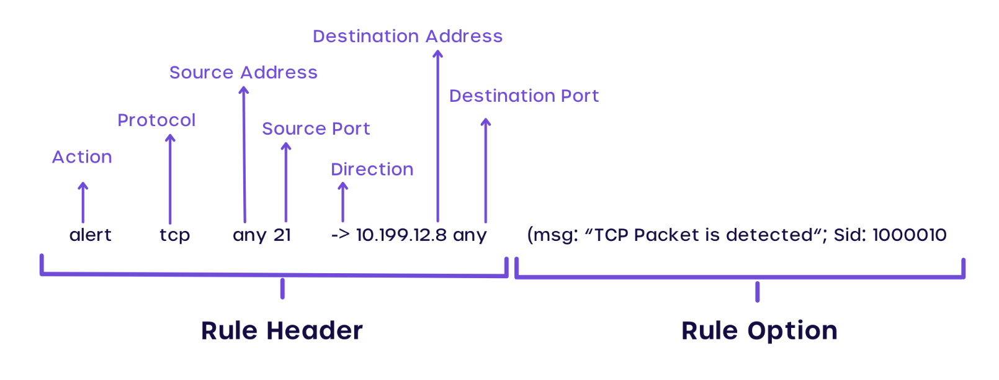

# 1. Snort 开源入侵检测系统

官网：https://www.snort.org/

规则库：https://www.snort.org/downloads/#rule-downloads

## 1.1 Snort 是什么?

Snort 是一种流行的免费开源 IDS/IPS 系统，用于执行流量/协议分析、内容匹配，并可用于根据预定义规则检测和预防各种攻击。

## 1.2 Snort rule 长什么样子?

Snort 规则与典型的防火墙规则非常相似，它们用于将网络活动与特定模式或签名进行匹配，从而决定是发送警报还是丢弃流量（在 IPS 的情况下）。



### 1.2.1 Action 动作

| 序号 | 名称     | 含义                                                         |
| ---- | -------- | ------------------------------------------------------------ |
| 1    | alert    | 使用选择的报警方法生成一个警报，然后记录（log）这个包。      |
| 2    | log      | 记录这个包。                                                 |
| 3    | pass     | 丢弃（忽略）这个包。                                         |
| 4    | activate | 报警并且激活另一条dynamic规则。                              |
| 5    | dynamic  | 保持空闲直到被一条activate规则激活，被激活后就作为一条log规则执行 |


### 1.2.2 Protocol 协议

Snort当前分析可疑包的ip协议有四种：tcp 、udp、icmp和ip。将来可能会更多，例如ARP、IGRP、GRE、OSPF、RIP、IPX等


### 1.2.3 source/destination address 地址

一个表示数据包的访问的源地址，另外一个表示目的地址，关键字"any"可以被用来定义任何地址，Snort没有提供根据ip地址查询域名的 机制。地址就是由直接的数字型ip地址和一个CIDR块组成的，/24表示c类网络， /16表示b类网络，/32表示一个特定的机器的地址。


### 1.2.4 source/destination port 端口号

端口号可以用几种方法表示，包括"any"端口、静态端口定义、范围、以及通过否定操作符。"any"端口是一个通配符，表示任何端口。静态端口定 义表示一个单个端口号，例如111表示portmapper，23表示telnet，80表示http等等。端口范围用范围操作符":"表示。范围操作符可以有数种使用方法，如下所示：

```
log udp any any -> 192.168.1.0/24 1:1024
记录来自任何端口的，目标端口范围在1到1024的udp流
log tcp any any -> 192.168.1.0/24 :6000
记录来自任何端口，目标端口小于等于6000的tcp流
log tcp any :1024 -> 192.168.1.0/24 500:
记录来自任何小于等于1024的特权端口，目标端口大于等于500的tcp流
log tcp any any -> 192.168.1.0/24 !6000:6010
端口否定操作符用"！"表示。它可以用于任何规则类型
```


### 1.2.5 rule option 规则选项

规则选项组成了snort入侵检测引擎的核心，既易用又强大还灵活。所有的snort规则选项用分号"；"隔开。规则选项关键字和它们的参数用冒号"："分开。按照这种写法，snort中有42个规则选项关键字

1. msg - 在报警和包日志中打印一个消息。
2. logto - 把包记录到用户指定的文件中而不是记录到标准输出。
3. ttl - 检查ip头的ttl的值。
4. tos 检查IP头中TOS字段的值。
5. id - 检查ip头的分片id值。
6. ipoption 查看IP选项字段的特定编码。
7. fragbits 检查IP头的分段位。
8. dsize - 检查包的净荷尺寸的值 。
9. flags -检查tcp flags的值。
10. seq - 检查tcp顺序号的值。
11. ack - 检查tcp应答（acknowledgement）的值。
12. window 测试TCP窗口域的特殊值。
13. itype - 检查icmp type的值。
14. icode - 检查icmp code的值。
15. icmp_id - 检查ICMP ECHO ID的值。
16. icmp_seq - 检查ICMP ECHO 顺序号的值。
17. content - 在包的净荷中搜索指定的样式。
18. content-list 在数据包载荷中搜索一个模式集合。
19. offset - content选项的修饰符，设定开始搜索的位置 。
20. depth - content选项的修饰符，设定搜索的最大深度。
21. nocase - 指定对content字符串大小写不敏感。
22. session - 记录指定会话的应用层信息的内容。
23. rpc - 监视特定应用/进程调用的RPC服务。
24. resp - 主动反应（切断连接等）。
25. react - 响应动作（阻塞web站点）。
26. reference - 外部攻击参考ids。
27. sid - snort规则id。
28. rev - 规则版本号。
29. classtype - 规则类别标识。
30. priority - 规则优先级标识号。
31. uricontent - 在数据包的URI部分搜索一个内容。
32. tag - 规则的高级记录行为。
33. ip_proto - IP头的协议字段值。
34. sameip - 判定源IP和目的IP是否相等。
35. stateless - 忽略刘状态的有效性。
36. regex - 通配符模式匹配。
37. distance - < distance - 强迫关系模式匹配所跳过的距离。
38. within - 强迫关系模式匹配所在的范围。
39. byte_test - 数字模式匹配。
40. byte_jump - 数字模式测试和偏移量调整
